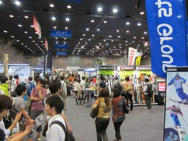

# ICIカスタムフェアへ行ってみた

📅 投稿日時: 2011-06-12 18:22:45

🏷️ カテゴリ: [スキー雑談](c1f9d2cb7478308da16419928ea3945e9.md)

という感じで．

天気も悪かったし．

いろいろあって，スキーに行かなかったこの週末．

例年通り，ICIカスタムフェアに行ってきました．

スキー用品の店が少なくなってきた今．

スキーやウェアが，これだけ揃って見ることができる

機会は，最近ではあんまり無いですね～．

今年は，すごい久しぶりに板を買わないシーズン．

板は昨シーズン頭に買ったばかりで，幸い今シーズンは[へたりませんでしたし．](http://blog.goo.ne.jp/skier_nobu/e/739c99f122390b651443d3488470166e)

ブーツは3ヶ月前に買ったばかりなので．

今年はウェア狙いです．

今年の会場は去年と同じ．新橋駅から徒歩10分ほどの，

ベルサール汐留，

会場に入ると…有名人が多いですね～．

柏木選手・井山選手・松沢聖佳さん，沖聖子さん，伊東秀朗さん…

ざっと気づいただけでもこれだけの有名選手が．

気づかないところにも，いっぱいいらっしゃったのかと．

板は買わないとはいえ，とりあえず見て回る，と．

で，気になった[ELANのAMPHIBIO](e5be2080b24fa9ab10470f95067659cdf.md)

話を聞いてくると…

普通のマシン通るみたいですね．

ただ，ストーンフィニッシュの際に，やっぱりロッカー部分の

一部にストラクチャーが着かない部分があるみたいなので，

その場合はダンボールとかをはさんで圧力を調整すると

ちゃんとストラクチャーが入るらしい…

でも，

この質問をした際，

「待ってました」

といわんばかりに回答が出てきたので．

どうやらFAQのようですね（笑）．この質問は．

しかし，Volkl,Salomon,Ogasaka,その他もろもろ…

ロッカー形状の板が流行ですが．

フルロッカーってわけじゃなく．

トップ接雪点がちょっとセンターよりになった程度．

実際見てみると，なんか…

コブを滑りすぎて曲がってしまって，いわゆる「チューリップ」

になっちゃったメタル板みたい…

これもってる人いたら，「板，曲げちゃったの？」って

真顔で聞いてしまいそう．

んで．

結局．

予定通り，ウェアを買ってしまいました．

スキーに行き過ぎてお金が無い私は．

ウェアは型落ちを買って，大体4-5シーズン着ます．

今のウェアもすでに4シーズン目に突入…

（それも，2シーズン落ちで上下14000円で買った安物）

しかし．

今シーズンは，

いろいろ理由があって．

最新モデルを買ってしまった…

＃最近は，あんまりまともなウェアが次シーズンまで

＃残ってないんですよね

最新モデルのウェアを買うなんて

大人になってから，初めてのような気がする…
