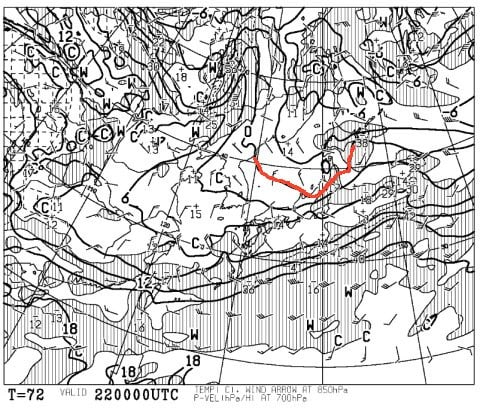
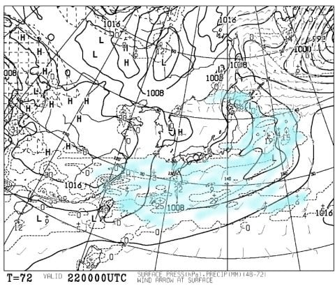
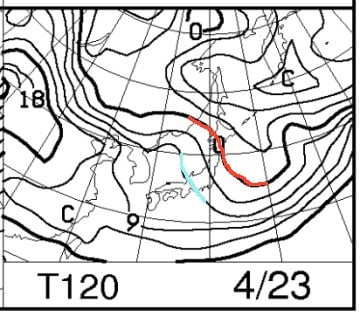
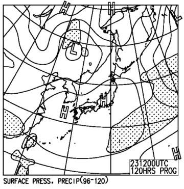
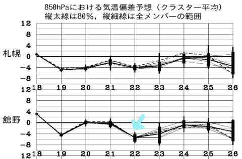

# 4月22，23日の週末の志賀高原スキー場の天気は…土曜は冷え冷え，日曜もこの時期としては寒めで，晴れるかな？

📅 投稿日時: 2017-04-20 01:45:35

まだ雪がたっぷりあって，

スキーがまだまだ楽しめそうな今シーズン．

皆様方におかれましては．

今週末も当然のごとく，スキー場に出動される

ことと存じます…

というわけなので．

まだまだ気になる，今週末のスキー場の天気．

水曜深夜恒例の週末の天気予想，行ってみましょう！

えー．

まず．

22日土曜の850hpa予想図ですが…

え！？？

なに？？

赤くマークした0℃線．

この時期になっても，まだ志賀高原に

かかっているのですが！？

これは…

土曜は，朝からガッツリ氷点下に冷えた，

冷え冷えの締まったバーンが滑れそう…

この日の地上天気図を見ると…

水色の降水域は太平洋側にかかっているけど．

ほとんど本州にはかかっていないですね…

だもんで．

おそらく土曜は．

朝のうち多少雲が多めかもしれませんが．

晴れそうですね～！！

そして，今度は．

日曜日，23日の850hpa気温図をみてみると…

あら．

この日は0℃線は北海道近くまで

北上して．

志賀高原は，水色で示した+9℃線と，

＋6℃線のちょうど中間くらいですか…

これは，昼間は+10℃近くまで上がっちゃいそう．

で，地上天気図を見ると．

ふむ．

でも．

高気圧に覆われてるので，天気は

すっきりと晴れになりそうですね～！

850hpa気温偏差を見ると．

水色矢印で記した土曜22日は．

平年より5度ほど気温が下がりそうで．

そして23日日曜も，平年より低い気温に

なりそうなので．

この週末は，結構冷えて，

雪がザブザブになってしまわず，

いい週末になりそうな予感…

とりあえず．

まとめると．

22日土曜：朝は多少雲が多いけど，基本的に晴れの一日！

　朝は山頂はしっかり氷点下に冷え込み，コース全面

　しっかり硬い斜面でスタートになりそうかな…

　エッジを研いでない人には，朝イチはちょいと辛いかも．

　気温は最高でも+5℃を超えない程度の

　寒めの天気だと思うんだけど．

　でも，昼に近づくにつれ，日差しが強くなるので．

　雪の表面は緩みそう…

　でも，下地にしっかりした雪が残るのに，

　表面がしっとりと柔らかく，エッジが良く効くという，

　この時期には恵まれたコンディションになるんじゃ

　ないかな～…

　昼間は日が射すと暖かく感じると思うけど．

　日が陰ったり，夕方になると寒くなるので注意！

　午後は，日が陰るにつれて昼間緩んだ雪が

　冷えてそのまま固まっていくので，難しい

　コンディションになるかも…

23日日曜：朝からすっきり晴れ！！

　朝は放射冷却で冷え込み，この日も

　しっかり硬いバーンでスタート！

　朝はかなり固めかも．

　でも，この日は土曜より気温が上がるので，

　午前中には雪がそこそこ緩んで，しっとりと

　したクリーミーな雪になっていきそう…

　気温は最高+10℃近くまで上がって，日が射すと

　暑く感じそう．

　ただ．気温が上がるとはいえ，平年よりは寒く．

　この日も雪は板が潜るほどのドボドボ雪には

　ならず，しっとりと重い雪になる程度で

　収まってくれそう．

　人も少ないので，午後になっても，

　そんなにひどくバーンは荒れないんじゃ

　ないかな…

という感じです．

今週末は，4月下旬に突入したということを考えれば．

天気が良いのに，雪が壊滅的にドボドボに

ならなさそうという．

結構恵まれた週末になりそうですね～．

## 💬 コメント一覧

### 💬 コメント by (かず)
**タイトル**: Unknown
**投稿日**: 2017-04-20 02:44:44

日曜は自分の技術ではきつく11時にはあがりました　やはり今週は冷えそうですね　この時期未経験なので硬さが心配ですが土日行きます　なんか来週も冷えますね　パークがイベントみたいなので奥志賀混みそう

### 💬 コメント by (Skier_S)
**タイトル**: かずさま
**投稿日**: 2017-04-21 02:22:49

今週はいい感じで冷えますよ～！

土日とも，一の瀬は朝はしっかり硬いアイスバーンに

なりそうです．

奥志賀も，朝は硬いかと思います…

ガチガチだと手ごわいですけど，ちょっと

緩み始めたくらいの固い斜面だと，

コントロールもしやすいし，気持ちよく

スピードが出せて楽しいです…

しかし，今シーズンはまだザブザブ雪にならずに

済んでますね～

