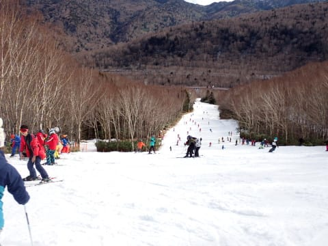
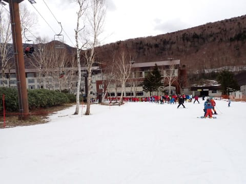
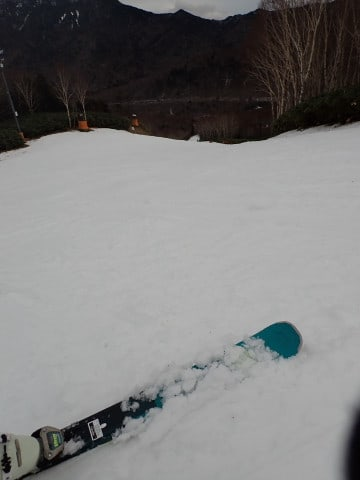

# 2023/12/16(土)の志賀高原焼額山スキー場は…リフト営業中はほぼ雨が降らなかったよ！でも研修会団体さんで混雑の一日

📅 投稿日時: 2023-12-17 00:53:10

🏷️ カテゴリ: [2024スキー滑走日記](c453f687e8a0f05679e95831d0a02cd0c.md)

ということで．

昨日の記事に書いたように，夜中に仕事から帰宅し，

そのまま徹夜で志賀高原へ向かった本日でしたが…

今回．

一緒に乗りあってきてくれる犠牲者心優しい方が

見つかったので，行きは犠牲者に運転を押し付けて

心優しい方に運転をお願いして，車で2時間寝られた

のが救い…

ってなことで．

朝8:30より3分ほど早く営業開始した本日．

リフト営業開始前まで雨が降ってましたが…

営業開始時は雨もやみ，うっすら日も差す

ほどの天気に！！

…ただ，昨日の夜から今朝まで，かなり高温の

雨が強く降り続けたようで…

雪は12月第1週よりも減った感じ（涙）

かなり雪が減ったなぁ…（泣）

なので．

今日の焼額も，営業するのは第4ロマンス1本．

残念ながら，先週動いた第2高速は雪不足で

本日は動かず（泣）

でも，ヤケビスタッフの努力のおかげか，

冷えた日にガンガン人工降雪を打ったらしく，

コース上の雪は維持されてたのが素晴らしい！

まぁ，朝から気温は+7℃ほどもあり，

朝イチから雪質はかなり残念な感じでしたが…（泣）

朝イチから重めの雪とは言いながらも，

朝のシマシマは楽しい！！

あさイチは快楽のフラットバーン！！

…でも，コースわきはちょっと雪が汚れてる

ところもあったりして…

やっぱり2週間前のほうがよかった…

で．

あさイチはリフト待ちも少なく，コースも

ガラガラで良かったのですが．

朝9時半に，某都道府県連盟の指導員研修会が

始まり…

大量の参加者が1本のペアリフトに

ドッとなだれ込む事態に（泣）

…その結果．

午前10時前から12時まで，リフト待ちが

5分～10分というかなり残念な感じに

なっちゃいました（涙）

さらに…

コースの人口密度もかなり上がってしまい．

イエティよりはマシだけど…

気持ちよく滑るのは難しい，残念な混雑

具合に（激涙）

気温は+10度近く，雪は悪いし…

コースは混んでるし．

リフトは10分以上混むし…

なんだか，かなり残念な感じ…（激泣）

昼休みタイムになると，研修会のメンバーが

昼食に入り，ガラガラになったけど…

このガラガラタイムも，昼休みの1時間だけ．

お昼休みが終わった1時からは，また大勢の

研修参加者が1本のペアリフトに集中し，

人口密度は上がるし…

リフト待ちも午前と同じ最大10分待ちに

なるし…（泣）

さらに．

気温が+10℃近いザブザブ雪で大勢が滑る

ので…

午後は結構コースが荒れて，コブ斜面とまでは

言わないけど，滑ってて飛ばされるほどの

凸凹バーンになってきました（泣）

まぁ，そんな中でも．

コース上は石ころが出てくることもなく．

コース幅いっぱい滑れる状態をキープ

していたし．

雨の予報だったのに，午後2時過ぎに

降ってるか降ってないかわからないくらいの

雨がちょっと降った以外，まったく

雨が降らなかったのは良かったかな…！

そして．

午後3時過ぎには研修も終わり．

コースはちょっと荒れ気味ながらも，

バーンはガラガラ状態に復活し．

ペアリフト1本しか動かず．

大勢の研修会の団体で混雑はしたものの．

終日雨も降らず，雪もブッシュや石ころが

出てくることもほとんどなく，

コース幅いっぱい滑ることができたので．

金曜から土曜の雨で，コースは壊滅するのでは…？

という最悪シナリオを心配してたけど．

そこまでひどくはなかったことに，ちょっと

ホッとしながら．

今日も16時のリフト営業終了まで

滑り続けたのでした…

志賀高原，まだ気温はプラスのままで，

雪が降る気配はありません…（泣）

明日，昼過ぎには冷えて雪が降り始めて．

それからは雪は良くなりそうだけど．

明日も午前は雪は回復せず．

午後は吹雪になりそうという，ちょっと

残念な感じ…

でも，明日も朝から滑ってます～！！

## 💬 コメント一覧

### 💬 コメント by (レインボー76)
**タイトル**: Unknown
**投稿日**: 2023-12-17 14:57:57

日曜日の志賀高原情報

朝の上林-1℃、蓮池-6℃。

いつものヤケビは指導員研修で混雑確実。熊の湯は地肌を避けてのスラロームが必須。一ノ瀬ファミリーは雪が融けてコース幅が狭い。高天原はコースが短い。

平日スキーヤーにとってどこも魅力がないので、さっと滑ってすぐに帰る案を採用。

ヤケビ四ロマを二本滑ったら、長蛇の列で終了。三本目を滑った仲間は、コロコロ出現&前日より15℃もの気温降下で寒くて終了。

高天へ移動した仲間が正解で、コースは短いけどストレスなく滑れたそうな。

今夜から明日が雪予報なので、今は太板を用意してます。降れ！

### 💬 コメント by (Skier_S)
**タイトル**: ＞レインボー76さま
**投稿日**: 2023-12-18 03:59:21

昨日はお世話になりました！！

今日の焼額はかなりの修行の1日でしたね…

高天ヶ原が正解だったんでしょうか．

これから1週間は結構冷えますよ！！

…でも，志賀はそこまでドサドサ降らないかも…

とはいえ，週末にはゴンドラが動くほどは積もってくれるんじゃないかと期待！

