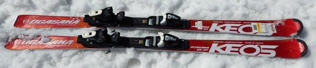
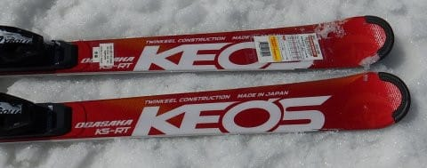
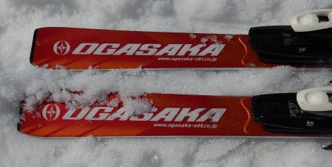
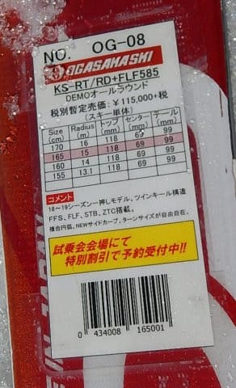
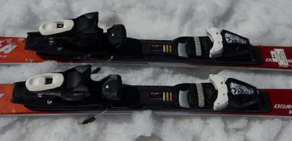

# 2020シーズンモデルのスキー板，試乗レポート…OGASAKA編その3

📅 投稿日時: 2019-06-05 02:05:26

🏷️ カテゴリ: [スキー板試乗](c0bd8048615710cee890e403a36cc9a2b.md)

うーむ．

やはり，このBlog．

週明けにスキーレポートが無いと，

違和感がありますね…

とりあえず，今週末の月山まで，

なんとか死なないように生きていきますが．

…今週末，天気悪そう（涙）

雨にならないでいてくれると嬉しいんだけど…

今のところ今週末の月山，

ちとヤバい感じ…（泣）．

でも．まだわからない．

もう少し前線が南に下がれば，

なんとかなる！！

ってことで．

今週はスキーに行ってないので．

本日もスキー試乗レポート，行きます！

今日はオガサカ編です．

では，どうぞ～！

○OGASAKA Keo's RT FL585 165cm

基礎オールラウンド．

以前，[Keo's GPの試乗レポート](e0a1e0d0485de3e3627b30faee3a0415a.md)を書きましたが．

2種類あるKeo'sのうち，前回レポートしたのが

シェルトップ構造のモデル，GP.

今回レポートするのは，ツインキール構造の

モデル，RTになります．

ツインキール構造の板はRT，CT，TTと3種類あり．

このRTが最上位モデルです．

ちなみに，シェルトップのモデルは来シーズンが

モデルチェンジですが．

ツインキールのこの板は，今シーズンからの

継続モデルとなります…

この板は，FL585プレート，FM600プレート，プレート無しが

選べますが．

試乗したのは，最も強いFL585プレート付きになります．

さっそく滑ってみると…

うむ．

結構柔らかい板なのか．

R=15というサイドカーブのわりに，

よく回りますね．

何も考えずに角づけをしていくと，

かなり楽にたわみ，このたわみに沿って，

きれいにカービングで回っていけます．

FLプレートが付いていても，板のたわみが

出やすいので，左右に角づけをするだけで，

簡単にたわんでくれて，エッジがグリップして

オートマチックにカービングで滑って行けます．

OGASAKAにしては，かなりオートマチック性が

高い感じ．

ただ，フレックスが比較的柔らかく感じるので．

R=15というよりも小さめの半径で回る感じ．

かなり旋回性は高いです．

R=15とはいえ，165cmだと，体重や脚力が

ある人には，大回りはちょっときついかな．

165だと，やっぱりミドル～ショートが

ちょうどいい感じの板になります．

簡単にたわみを引き出せるフレックスの割には

比較的しっかりグリップしますが，

ターンのどんな局面からでも板を動かせる

自由度があります．

OGASAKAらしく，ずらしのコントロール性は

かなり高いです．

ただ，トップスピードを出すと，

たわみすぎて旋回半径がぐんぐん

小さくなっていきますし．

私のホントのトップスピード域だと，

ちょっと板が逃げる感じがありました…

そんなにガンガンかっ飛ばさないけど．

そこそこのスピードで，楽に気持ちよく

カービングをしたくて．

カービングでキュンキュン回ってくる板が

好き…

という人におススメの板でしょうか．

## 💬 コメント一覧

### 💬 コメント by (カンタロス)
**タイトル**: Unknown
**投稿日**: 2019-06-05 19:45:04

いつも楽しく拝見させてもらってます。月山まで滑る気合いが素晴らしく思います。私はゴールデンウィークでシーズン終了です。

物欲選手権、期待しておりますので情報を(笑)

神田、石井スポーツにてアトミックSL PROが売っておりました。SXの上位互換になるのでしょうか？

価格は59800円でした。

ちなみに、個人的に物欲選手権に負けて、S9を買ってしまいました(笑)

### 💬 コメント by (Skier_S)
**タイトル**: ＞カンタロスさま
**投稿日**: 2019-06-06 01:32:25

いや…気合で滑っているのではなく．

滑らないと死んじゃうので，やむなく月山まで

行かざるを得ない感じです…(笑)．

SL Proですが，SXの上位機種になります．

中身はほぼSL競技モデルです…

まだ神田には残ってるんですね！

そして，S9購入おめでとうございます．

来シーズンモデルですか？

結構いい値段しますよね…（涙）

私は…買いません．

SXもまだ履いてないのが1セットあるし，

次のシーズンは，板を買わなくても済むはず！！

### 💬 コメント by (カンタロス)
**タイトル**: Unknown
**投稿日**: 2019-06-06 13:18:01

返信ありがとうございます。

ニューモデルは高いので当然片落ちです。(笑)

### 💬 コメント by (Skier_S)
**タイトル**: ＞カンタロスさま
**投稿日**: 2019-06-07 03:11:23

あら．

やっぱり型落ちですか．

まだ2019モデルの165cmって残ってたんですか？

### 💬 コメント by (カンタロス)
**タイトル**: Unknown
**投稿日**: 2019-06-07 05:55:50

当然型落ちですよ。家庭がある身ですので。

そこはさすが神田です。残ってました。

アスペンにて、たしか後二本くらいあったと思います。

時間の問題で無くなるね(店員談)

だそうです。

### 💬 コメント by (Skier_S)
**タイトル**: ＞カンタロスさま
**投稿日**: 2019-06-08 01:10:07

まだ残ってるんですね…S9．

S9iじゃなくて，S9ですよね？

昨年モデルは当たりだと思います…

まだ残ってるのか…

…

…いや．

買わない．

買わないぞ～！！！

### 💬 コメント by (カンタロス)
**タイトル**: Unknown
**投稿日**: 2019-06-08 05:56:01

はい。もちろんiの付かない赤いやつです。

年間30日くらい滑ってますが、あくまで自称レジャースキーヤーてすので、板はコスメが重要！(笑)

赤いほうがカッコいいと、思うので。

ちなみにiのほうも残ってました。

物欲万歳🙌です。

ひそかに、物欲選手権、期待しております

### 💬 コメント by (Skier_S)
**タイトル**: ＞カンタロスさま
**投稿日**: 2019-06-08 20:25:26

おっと．iの方も残ってましたか…

来シーズンはiの方が良さそうですが，

今シーズンまでは赤いほうがよさげな感じだったので．

やっぱり旧モデルなら赤いほうが正解かな…

…

はっ！！

買わない！

買わないぞ～！！

### 💬 コメント by (カンタロス)
**タイトル**: Unknown
**投稿日**: 2019-06-08 20:51:02

やはり赤が正解ですよね。

月山、日帰り。もはや人の所業とは思えない難行苦行(？) ですね❗️レポートお待ちしております。

### 💬 コメント by (Skier_S)
**タイトル**: ＞カンタロスさま
**投稿日**: 2019-06-10 02:02:23

いや…

日帰り月山，やっぱりきついです．

でも，楽しめましたよ～！

明日の詳細レポートお楽しみに！

