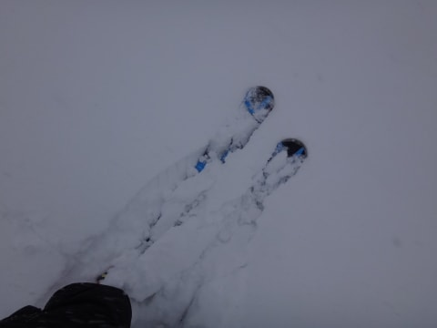

# 1月31日の志賀高原は…終日激しい雪降りの一日

📅 投稿日時: 2015-01-31 20:28:25

えー．

本日は，予定通りの1泊2日で志賀高原にこれたわけですが．

…ええ．

ちゃんと，1泊2日で来れたんですが．

なぜ，土日とも天気が良い先週は日帰りで，

泊まりで来れた今週に限ってこんな仕打ちを…（以下，愚痴が続く）

とりあえず．

本日朝．

信州中野ICを降りたあたりはまだ日もさす状況だったわけで．

「ん？天気予想，（いい方向に）はずしたかな…？？」

と思うような状況で始まった一日だったわけですが．

…ただ，路面はかなりいい感じでつるつるで．

楽しい感じのスケートリンク路面でした…←普通は楽しむところじゃない

んで．

いつもどおり焼額へ到着すると…

ふむ．

強風で，第2ゴンドラ運休ですか…（泣）

第1ゴンドラも，減速運転とな…（涙）

「夕方に向かって吹雪っぽくなっていくので，ゴンドラが

　減速運転になるかも…」

と，予想はしたけど．

まさか，朝から運休とはっ！！

第2ゴンドラ，あれですね．

まるで神田に行ったSkier_S並みにこらえ性がないというか，

根性がない感じが…←いや，安全のためだから

とりあえず．

減速運転の第1ゴンドラに乗り，山頂に行くと…

気温はマイナス12度と，結構な冷え込みですな．

そして，朝の1本目は，薄日も差し…

圧雪コース上は，新雪が5cm～10cmほど，うっすらと

乗った感じで，それほどの積雪はなく．

適度に快適に飛ばせる感じですな！

うむ．

このままの状況が続けば．

まぁ，ゴンドラは減速運転だけど，

今日もそこそこいい日になりそう…

と，思っていたのもつかのま．

2本目を滑り始めるころには，雪がすごい勢いで

降り始め…

ゲレンデは視界が悪くなり…

見えないゲレンデに，モフモフと雪が積もっていき．

…すごい滑りにくいんですけど．

ってか，スピードも出せないし，見えないし．

ちと怖いんですけど…（涙）

そして．

第2ゴンドラが動いてなかった上に．

第1ゴンドラも減速運転のため…

なんだ，これは（涙）

時折，こんな感じでゴンドラ待ちが…

でも，基本的には終日この程度．

まあ，2-3分待ちだったかな…

…でも，減速運転なので．ゴンドラ乗車時間は10分以上…（涙）

ぜんぜん本数が滑れない…（悲）

そして．

「ひたすら雪が降り続け，午後はゲレンデがもさもさに荒れていきそう．

　夕方に向かって吹雪っぽくなっていく」

という，あたってほしくない予想が呪われたかのように

次々当たっていき，

午後には雪だけではなく，風も強くなり…

吹きさらしのリフトに乗ると，

「死ぬ！寒さで，死ぬっ！！」

って感じで．「これ何の罰ゲーム？」的状況になり…

さらにゲレンデの視界は最悪．

コースが見えない…

焼額知らない人は，遭難しても不思議じゃないレベル．

ゲレンデは，圧雪コースでも，あっという間に新雪バーンと

化して行き…

なんというか．

寒いし見えないしコースは荒れてくるし．

…大変残念ながら．

本日は快楽バーンからは遠い状況でした…（涙）

で．

さらに．

何の仕打ちだか．

本日悪天候のため，焼額も一の瀬も，志賀全てナイター中止っ！！

うがーーーっ！！！

なぜ．

なぜだ．

日帰りでしかいけなかった先週は．

土日とも晴天で，いいコンディションだったというのに．

1泊2日でいける今週は．

強風・悪天候・視界なし・ナイター中止…

といった試練が与えられるのかな～（涙）

とりあえず，今もそこそこの勢いで雪は降り続けてるので．

明日の朝は，ひざパフ～腰パフの間くらいは積もってくれそうかな．

せめて，明日の朝のパフパフに期待しよう…

これで明日，強風でゴンドラが全滅だったら，そのときは

暴れる．本気で暴れる．←天気図を見ると，そうなる可能性が高い気が…

## 💬 コメント一覧

### 💬 コメント by (KENKEN)
**タイトル**: 焼額デビュー
**投稿日**: 2015-01-31 21:45:49

本日念願叶い焼額デビューしました。

かなり強烈な洗礼(吹雪)を食らいましたが。

最初は本気で迷子になりそうでヤバかったです。

明日も昼過ぎまで焼額廻りをグルグルしようかと。

どこかでお会いできるといいですね。

真っ赤なウェアで白のサロモン板の

へたっびがいたら自分かもです。

### 💬 コメント by (いか)
**タイトル**: Unknown
**投稿日**: 2015-01-31 23:06:44

ヘ(・_|←東京で仕事してる人の怨念

人がいないところならいくら飛ばしても大丈夫なような…(荒れ地)

### 💬 コメント by (Skier_S)
**タイトル**: KENKENさま
**投稿日**: 2015-01-31 23:38:50

明日は私も焼額ぐるぐるしてます～！

新雪がつもるだろうから、オリンピックコース

ひたすら滑り続けているかと…

会えるといいですが…

私の目印は、いつもの店のシールがあるアトミックの

板です～

### 💬 コメント by (Skier_S)
**タイトル**: いかさま
**投稿日**: 2015-01-31 23:41:42

何か…何か、強い怨念を感じる！

さては、今日の天気は…！

明日のゴンドラが止まらないよう、

こちらは現在必死に祈り中です

