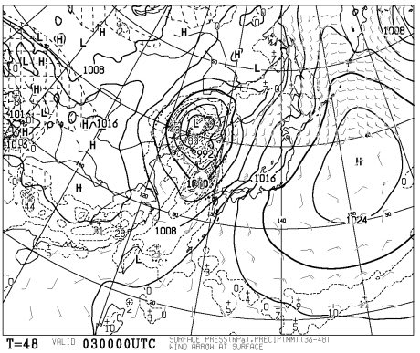
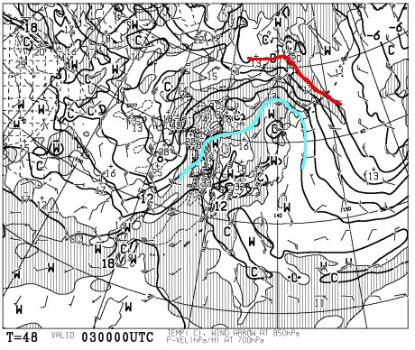
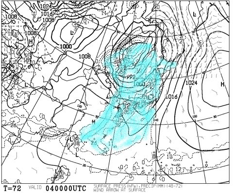
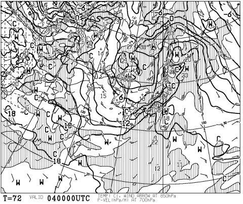
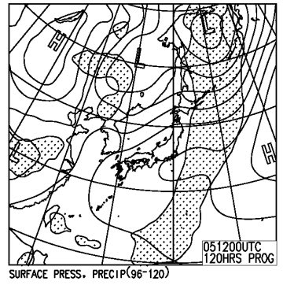
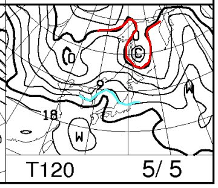

# GW中盤，5月3，4，5日3連休のスキー場の天気は？…4日は壊滅的天気だよ（泣）．

📅 投稿日時: 2016-05-01 23:40:31

志賀高原の今シーズ営業が終了してしまい．

[田代⇔かぐらの連絡コースも，明日で終了](http://www.princehotels.co.jp/ski/kagura/files/pdf/20160502mapb.pdf)に

なるらしい今日この頃（涙）．

皆様いかがお過ごしでしょうか．

ってことで．

3連休最終日が終わったばかりですが．

すぐやってくる，次の3連休．

5月3，4，5日のスキー場の天気予報はどんな感じか，

と，気になる人もいるでしょうから．

＃極めて少数な気がするのだが…

とりあえず，3連休のスキー場の天気予想を行くのだ！！

えー．

まず，初日の5月3日の地上天気図は…

うむ．

西からひたひたと，危険な低気圧が

接近してきていますね～…（戦慄）

そして，850hpa気温図はこんな感じで．

赤い0℃線は北海道よりずっと北．

水色の+12℃線ですら，北海道より北に行ってしまい．

本州には，+15℃線という，この時期でもありえない

激烈高温線が近づいてます…（涙）．

…3日，天気は晴れそうだけど．

強烈高温の南風が吹き付け，雪がすごい勢いで融けます．

ってか，強風でリフトの運転にも影響しそう…

で．

3連休の中日，4日の天気図は…

あう…（死）．

これは…（絶望）．

一応，850hpa気温を見ておくと…

3日ほどではないけど，+9℃線がかかってますね…

ってか．

これ．激烈強風になる天気図ですね…（涙）．

…この日も，気温は上がって．

そして，かなりの強風が吹きすさぶ，

横殴りの雨です（泣）．

全くもって，スキー日和ではありません（泣）．

3連休最終日，5日の地上天気図は…

降水域の網掛けがかかってないので，

まぁ，5日は雨はふらないで済みそうですね．

で，850hpa気温はこんな感じなので…

かぐらや白馬方面には，水色の

+12℃線がかかっていて．

この日も気温は上がりそう…

ダメな感じです（泣）．

この日まで，ゲレンデはまともな状態でもつのか…っ！？？？

ってことで．

まとめると．

3日：朝は晴れ．だんだん雲が増えていく．

　強い南風が吹き，朝から気温は高めだけど，

　昼間に向けてさらに気温はぐんぐん上昇．

　夏か？？と思う気温と風で，雪は朝からザブザブに

　緩む．ゲレンデコンディションは…期待しない方が…

　午後は雲が増えていく．

4日：朝から雨．強風の横殴りの超高温の雨．

　おそらく，ゴンドラは動かないんじゃないかな．

　リフトも強風で運転できないものが多そう…

　激烈な勢いで雪が融けるでしょう．

　まぁ，スキーに行かない方がシアワセな気がする．

　午後は雨が止んでいくかもしれないけど…

　風は終日強いかな．

5日：おそらく，終日晴れ．朝は雲が多いかもしれないけど…

　朝から気温は高め．昼間も気温は上がり，雪はもう…

　ってか，4日の雨に耐えて滑れるスキー場は，どのくらい

　残るんだろうか…？って方が疑問．

　滑れるスキー場が残ってれば，雪質などに

　不満を述べず「滑れるだけシアワセ」と

　思ってすべてを受け入れましょう（達観）．

という感じです…

あぁ．

やはり，29，30日の冷えがラストチャンスだったのか…

この3連休も，あまり期待できないなぁ…（涙）．

## 💬 コメント一覧

### 💬 コメント by (ろうさん)
**タイトル**: お礼
**投稿日**: 2016-05-02 11:21:49

先ほど、田代～かぐらのリフトでお声がけした者です。今シーズン最終日にお会いでき、シールまでいただけて感激です。ありがとうございました。来シーズンの板に貼りますU+203CU+FE0E

### 💬 コメント by (Skier_S)
**タイトル**: ろうさんさま
**投稿日**: 2016-05-02 12:50:12

さっそくのコメントありがとうございます～

あんなに喜んでいただけるとは、

こちらとしても嬉しい限りです(^^)

普段は志賀にもいらっしゃるとのことでしたので…

また来シーズン、志賀でお会いしましょう！

### 💬 コメント by (Goku)
**タイトル**: 友達の輪
**投稿日**: 2016-05-02 18:33:02

友達の友達はみな友達。

みんなで広げよう２００００ｍ倶楽部の輪！（古）

って感じで広がっていますね～(笑)

で、ＧＷはやっぱりかぐらなんですね。

### 💬 コメント by (Skier_S)
**タイトル**: Gokuさま
**投稿日**: 2016-05-02 22:58:50

志賀が終わったら，私はやっぱりかぐらです．

今日の午前中は混みましたよ～！

まさか，かぐらで20000m倶楽部シール見て

声をかけてもらえるとは思わず…

この時期のかぐらに来るようなコアな人は，

私のBlogを見ている人も結構いるのかも…

と思った本日でした．

### 💬 コメント by (Goku)
**タイトル**: Unknown
**投稿日**: 2016-05-02 23:34:12

＞まさか，かぐらで20000m倶楽部シール見て

＞声をかけてもらえるとは思わず…

次は月山ですね(笑)

いやー恐るべし、２００００ｍ倶楽部の知名度の高さ。

というより、このブログ読者の多さ。ですかね

### 💬 コメント by (Skier_S)
**タイトル**: Gokuさま
**投稿日**: 2016-05-03 18:30:07

月山の前に，いつまでかぐらが滑れるのか…

GW末まで滑れるといいんですが…

月山は遠いので，なるべくかぐらが

長持ちしてほしいところです…

