# 2021/3/25(木)の志賀高原スキー場特派員レポート！…気温は上がったけど曇りで意外と雪は滑ったらしい…

📅 投稿日時: 2021-03-26 02:12:51

🏷️ カテゴリ: [日記](cc4b5682fb7b8b144980957a978653fb0.md)

えー．

最新の天気図を見ると．

土曜日の天気は，昨日の予想と変わらず．

晴れて気温が上がるという予想

なんですが…

でも．

日曜夜9時の天気図を見ると．

うーむ．

赤い0℃線が北海道より

北に上がって，+9℃線が

志賀高原にかかるので．

昼間は+10℃以上．

夜も+5℃程度までしか下がらなさそう…

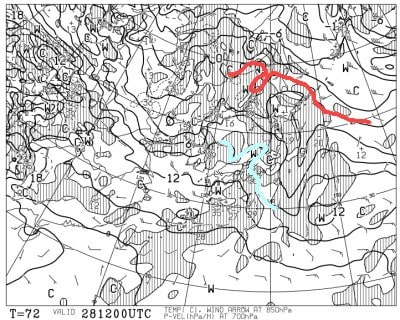

ってのはいいんだけど．

この天気図を拡大すると…

なに？？？

赤で囲った部分，風速60ノット？？

風速60ktsって…風速30m/sですね（涙）

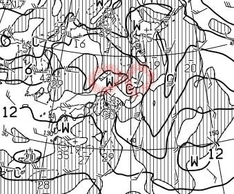

うーむ．

日曜日．

朝のうちは風が強め，曇り空程度だけど．

午後になってくると，

暴風の南風でゴンドラが止まり，

夕方にはリフトも止まりかねない

ですね（涙）

そして，夜9時の地上天気図では，

降水域も見事に志賀にかかっているので…

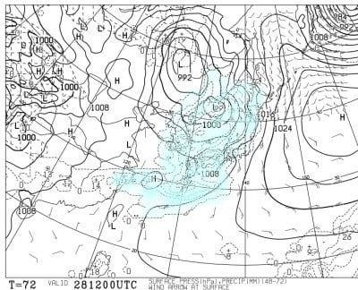

…降り始めも，リフト営業時間中かも…

まぁ，午後3時ごろまでは降らないで

もってくれるのではないか…

と，祈ってます．

願ってます．

信じてます…

という，良くないお知らせのあとは．

落ち込んだ気分を楽しくする効能があると

言われる←誰が言ってるんだ？？

志賀高原特派員レポート，行ってみましょう！

まず．

最近では一番大事になりつつある，

朝イチおこみん写真．

一昨日は双子．

昨日は三つ子

に増殖していたけど．

…まさか今日は四つ子になってないよね…

…

…

四つ子になってたーー！！！(笑)

見事だ…

見事な特派員たちの連携パワー．

今日イチゴンに集まった特派員が，

全員おこみんをもっていたということか…？？

これは，明日は五つ子に増えてそうですね！←特派員にかける過剰な期待(笑)

という，四つ子に驚いた後は．

いつもの山頂温度計ですが…

うむ．朝から0℃程度と，

今日も気温は高めですね…

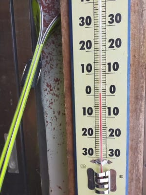

でも，朝は結構締まった感じの，

そこそこ硬めバーンだったようで．

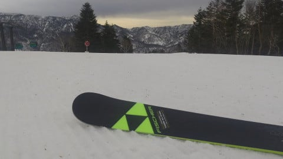

気温が高かったものの，天気は曇り空で，

日差しが弱かったので…

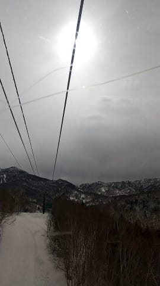

午前10時過ぎまで，焼額GSコースは

いいバーン状態だったようです！

…やっぱりこの時期，晴れよりも

うす曇りくらいがいいよね…

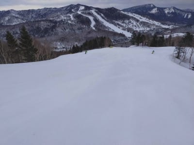

ただ，午前11時くらいになると．

さすがに気温も上がってきたので，

焼額のGSコースも緩み始め．

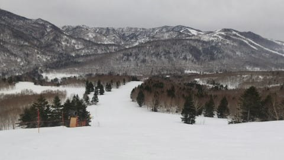

奥志賀も全体的にゆるめの雪に

なっていったようですが…

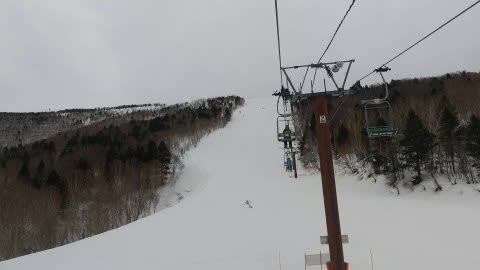

日が射さないので，ザブザブに

なることは無く．

緩めながらも雪も荒れたりすることなく．

バーンもフラットで，滑り良かった

ようです…！

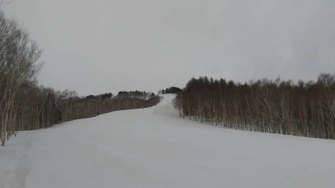

ただ，標高が低い西館方面は，

かなりザブザブの雪になってしまった

みたいで…

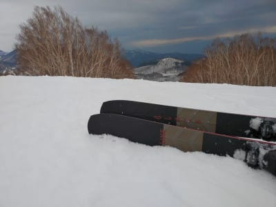

土が出てきているところも，

結構出現してきているようです…

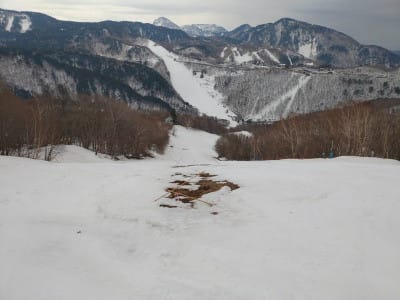

あ，でも．

一の瀬・高天ヶ原方面はまだ全然

雪がいっぱいありますし．

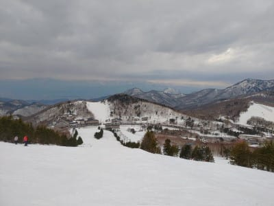

寺小屋は今日も良かったみたいですし．

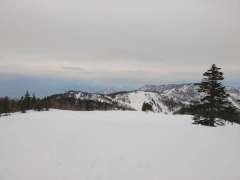

焼額方面も，まだまだ雪がありますよ～！

…って，焼額もGSコースは，西舘・東館・

ブナ・丸池と同じく．

31日で営業終了ですが…（涙）

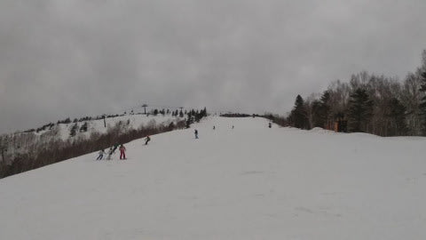

で．

本日「一瞬液体がぱらつくかも？」

と予想しましたが．

予想通り，午後2時にホントに一瞬

ぱらついたようですが…

焼額山頂では雪だったようです！

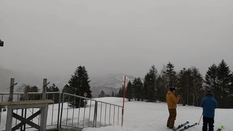

ただ，気温はプラス気温だったので．

標高が低い西舘以下は，雨だったようですが…

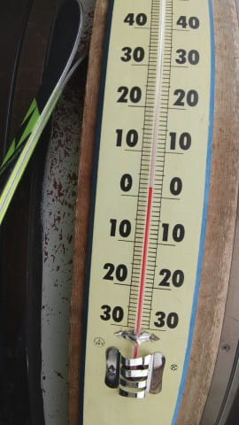

ってな感じで．

気温が高いながらも，日が射さず

雪はザブザブにならなかった焼額．

最後はザラメっぽくなったけど，

いい感じで滑る雪で，

ストップ雪になったり，粘るような

雪になっちゃうことは無く．

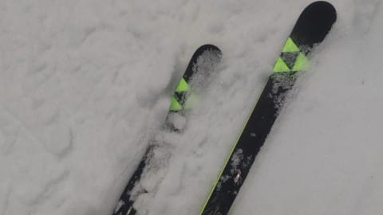

夕方には空もちょっと明るくなってきて．

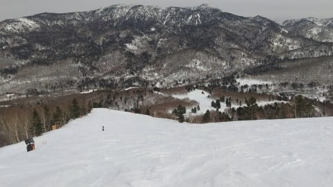

ラストまで，いい感じで大回りが

出来たようです～！

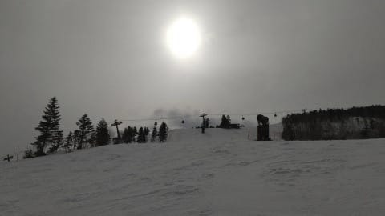

あ，それで．

昨日焼額のウインチ付き圧雪車がぶっ壊れて，

非圧雪になってしまったオリンピックコース．

明日も非圧雪のようです…（涙）

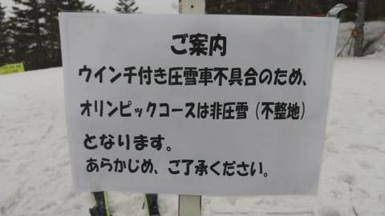

今週末が，オリンピックコースを滑れる

最後の週末なので．

週末までに直ってくれるかな？

とりあえず，強烈な日差しが無かったので，

気温が高いながらも結構良かったらしい本日．

土曜も晴れずに，うす曇りくらいで

おさまってくれるといいんだけどなぁ…

日曜もリフト営業中は降らずに，

風もそこそこで収まってくれれば…

しかし，この3月はダメダメだったなぁ．

…と，一か月予想を見てみると．

え？

なに？

赤印の3月中の期間は，ひたすら平年比

+4℃線後の日が続いたけど…

水色矢印でしめす4月は…

気温が平年並みに落ち着いて

くれそうですよ！！？？

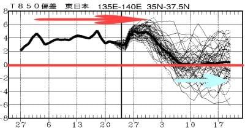

…できれば平年より冷えてほしいところ

だけど．

まぁ，平年並みに戻ってくれて，

「4月もダメダメだった～！！」って

ならないだけでも，ありがたいかも…

これはたぶん．

早くも，

「冷え冷えよもう一度！

　これから真冬に戻って

　パウダードサドサウハウハ踊り」

の効果がわずかに出てきたに違い

ない…っ！←いや，違うと思う．パウダードサドサにはなってないから．

## 💬 コメント一覧

### 💬 コメント by (レインボー73)
**タイトル**: Unknown
**投稿日**: 2021-03-26 15:14:56

金曜日の志賀高原情報

朝の上林４℃　蓮池２℃　2ゴン上ー３℃。曇り空にふわふわ雪が。

パノラマからカラマツへ。今日まで270人の団体が。硬いけど気持ちいい。

ＧＳはカッチンカチン。

オリンピックは凸凹カチカチで敬遠。パノラマ、カラマツは過密すぎる。

エキスパートが良かったとの情報を得たが、賞味期限切れでした。意外や柔らかい。だけど走らない雪。緩斜面では妖怪も目を覚ましている。

10時00分のバスにピッタリ。ついてる。でもこんな所で運を使い果たしてはおられない。

高天で降りて西たてへ。まずは圧雪バーン。快適です。人もいません。次に非圧雪バーン。大きな地肌がいっぱい。これなら３月末閉店に納得。

そしてまた今日も銀嶺でざる蕎麦。ここでまたスーパーキッズ亮○君とな○ちゃんと遭遇。山口県から走って（足じゃないよ）滑りに来たツワモノもいます。

その間に雪が強くなりガスも、。

『寺子屋ホワイトアウト』

『ジャイアントはガス』

などなど情報が。

私達は西たてを一気滑りして撤退を決意。ヤケビのサウスも5cm以上の新雪で滑りやすかった。

13時業務完了。車には10cmもの積雪が。

### 💬 コメント by (アリス)
**タイトル**: お客さんの入りいい兆候ですね
**投稿日**: 2021-03-26 18:31:42

Skier_S様

まだまだ色々なバーンをたくさん滑れますね♪

平日は修学旅行生とシニア世代、週末は一般客と学生さんと、少しづつではと感じますが、志賀高原にお客さんが戻ってきていますね♪

レインボー様の情報には活気がありますね♪

### 💬 コメント by (Skier_S)
**タイトル**: 明日は志賀に復活！！！
**投稿日**: 2021-03-26 23:43:58

＞レインボー73さま

いや．今日は予想外に新雪が積もりましたね！

明日は気温が上がるまでは最高になりそうですが．

気温が上がったら…滑らない危ない雪になりそう(涙）

明日，久しぶりに志賀でお会いしましょう！！

＞アリスさま

志賀高原全面滑走可能な週末は，今週末がラストです…

シーズンが終わっていきます．

この週末，緊急事態宣言が解除されたからゲレンデの活気はすごいことになってるかも？

### 💬 コメント by (地元民)
**タイトル**: Unknown
**投稿日**: 2021-03-30 00:39:31

なんか今年の冬は1月10日くらいで冬が終わって、あとはひたすら生暖かった記憶しかないです。

去年以上の暖冬かも。

長野市では、桜も開花したらしく、３月中に咲くのは観測史上初だとか。

### 💬 コメント by (Skier_S)
**タイトル**: ＞地元民さま
**投稿日**: 2021-03-30 01:42:41

1月はそこそこ寒そうに見えたんですが…

3月はダメダメでしたね（涙）

しかし，長野で3月に桜が開花とは…！

4月の志賀高原，冷えてほしいです…（祈）

