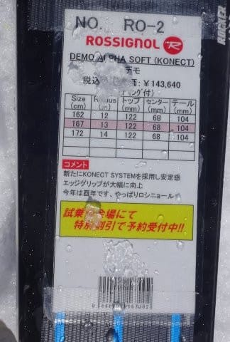

# 2018シーズンモデル，スキー試乗レポート第12回…ROSSIGNOL編

📅 投稿日時: 2017-06-01 02:35:57

🏷️ カテゴリ: [スキー板試乗](c0bd8048615710cee890e403a36cc9a2b.md)

先週末の日曜の，ファイナルかぐら．

かなり悲しい天気だったのは，

[レポートした通り](eeeea2731c4fd34e3a1bc13639c19f66f.md)ですが．

…なんだか，この日．

[このレポート](https://blogs.yahoo.co.jp/mouse_tyu/64244149.html#64244149)によると…

渋峠はすごく天気が良かったようですね．

すっきり晴れだったようですね．

なぜ，渋峠がすっきり晴天だったのに．

私が行ったかぐらだけ，雨＆ガスだったのか…（涙）．

とりあえず．

本日はスキー試乗レポート．

ロシニョール編です．

では，どうぞ～！

---

○ROSSIGNOL DEMO Alpha R21 Racing 167cm

基礎小回り用．

ロシニョールのデモシリーズとしての最高モデル．

しっかり強い，R21プレート付きの板になります．

履いてみたところ…

フレックスが強く，どっしり感もある，

グリップもガッツリ強い板です．

そのため，板のサイドカーブに沿って

かなり板なりに進んでいく感じを受けます．

乗り手がしっかり板をたわませていかないと，

板なりの方向に行かされちゃいます．

かなり雪が柔らかくなってから試乗したので，

柔らかい雪だとたわませにくく，

サイドカーブなりでしか滑れない感じが…

硬い雪で履いてみたかった…

でも，逆に言うと．

しっかりしたフレックスがもたらすかなり高いスピード耐性と，

R=13という小回り用っぽいサイドカーブにも関わらず，

そこそこのロングっぽいターンまでできるような，

そういう特徴を備えます．

どんな斜面でも滑れる自由度があるというよりは，

硬い斜面でスピードを出した時に合わせて

フレックスを作ってあるように感じたので．

やっぱり体力のある人が，しっかり硬い斜面を

スピード出して滑る板かな…

と思いました．

○ROSSIGNOL DEMO Alpha SOFT 167cm

基礎小回り用．

こちらは，先ほどのDEMO Alphaとサイドカーブは

同じですが．

強いR21プレートは乗っていないモデルです．

で．

今シーズンからはKonectとかいう

新しいビンディングが乗るようで．

昨シーズンモデルより，さらにしなやかさが

増した気がします．

…思い過ごしかな？

R21プレート付きの板と比べると，良くたわみます．

ターン始動時からすっとたわみ，

たわみのコントロールで弧を自由に作れる気持ちよさが

あります．

切り替え時にたわみが適度な反発で解放されて，

気持ちいいバネ感ですっと返ってくるもいい感じ．

傾けると板全体がしっかりグリップして回り始め，

遠心力で自動でたわんでギューンと回っていき，

切り替えでたわみがすっと解放される…

という感じで，ターンが気持ちよく作れます．

粘り，やわらかさ，安定感があり，

張りがそこそこあるのに，良くたわんで

板がすっと回ってきて，乗りやすく，

コントローラビリティが高い板．

それなのに，スピード耐性はそこそこあって，

板が叩かれることなく，しっとり感があります．

荒れた斜面でも軽快に板を動かしていける軽さも

あるし．

DEMO Alpha R21とはかなり違う板です…

気持ちいいのはミドルターン．

ホントのトップスピードを出していくと，

板がぐんぐんたわんでいき，ちょっと板の

グリップが耐え切れないところも出てくるので，

リアルハイスピードでの大回りは厳しいけど．

普通のゲレンデで滑るスピード域なら，

大回りっぽく引っ張ることもできるし．

軽快なので，小回りもやりやすいし．

結構軽快なミドル～小回り板として

おススメできる板かと思います．

## 💬 コメント一覧

### 💬 コメント by (しんちゃん)
**タイトル**: 信号機の色ｺﾝﾌﾟﾘｰﾄ
**投稿日**: 2017-06-01 22:33:40

ロシニョールは、これまでの黄色・赤色に次いで青色を出しているので信号機の色コンプリート、となります。

すごいロシニョールファンの方で、すぐに板をへたらせてしまう能力の高い方がいたなら、おうちに３色のデモアルファを「信号機」の様に並べて笑っているのではないか、と妄想しています(^^ゞ

もしもマスターシリーズを試乗されていたなら、印象を教えていただければなぁと思います。

### 💬 コメント by (Skier_S)
**タイトル**: しんちゃんさま
**投稿日**: 2017-06-02 01:06:01

をを！

確かに信号ですね…

3色コンプリートしている人はいるんでしょうか（笑）．

マスターシリーズは残念ながら試乗していません…

すみません…

