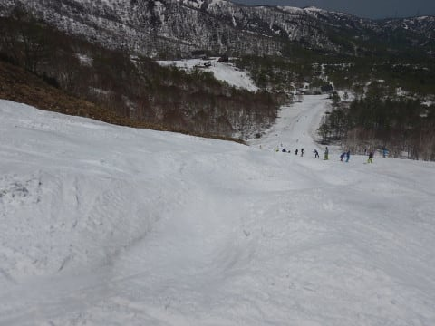

# 5月20日（土）のかぐらは…混んでたけど，思ったよりマシかな…雪は多くて楽しめるよ！

📅 投稿日時: 2017-05-21 00:53:24

🏷️ カテゴリ: [2017スキー滑走日記](c7d777cecfc91bdf0fa464ad62c6d49ab.md)

えー．

今日は予告通り，日帰りかぐらへ

行ってきたわけですが．

あ，今日はちゃんと朝イチから

かぐらへ行きましたよ！

志賀高原経由では行ってませんよ～（笑）

＃あんなバカなことは2度とやりたくないものだ…

というわけで．

本日のかぐらスキー場．

やはり．

かなり混みました…（涙）

でも，予想よりはひどくなかったかな～．

とりあえず，朝イチのリフト券の購入から

すごい列です（泣）．

リフト券を購入して，ロープウェーに

乗るまで，30分近く…（ちょっと涙）

でも．

まだ，ピスラボを滑ることなく

ゴンドラに滑りこめるし．

をををを！！

かぐらメインバーンもまだ雪たっぷり

じゃないですかっ！

メインバーン上部，さすがにこの時期ともなると，

この写真の左側の部分に土が出てきていますが…

でも，それ以外はコブ溝に土が出てくるような

こともなく．

この時期でも十分な雪の厚みがあることに驚き！

ジャイアントコースも，一部に

ちょっと土が出始めてきたけど…

この部分以外は，リフトに向かって

落ち込む部分もまだ雪がしっかりついてるし．

来週までは問題なく滑れそうですね～！

で．

今日はオープン予定じゃなかったはずの，

パノラマコース．

なんと．

パノラマコースのリフトが動いてるじゃ

ありませんかっ！！

午後はちょっと雪が薄くなってきた部分も

あったけど．

この時期にパノラマコースが滑れるとは…っ！

ただ，テクニカルコースは…

うーむ．

そろそろヤバげな感じ…

全てのラインで，コブ溝に土が

出てきてます（涙）．

来週はダメかな～．

…でも．

クローズ前の週まで，これだけ

雪が残ったというのはすごいこと

なんですけど…

今年は基準がくるってしまいます（笑）

って感じで．

雪がたっぷりあるかぐらですが．

…雪だけじゃなく．

人もたっぷりでした…（涙）．

リフト待ちも，午前中はクワッドリフトが

こんな感じ．

並行するペアリフトが午前中は動いていて，

そっちはそれほど待たずに乗れたんですが…

午前11時過ぎにはちょっと人が減って．

ほぼ飛び乗りになりましたが…

また午後1時半～3時近くは人が増えて，

5分待ち程度に延びた感じ…

これだけの人々が，

ゲレンデの掘削作業を必死に進めるものですから．

はい．そうです．

午後のメインバーンは．

いつものザ・コブ祭りです．

午後3時にはこれもんです．

全面コブフェスティバルです．

…しかし．

今年のメインバーン．

これだけのコブになっても，

コブ溝にまだ全く土が出てこないのが

すごいところ…

ってことで．

16時のかぐら高速リフトの営業終了まで

滑ったら．

ゴンドラコースを下山！

…ゴンドラコースも雪がまだいっぱいあるので．

来週までは問題なく滑れそう…

そして，連絡用のみつまたコースも．

まだ雪はしっかり残ってます…

よっぽどな高温になったらやばいかも

しれないけど．

ここも，来週まで行けるかな～．

ってな感じで．

リフト待ち15分を覚悟していたけど，

パノラマも滑れて，人が分散したからか．

最高7-8分待ち，昼休みタイムはほぼ飛び乗りと，

予想よりは混まなかったかぐらですが．

水曜の予想通り，今日は暑かったですよ～！

Tシャツで十分な気温でした…

ということで．

明日も高温になりそうですが．

まだまだ楽しめますよ～！！！
