# 2019年8月，4度目のモアルボアル・小6の娘Cカード取得1周年！その9…ダイビング初日の夕食は一緒に潜った人たちと

📅 投稿日時: 2020-08-05 01:11:59

…なんだか，夏休み直前になり．

また急激にコロナウイルス感染者が増えてきて．

この夏休み，沖縄に行けないんじゃないか？

という微妙な空気になりつつある今日この頃，

皆様いかがお過ごしでしょうか（時候の挨拶）

ヤバい…

沖縄県は県緊急事態宣言だとか言ってるし．

どうも，座間味島に行く高速船は便数削減

するみたいだし．

ゲストを断る宿が出てきたようで…

うむ．

スキーに行けなかったこの4月，5月に続いて．

潜りに行けなかったこの8月

という悲しい状態になるのか…！？？

そろそろストレスを発散しないと，

いろいろやばい感じなんだけど…（涙）

…コロナが．

コロナが憎い…

ということで．

もしかすると，今年は，

Cカード取って以来の1本も潜らない1年

になってしまう気配が高くなってきた

今日この頃．

そんな危機感を感じつつ．

昨年のダイビング旅行記へ，Go！

---

ってなことで．

3本ダイビングした後に，さらに1時間半

泳ぎ続けた娘でしたが…．

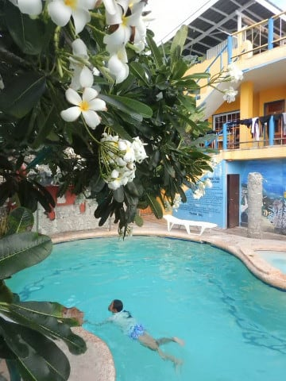

しかし，今日は一緒に潜った人たちと，

午後6時にレストラン待ち合わせで

一緒に夕食の約束をしたので．

…これからシャワーを浴びて髪の毛を

洗ったり乾かしたりする時間を

考えると，もう夕食を食べに

行けるギリギリいっぱいなんですけど！？？

私「娘ー．もう出ないと，夕食に間に合わないよ！」

娘「まだ！まだ大丈夫！

　シャワーも5分で終わらせるから！

　ギリギリまで泳ぐの！」

…お前…

プールにかけるその執念は，一体何なんだ…

もう，日が暮れかけてるんだけど…

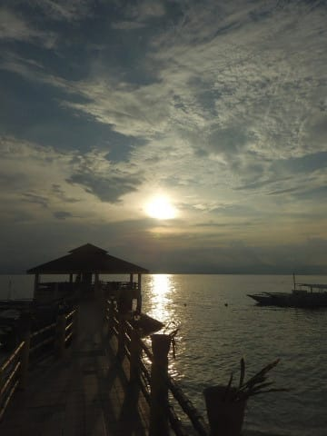

ってな感じで．

日が暮れかけた中，

薄暗くなってきたプールから

娘を強引に引き揚げるという．

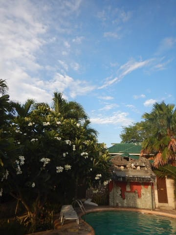

ダイバーになってからも，

幼稚園時代からあまり変わらぬ

いつもの営みを実行したあと．

部屋に連れて帰って，一瞬でシャワーを

浴びさせ，着替えさせて…

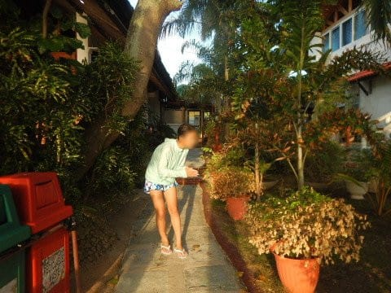

そして，モアルボアルの街を歩いて，

夕食へ！

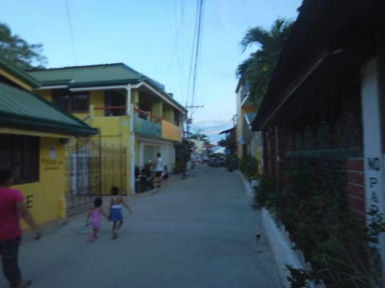

今日のお店は…

そうです．

毎度おなじみ，魚介類が揃った

Little corner.

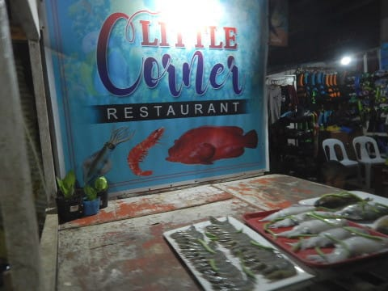

レストランは，海に面しているので，

ちょうど夕日が沈んだ後の，

きれいな夕焼けが目の前に

広がります！

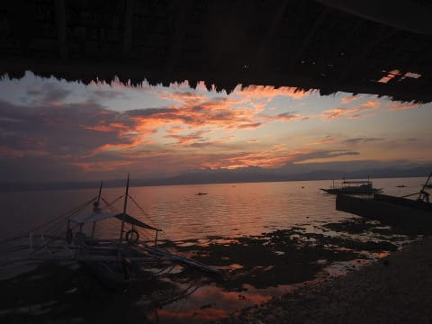

見事な景色…

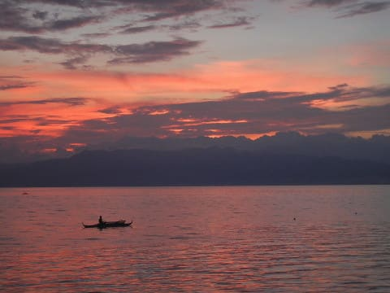

こんな景色を眺めながらのビールは

最高っ！

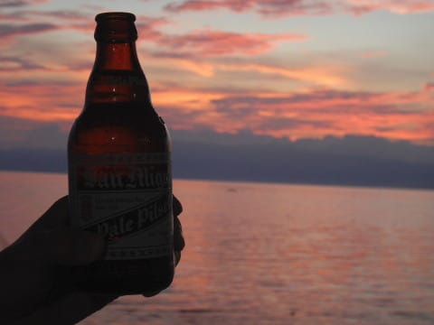

ってないい景色を眺めながら，

今日一緒に潜った皆さんと夕食タイム．

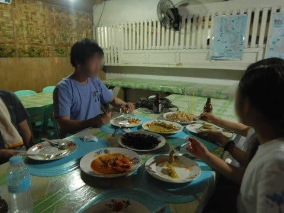

座間味ではペンション星砂さんで

夕食なので，いつも家族だけで

食べる感じだけど．

こうやって，他のダイバーさんと

話ながらの食事は楽しいですね～！

しかし，やっぱり小学生のダイバーは

かなり珍しがられますね…

…そうですよね．

私も，長いことダイビングやってますけど，

うちの娘以外の小学生ダイバーに

まだ会ったことないですから…

ダイバーの皆さんは，自分がCカードを

取った時を思い出しているようで，

一緒に行った人「小学生でCカード取れるんだ…」

私「ジュニアオープンウォーターが10歳で取れて，

　15歳で申請すれば，普通のオープンウォーターに

　切り替えられるんですよ」

一緒に行った人「ジュニア用の講習があるんだ…」

私「いや…そこが，ジュニア用の講習ってのはなくて．

　ジュニアも大人と同じテキストとテストで．

　実習も大人と同じ項目を全部こなすんですよ…」

一緒に行った人「小学生であの学科と講習やるんだ…」

私「学科は，私がテキストを説明することで

　なんとか理解出来た感じです…」

一緒に行った人「実習は怖くなかったの？」

娘「全然．ゴーグル・フィン無しの200mの泳力テストも，

　10分間水面に浮き続けるってのも全然平気！」

私（まぁ，放っておいたら2時間でも3時間でも

　プールで遊び続ける，水大好き娘だからな…）

という感じの，想定質問通りの

質疑応答が行われたのでした…

ってか．

うちの娘の，海洋実習中の貫禄のある姿を

見せてあげたいくらいです…

ってな感じで．

このお店では絶対食べるべき，

イカスミのパスタは相変わらず

みんなから絶賛で．

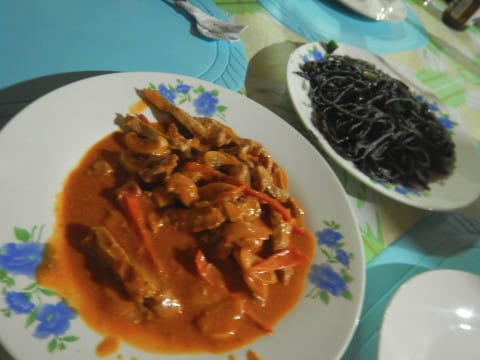

いろいろ楽しい時間を過ごし．

最後は，みんなで通り沿いのお土産屋さんを

いろいろはしごして．

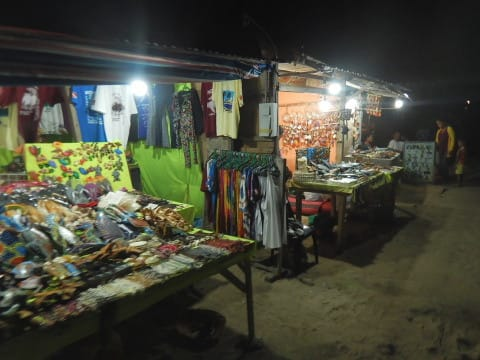

初日の夜が，終わっていったのでした…
