# スマートウォッチ，Amazfit PACEを買ってみた　その10…スキーでのGPS記録を詳しく見てみる

📅 投稿日時: 2020-05-29 00:17:22

ってなことで，

Amazfit PACEの使用レポートを書いてきましたが．

[第1回　Amazfit PACEとは？](ed3d5d801313ccbb4de704222aba3cdc0.md)

[第2回　海外通販での注文から到着まで](ee08698196e276d6c47312dbced43bf34.md)

[第3回　到着＆開梱の儀＆初期設定](ed1bf51c8f4791b77b1b4731aae9be689.md)

[第4回　バンド交換＆時計本体の設定画面](e3928a10367db811404c9ce7b1d95f3fe.md)

[第5回　運動記録…スキーで使うとこんな感じ](e494f1a5f2dcecb6c986e7d9821c27fe4.md)

[第6回…過去のスキーの記録を時計本体で見る＆GPXファイルをGoogle Mapで見る](ef027dd244e860f24105fa098fbeedce4.md)

[第7回…スキーログ以外の，時計本体の機能も盛りだくさん](ea509a7c711b06640acb6477bdc2890df.md)

[第8回…スマホアプリを使ってみる](e1f31851c8b18814cc3cbc862eba42859.md)

[第9回…スマホでスキーのログを見てみる](e91749b873f56737982d3772e365e3b39.md)

今回は，Amazfit GTRの欠点だったGPS精度．

Amazfit PACEはGPS精度が高いということで

期待して買ったわけなので．

…果たして，Amazfit PACEはGPS精度が

高いのかどうか？？

ってところを，Amazfit GTRとPACEを

比較しながら，細かく報告して

みましょうか…

まずは，Amazfit PACEのGPS軌跡を

スマホで見てみるわけですが．

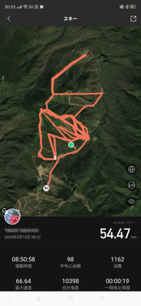

こいつを拡大してみると…

Amazfit PACEのこの記録，結構きれいに

ルートに沿って軌跡が残ってる

ように見えますね…！！

コースからはみ出したり，林の中を

突っ切った軌跡になって無いようです…

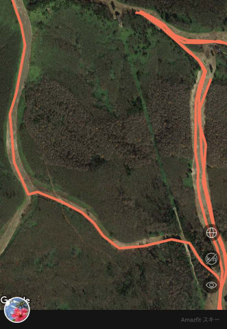

もう少し拡大すると，

Amazfit GTRでは，水色のコースを通った際の

軌跡が，こんな感じで森を突っ切ってましたが…

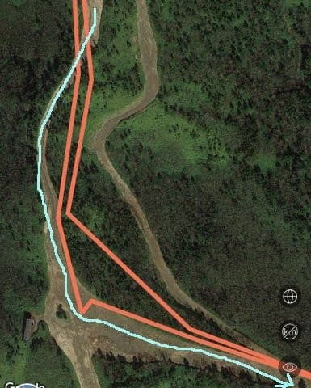

Amazfit PACEでは，軌跡はコースから

はみ出しておらず，きちんとコースの

中を通った軌跡になってます！

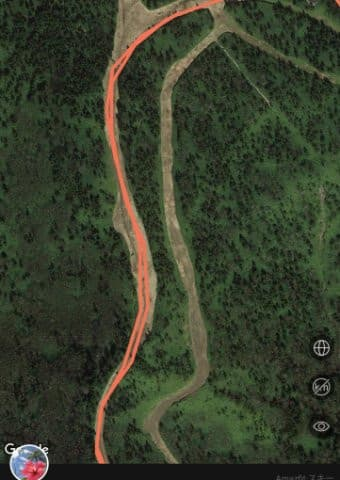

前回，Amazfit GTRの軌跡では，

赤丸のところ，リフトに乗るたびに

毎回5林に50mほど突っ込む

という，恐ろしい軌跡になってましたが．

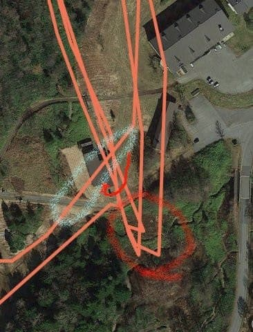

Amazfit PACEでは，軌跡が森の中に

突っ込むことは無く，ちゃんと水色の点で

示したリフト乗り場に向かっています…

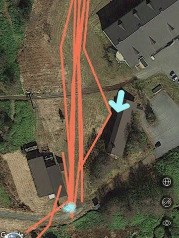

途中一回だけ，水色矢印のトイレに

立ち寄っているのが分かりますね…

そのほかにも，一の瀬ファミリーを

滑った記録を見てみても，

Amazfit GTRでは，赤矢印と青矢印の

ところ，カクカクした軌跡になってますが…

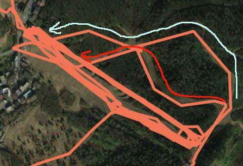

Amazfit PACEの方は，

なめらかな線になっていて．

特に水色で囲ったあたり，GTRのときは

林の中をショートカットしてたけど，

こっちはきれいにコースをたどってます…

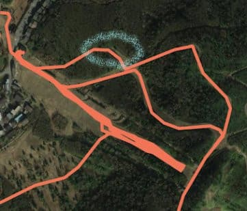

そのほか，GPS電波が弱くて

Amazfit GTRだと線がとぎれとぎれになる

一の瀬ダイヤモンド．

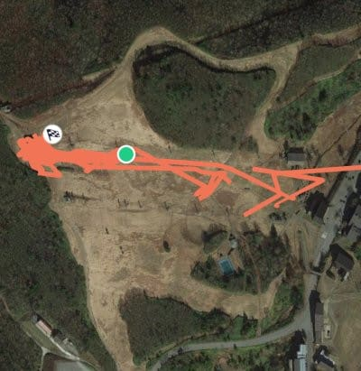

これも，Amazfit PACEだと，

ちゃんとコース上，線が途切れず

繋がってますね…

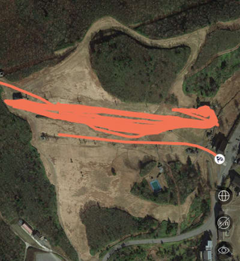

一本だけ，下にずれた線がありますが．

これは，この1本だけリフトを降りてから

平らな所を移動して滑ったからで．

登り始めるとGPS記録がいったん止まり，

下り始めてからGPS軌跡の記録が始まる

Amazfit PACE．

リフトを降りてから平らな所を移動すると，

軌跡のスタートがリフト降り場から

ちょっとずれちゃいます…

でも，Amazfit PACEのGPS記録，

かなり正確です！

Amazfit PACEの他の記録を見てみると．

この画面なんかだと，赤い点で示した

4か所のリフト乗り場に向かって，

正確に軌跡が繋がってますし…

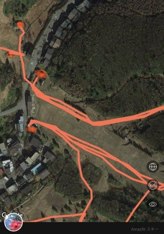

この拡大図．

どこの木の切れ間を通って滑ったかまで

分かる正確さで記録が残ってます…

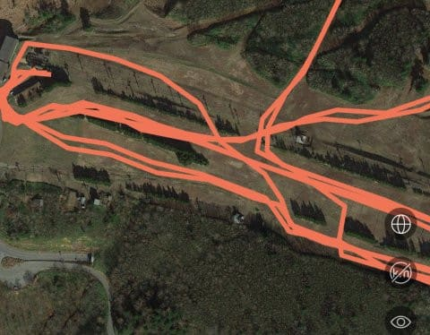

スマホ画面を見ただけでも，Amazfit PACEの

GPS精度が，

[ちょっと残念な感じのAmazfit GTRのGPS精度](eeb684c478255cfab52c0b4bc023f3d47.md)と

全く比較にならないことが分かりますが…

さらにこのAmazfit PACE．

以前のレポートで書いたように，この[GPS記録を
GPXファイルに書き出して](ef027dd244e860f24105fa098fbeedce4.md)，Google Mapとかで

詳しく見ることができるので，

今度はGoogle Mapで，もっと細かく見てみましょう…！

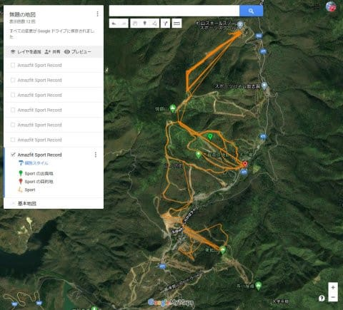

焼額近辺を見てみると…

この時点だけで，奇跡はコースからはみ出して

おらず，精度が高そうなのが感じられます…！

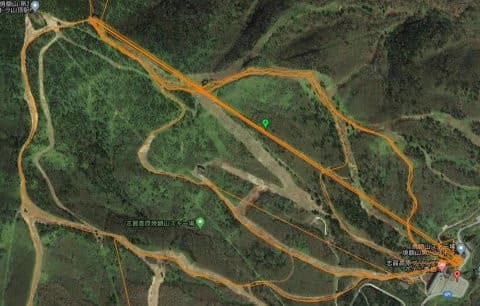

さらに拡大していくと．

なんだか，深回りしているところは

そのターン弧まで見えてるんですが…？

GPXファイルを読み解くと，Amazfit PACEの

GPS記録間隔は1秒ごとのようなので，

数秒かかる中回り程度であれば，

ターン弧が記録に残っちゃう分解能です…！！

すごい…

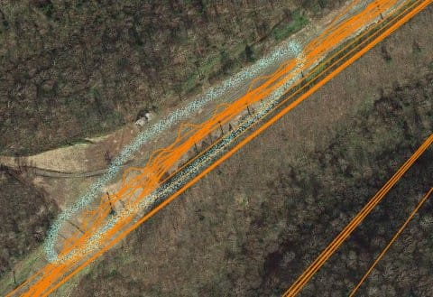

一の瀬ファミリーのパノラマコースを滑った

軌跡も，きれいにコース上に残ってますし…

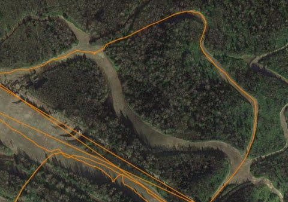

タンネの森を滑った記録では，

どの木とどの木の間を通ったかが

分かるレベルの記録なんですけど…！

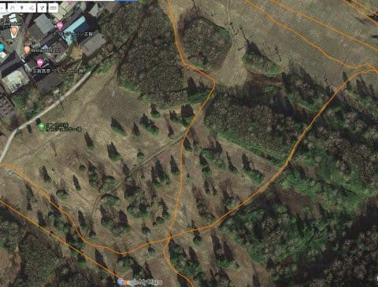

そのほかにも，焼額の第1ゴンドラ，

GSコースのこの部分．

矢印の木の右側か左側を選んで滑るわけですが．

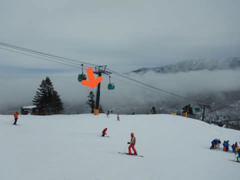

写真の矢印の木を，地図でも矢印で

示してみましたが．

水色で示した，木の左側を選んだパターンと，

赤で示した，木の右側を滑ったパターン．

それぞれ2本ずつってのが分かりますね…

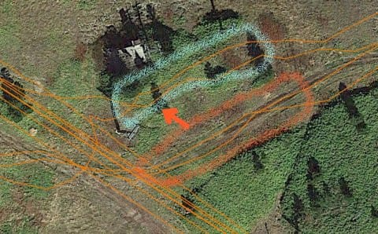

そして，同じくGSコースの記録ですが．

人が多い時は，私はこの矢印部分で

コースの端に寄って止まることが

多いのですが…

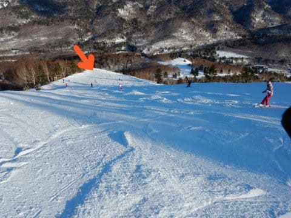

（この写真でここがどこか分かるのは，

　焼額に通うマニアだけだと思うんだけど…）

そこでコースの端っこに寄っているのが，

ちゃんと分かりますね…

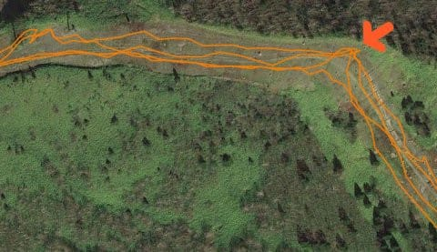

って感じで．

細かく見てみると．

Amazfit PACEのGPS，1-2mくらいの

精度で記録されている感じです…

いや…すごい．

すごい精度です！！

毎回林の中に突っ込んで滑ってることに

なっちゃってる，Amazfit GTRとは全く

比較にならないGPS精度です…！！

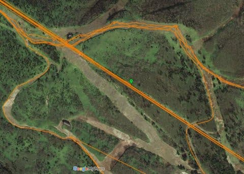

…ってな感じで．

Amazfit PACE．

8000円ちょいの時計としては，驚くべき

機能も多さと，GPS精度の高さです！！

…が，惜しい．

これで，高度計の精度さえ高ければ．

かなり無敵のスキー用スマートウォッチなのに…っ！！

高度計が不正確なのが，惜しい…

惜しすぎる…

## 💬 コメント一覧

### 💬 コメント by (ブイン)
**タイトル**: Unknown
**投稿日**: 2020-05-29 21:45:38

いつも楽しく拝見させて頂いてます。

私もGPS時計でスキー滑走の位置ログを取ります。

時計のボディが金属の物はGPS受信が不正解になりやすく、プラスチックボディの物は正確性が増す傾向があるように感じました。

### 💬 コメント by (Skier_S)
**タイトル**: ＞ブインさま
**投稿日**: 2020-05-30 01:24:37

コメントありがとうございます～！！

あ，GPS付き時計，何を使ってらっしゃるのでしょうか…？

やはり，金属ボディはGPSアンテナの感度を取るのが

難しいようですね…

プラボディ＆ベゼルは，GPSアンテナの感度が取りやすいのでしょうが，

ボディやベゼルが傷つきやすいのが痛いところ…

