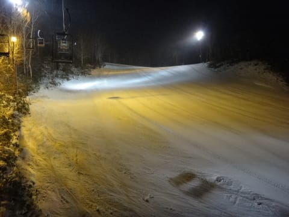

# 12月26日の志賀高原・焼額山…雪積もらず．混んでます（涙）

📅 投稿日時: 2015-12-26 22:57:26

ってなわけで．

本日も志賀高原に来ているわけですが．

あーーー．

足りません．

雪が，圧倒的に足りません（涙）

本日も．

焼額は第1ゴンドラ，第3高速は動かず…（泣）

23日から滑れるリフトは全く増えてません（涙）

むしろ，23日よりも山頂のブッシュエリアが

広がってるかも…

奥志賀も，ゴンドラ，第2高速ペアはまだまだ滑れず．

一の瀬も，ファミリー正面バーンがまだ空いていません．

寺子屋も西舘も東館山も，まだ全然滑れません（泣）．

…皆さんの祈りが足りなかったに違いありませんっ！！！

ちゃんと真剣に祈りましたかっ！？←自分の祈りが通じなかったことを人のせいにしていないか？？

ということで．

ゲレンデにはそれほど積もっていないのに．

道路には十分積もっているという皮肉を感じる，

本格つるつる雪道を登って…

やってきました焼額！

山頂の朝の気温は，マイナス7度と

冷え込みは十分！

（あと雪さえ降れば…）

ゲレンデ状況は，一見まともそうにみえるけど．

朝イチから山頂付近，結構ブッシュさんがいましたが…

とはいえ，人工雪を付けたコース下半分は，

朝イチはけっこうよかったかな！！

…と，思ったのもつかの間．

営業開始1時間後には…

…な，なんだ！このゴンドラ待ちはっ！

まだ朝9時半なんですけど！？？

当然，平行してかかるペアリフトも…

混んでます（涙）

どうやら，今日から年末休みという，

恵まれた人も多いようで．

かなりの人出です…

んで，ゲレンデは…

ああ．だめだ．

コース全面の，人．人，人っ！！

（ごく一部スキー用に改造されたサイボーグ含む）

人が多いので，人工雪がない山頂部分は，雪が削られて

デンジャラスブッシュエリアが絶賛拡大中で…（悲）．

そして，人工雪を付けた中間点から下は，

上のやわらかい雪がはがされて，下地の

硬い人工雪が表に出てきて，ツルツルの箇所も…（涙）

でも．

だけど．

今日は，私の予想通りなら．

雪がそこそこ降って，ブッシュもツルツル人工雪も

隠してくれるはず…っ！！

…

…あら？

ええ？

ど，どうしたことだ…

天気予想，外したかっ！？

…残念なことに．

雪がちらちら，時折強く…

という予想は見事に外れ．

曇り，一瞬気雪がちらちら，時折晴れる

というのが，実際の天気でした…（涙）．

おかげで．

雪が増えるどころか，減っていく…

コース上部，そこかしこにこんな小石が…（泣）．

昼に一瞬ゴンドラ待ちは短くなったけど．

この日は午後もゴンドラ待ちは長く…（残念）．

ゲレンデも，夕方になっても混雑したままで．

そのおかげで，ゲレンデも荒れていき…←当たらなくていい，こういう予想は当たるのね

かなり残念な感じで，日が暮れるリフトストップタイムまで

滑り続けたのでした…←やっぱりそれでも最後まで滑るのね

…で．

ナイターです．

そう．ナイター．

なんと．

本日．

雪不足というのに．

焼額山．

当初の第3高速のナイター予定を変更して．

第4ロマンスで，本日ナイターを実施しました～！

すばらしぃっ！（ぱちぱちぱち）

＃一の瀬ファミリーのペアリフトと，サンバレーもナイター実施したみたい…

で．

昨シーズンは，焼額はナイター前の圧雪がなくなったけど…

今シーズンは…

やったーっ！ナイター前の圧雪，復活！

もう．最高っ！

昼間は激混み荒れ荒れバーンだったけど．

このナイター，人がいない最高のシマシマバーンだよっ！！

昼間は残念だったけど…

ナイターは最高！（リフトは遅いけど…）

いやいやいや．

今シーズン最高の数本を満喫！

当初のリフトを変更してまでナイター営業してくれて，

ありがとう～っ！

とりあえず．

このナイターがあったので，今日は何とか満足して

終えることができたのでした…

で．

ナイター中から，雪が降り始めてきたので．

うーむ．明日は積もってくれないかな～．

今のところ，焼額第1ゴンドラは29日の月曜から営業開始らしく，

日曜は現時点では営業予定はないようです（涙）．

ただ，明日の朝，ものすごーーく積もってたら，予定変更して

日曜から営業ってことも，もしかしたらありうるかも…

ってことでしたが．

うーーーむ．

これから明日の朝にまで，どっさり積もってくれないかな～．

できれば1mくらい…←無理だから

## 💬 コメント一覧

### 💬 コメント by (はなげ親分)
**タイトル**: 混雑していましたね
**投稿日**: 2015-12-27 09:12:51

快適だったのは初めの3本くらいで、あとは人と石ころを避けるのに大変でした!!

S様のようにミリ単位で避けることが出来ないので、板と心にダメージを受け3時には退散しました。

今日は出遅れて、ただいま2ゴン2

本目乗車中です。

### 💬 コメント by (やっさん)
**タイトル**: 12月から拝見させて頂いております。
**投稿日**: 2015-12-27 15:42:35

突然、失礼します。

京都市在住で、３年前から年末年始を家族で志賀高原で迎えております。

今年は雪が心配で、志賀高原の状況を毎日拝見させて頂いております。

状況がよくわかりありがとうございます。

今晩、京都を出発致しますU+2757

リフト混んでますね！

明日からはもっと混みそうですね！

でも1年ぶりでワクワクしています！！

### 💬 コメント by (ゆうじろ～)
**タイトル**: いつも応援しております
**投稿日**: 2015-12-27 18:21:22

11月から、読者になりました！

毎週の生スキー情報、楽しみにしております。

約15年振りに、スキーをやりました！

カービングを知らない旧人類だったわたしは、今の板の性能に、衝撃と技術の進歩を感じます・・・

でも、昔の板の方がよかったかな～・・・

志賀がホームゲレンデのようですので、お逢い出来る確率は少ないと思いますが、丸沼・岩倉方面にお越しの際は是非、宜しくお願いいたします。

今後の、ご活躍をお祈りいたします。

### 💬 コメント by (Skier_S)
**タイトル**: ご愛読ありがとうございます！
**投稿日**: 2015-12-27 22:26:35

＞はなげ親分さま

あの後も，結局ゴンドラ営業終了まで

すごい混雑がつづきました…

だめです．この年末は，だめです…（涙）

＞やっさんさま

コメントありがとうございます～！

年末年始，志賀高原ですか…

我が家と同じパターンですね！

上林のチェーンチェックから先の

上り坂は，最初は雪がなくてなめてかかりますが，

途中から気合が入ったツルツル道路

になってますので，お気をつけて上ってきてください．

明日から焼額第1ゴンドラ動きます．

私はひたすら第1ゴンドラ滑ってますので，

第1ゴンドラ滑ってたら私を見かけるかもしれません．

では，よいスキーを！

＞ゆうじろ～さま

コメントありがとうございます．

こういったコメントが，私のBlogを書く励みに

なっておりますので，大変うれしいです．

…しかし，今シーズン復活ですか．

15年の道具の進歩はすごいですよ．

滑り方も，昔と変わってます（＾＾

最近の板は何もしなくても曲がりますので…

これになれると，昔の板には戻れなくなります．

また，今後もご愛読のほど，よろしくお願いします～

