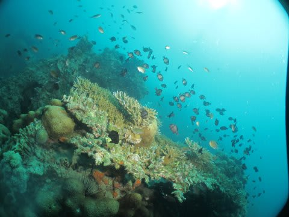

# 2013年9月　子連れタイ・タオ島ダイビング旅行記　その18…3日目のダイビング終了

📅 投稿日時: 2013-11-02 00:25:08

ってことで．

外洋を2本潜り終えたら，船は港に向かって戻ります…

途中で，娘はぐっすりお休み．

こうして揺られること1時間．

船は，ホテル前に到着しましたが…

ガイド「戻るのが遅くなりましたので，皆さんは乗船したままで，

　船の上で食事をとってください～．このまま午後のポイントへ向かいます～」

…ってことで．

ホテル前に着いたら，午後だけ乗船のお客さんとお弁当を乗せた

水上タクシーがやってきて．

お弁当を受け取ったら，船は直ちに出港．

そのまま船の上でお昼タイムとなりました．

…どーでもいいけど．

娘，まだ寝てますね～…

んで．

お昼を食べ終わると，船はもう午後の1本目のポイントに着いてます．

…当然，午後はあまり多くを期待できない島沿いのポイント…

ってことで．

食事が終わったら，午後1本目のブリーフィング開始．

…どーでもいいけど．

娘．まだ起きてませんね～…

みんなが午後の1本目のダイビングのために，海に飛び込み始めたころ．

ようやっと起きだした娘…

「いってらっしゃーい」

…午後の1本目は，私が娘とお留守番．

娘が寝ていて食べそびれたお昼を一緒に食べます．

…で．結局．

今日の昼は下船しなかったので．

なし崩しに今日は午後まで乗船することになった娘．

…このポイント．

船が止まっているところは深くて底が見えないので．

泳いでも何も見えないし．シュノーケリングは無理だなぁ…

ってことで．

食後は景色なんかをみつつ…

妻が帰ってくるのを待つこと1時間．

…ひまだなぁ…

と思ったころ，妻が戻ってきます…

そして，水面休憩を1時間ほど．

今度は，私が潜りに行く番です．

ってことで．

ダイビングがスタートしたわけですが…

なんだ？この透明度は？

10m先が見えてない…(がっくし）

…あまり，沿岸のポイントに透明度や大物を求めてはいけませんね…

…ってことで．

今，ログブックを見返しても

「なに見たっけ？」

と，思い出すことができないような1本が終了して．

本日の全ダイビングはおしまいです…
