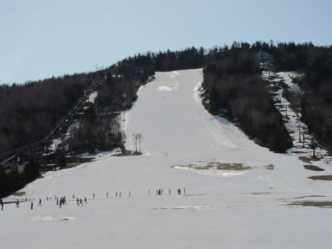

# 4月16日の志賀高原は…暖かい穏やかな春スキーの一日だけど，終末感が漂うゲレンデ（涙）

📅 投稿日時: 2016-04-17 00:10:21

🏷️ カテゴリ: [2016スキー滑走日記](c70c67ed5248e9432b899dcd5747048bb.md)

ということで．

ナイターがない本日．

早く寝ようかな…と思いながら．

なぜか，遅くまで飲んでしまったので．

深夜更新になってしまったSkier_Sです…

たしか．今朝も4時間睡眠で出てきた気がするのですが…

で．

本日ですが．

天気も良く．

日曜の荒天予想から考えると，嵐の前の静けさというか…

穏やかな春スキーの一日でした．

ホームゲレンデ焼額が終了しているので，

一の瀬スタートの本日．

…うむ．

これは．

もしかすると…

凄い雪が減ったのでは？？←もしかしなくても減っているから．すごく減ってるから

先週は無事だった，一の瀬ファミリー下の緩斜面．

なんだか，今週は穴が開いてるんですけどっ！？？

…雪が減ったなぁ…（涙）．

そして．

山頂に出てみると…

いや．

天気自体は．

すっきり晴天で気持ちいいですね～．

気温は朝イチから+5度以上と，高めですが．

晴天朝の放射冷却で冷えており．

朝イチは，そこそこ締まった，硬めのいい雪ですね～．

だけども，ちょっと圧雪が荒め…（涙）

で．

ダイヤモンドスキー場に雪がないのはいいけど…

一の瀬正面バーン上部も…

あれ？

な，なんですかっ！？？？

ブッシュが出ているという次元ではなく，コース真ん中に

ポッコリと穴が…（激涙）

雪があるところも，こんな感じで…

もうすぐ穴が開きそうな勢い（泣）．

これは…

明日，雨が降ってしまうと…

…

…

…考えたくないけど．

明日で，正面バーン上部，まともに滑れなく

なっちゃうのでは？？（戦慄）

そして，ファミリー下部の緩斜面も，真ん中にポッコリと

大穴が開いてます…（愕然）．

なんてこった…っ！！

しっかり人工雪をつける一の瀬ファミリーが．

4月中旬でこんな状況になったのって…

わが人生で初めての経験なんですけど…（涙）

当然，パーフェクターはもうクローズしてますし．

パーフェクターを下から見るとこんな感じで．

もう，終わってますね…（泣）．

パノラマコース用の，雪出しゲレンデとして使われているようです．

意外と，緩斜面の天狗コースが，ブッシュも土も

出ておらず，積雪的には一番ましだったかも…

（楽しくないけど）

つぎに，パノラマコースを見てみると…

まぁ，意外とまともですが．

天狗に比べると，まだブッシュやら何やらが出ています．

うーむ．

寺子屋にいくと，まだマシだったりしないかな？？

と，無駄と分かっている期待を持って，

寺子屋に行ってみますが…．

…

…雪，減りましたね（泣）．

昼間の気温は，寺子屋でも⁻10℃以上と高めで．

寺子屋のコース上も…

寺子屋ですが…

いや．語るまい．

あえて多くは語りません（落涙）．

まぁ．

決して楽しくはない感じです…

で．

一の瀬ファミリーに戻ってみますが．

リフトストップのころには…

うむ．

正面バーン上部の土エリア．

…すごい広がってませんか？？？

そして，下部エリアも，一部は水浸しで，

川と化してます…（とめどない涙）．

で．

本日の営業終了後，

一の瀬ファミリー下部．

この写真での右側から雪出しを始め．

左側に雪を寄せ始めました…

ってことなので．

今後，下から見て右半分は放棄してでも．

なんとか，左半分の一部でももたそうとするようですが…

…でも．

明日も強烈な南風が吹き付けるような雨の天気となり．

さらに来週も，また雨になる日がありそうなので．

もし，仮に来週，一の瀬正面バーンを滑れたとしても．

それは「滑って降りれる」レベルであり．

一の瀬を楽しく滑れるのは，今週が最後なのではないか…

という気がした，本日の

一の瀬ファミリースキー場だったのでした…（したたり落ちる涙）

ああ…

でも．

明日は雨なんだよな…（泣）

## 💬 コメント一覧

### 💬 コメント by (Goku)
**タイトル**: Unknown
**投稿日**: 2016-04-17 06:33:02

アアアア～～～～！

なんじゃこりわー

酷すぎる。

今日雨降ったら、終わりですね。

それにしても、修旅が入ってるみたいだけど、こんな時にじゃ可哀想ですね。

### 💬 コメント by (takac)
**タイトル**: うかつでした
**投稿日**: 2016-04-17 13:09:08

今回、所用で午前中だけの滞在でしたが、一の瀬・寺子屋にいました。

Sさまは奥志賀だろうと思い込んでたので気づかなかった～。

今シーズン最後でしたのでお会いしたかったですが、また来シーズンお声掛けさせていただきます。(^o^)/

その際はシルバーステッカーお願いします！

片道450kmのtakacでした。

### 💬 コメント by (Goku)
**タイトル**: 撤収しました
**投稿日**: 2016-04-17 13:55:37

ステッカーありがとうございました。

えっと、11時前に熊の湯・横手に移動したものの、雨風激しくリフト全滅、潔く帰りました。

既に家でくつろいでます。

全国的に暴風雨で、北陸新幹線も止まっているそうです。

### 💬 コメント by (いか)
**タイトル**: Unknown
**投稿日**: 2016-04-17 19:40:54

これはなかなかにひどいですね…

普通の年ならもうそろそろコース閉鎖では、という感じですね。

こちら八方は、2週前から雪こそ減ったものの滑れないコースはできておりませんでした。コブの溝は黒菱含めかなりヤバイ感じです。私はGW前半で今季終了の気分です...

本日は朝からゴンドラ動かず、うなぎを食べて帰ってきました。　動かない前提で昨日飲み過ぎました（笑）

### 💬 コメント by (Tomoko.Y)
**タイトル**: 奥只見♪
**投稿日**: 2016-04-17 21:45:52

かぐらに少々飽きたので、土曜は奥只見に行ってきました。

他と比べれば豊富な雪量ですが、一番下の急斜面は半分土が出ていてびっくり！

上からは見えないので、スピードを落とさずに右側に入ると泥んこにダイブします…。

来週は日曜にかぐら予定ですが、きっとイモ洗いのプール状態でしょうね…。

### 💬 コメント by (Skier_S)
**タイトル**: シーズン終わりっぽい…（涙）
**投稿日**: 2016-04-18 01:06:03

＞Gokuさま

今日は悲惨な一日でした（涙）．

我が家も1時半過ぎまで様子を見ましたが，

動かないので帰りました…

私は1泊2日だったから良かったのですが，

今日日帰りってのはちょっと残念でしたね…

＞takacさま

午前中は，11時近くまで一の瀬メインバーンを

ぐるぐるしてましたよ～！

寺子屋は午後に移動しましたが…

そうですか．

午前中は一の瀬にいらっしゃったんですか．

メインバーンを滑っていらしたなら，

20000mクラブな方々と滑っていた私を

見かけているかもしれません…（＾＾；

＞いかさま

あら？

八方はコース閉鎖がそれほど無いんですね…

まだ，パノラマは大丈夫そうなんでしょうか？？

ってか，GWまで滑れそうなんですか？？

＞Tomoko.Yさま

奥只見は混んでなかったのですか？？

うーむ．

これからのかぐらは激込みでしょうね…

GWまで雪はもちそうでしょうか？

GWは，リフト30分待ち超えそうな勢いじゃ

ないでしょうか…

### 💬 コメント by (いか)
**タイトル**: Unknown
**投稿日**: 2016-04-18 07:41:46

八方は滑走エリア自体は例年通りの上部が維持されています。パノラマは小谷側に雪を寄せているのでそちらはブッシュなどは全くないです。気持ちいい大回りバーンでした^ - ^

グラートは平らなところがかなり狭くなっていますが急斜面はOK、スカイラインはリフト前斜面がかなりヤバい感じです。

概ねどこもGW前半といった感じですが、なんとかあと2週間くらいは持つのではと思っています。鬼門はうさぎの下山でしょうか…

### 💬 コメント by (Skier_S)
**タイトル**: いかさま
**投稿日**: 2016-04-19 02:56:08

なんだか，志賀より八方の方が雪がありそうに

感じますね～．

パノラマも，意外といいみたいで…

志賀はもう気持ちいい大回りバーンはありません（涙）．

で，動画のコブは兎ですか？

### 💬 コメント by (いか)
**タイトル**: Unknown
**投稿日**: 2016-04-19 22:42:16

動画はグラートの急斜面です(^^)

最後の1本だけは、黒菱の整地横の斜面です。

日曜日の南風で八方もかなり溶けてしまったらしく、木曜日の雨次第では大回りができるのは今週末までかもしれませんね...

### 💬 コメント by (Skier_S)
**タイトル**: いかさま
**投稿日**: 2016-04-20 01:03:45

グラートがきれいなコブになってるんですね～．

しかし，八方も今週末でダメですか…

GWはやっぱりかぐらしか残らないのかな？？（涙）

