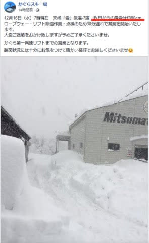
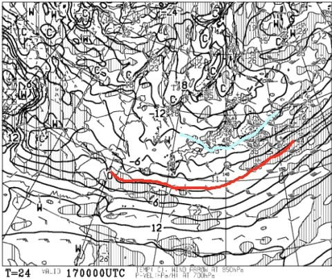

# 12月19，20日の週末の志賀高原スキー場の天気は？…土日とも雪．土曜朝はかなりの積雪でパウダーデー，日曜も降り続けるよ

📅 投稿日時: 2020-12-17 02:23:42

🏷️ カテゴリ: [スキー天気予想](c6554f5c3c106093b511a8daae23757e8.md)

えー．

降ってますね…

天が11月中の高温の穴埋めをしなきゃ

いけないと思っているのか．

ハンパなく降ってます…！

（[北信建設事務所道路気象情報ページ](http://hokushin.pref-nagano-roadcamera.jp/)より）

かぐらでは，一晩での積雪が80cmにも

なったようで．

（[かぐらスキー場Facebook](https://www.facebook.com/snowkagura/posts/3363625583764738)より）

新潟県の一部では，一日の積雪が

1mを超えるところもあったようですね…

ってなことで．

降るのと降らないのが極端すぎるんだよ

と，声を大にして空に向かって叫びたい

今日この頃，皆様いかがお過ごし

でしょうか（ここまでが時候の挨拶）

…ホントに，平均的に降ってほしい…

というわけで，今週末にかけて．

熊の湯…第3クワッド（18日金から）

奥志賀…第1高速ペア，第2高速ペア（18日金から）

中央エリア…山の神（18日土から）

の営業案内が出たようですが．

おそらく今週末は，

一の瀬ファミリークワッド，高天ヶ原クワッド，

タンネも動くと思いますし．

運がよければ寺子屋も動くかも…

横手も山頂から滑れるようになるんじゃないかな？

奥志賀第4が動かず，焼額とつながらないのは

惜しいですが．

今週末は，焼額から高天ヶ原まではつながり

そうですね…！

ということで．

この週末にかけては，期待が膨らむ

積雪量なわけですが．

週末の天気は果たしてどうなるのか…？

水曜深夜恒例の今週末の天気予想，行ってみよう！

まず．

木曜17日の500hpa天気図を見ると．

うおおお！12月では珍しい，

超大雪の目安，-36℃線が

志賀高原にかかってますよ…！

これを見ただけでも，17日も

かなりの雪になりそうな感じ…！

この日の850hpa気温図は，

赤い0℃線は奄美大島や小笠原近辺まで

下がってるほどで，

水色の-9℃線が太平洋側まで下がって

いるレベル…！

これは，冷える．

志賀高原では，終日-10℃程度の冷え冷え！

当然，木曜の地上天気図を見ても，

日本海に寒気の噴き出しによる降水域が

かかってますし．

まぁ，また一晩で志賀高原には20cmくらい

積もるんじゃないかな…

新潟方面にはもっと積もりそう．

そして，翌18日の金曜．

850hpa図を見ると，17日ほどの

冷え込みではなさそうですが，

それでも水色の-6℃線が志賀高原に

かかるレベル．

昼間も-5℃以下をキープしそうな感じ．

で，この日の地上天気図は…

日本海側に降水域がかかっているものの．

降水域は17日より小さいので，

雪は降るものの，16日みたいにドサドサは

降らないかな…

次に，肝心な週末の土曜19日．

850hpa気温図を見ると，この日も

水色の-9℃線が長野県にかかっているので，

この日も冷え冷え！

志賀高原，朝は余裕で-10℃を下回る

寒い朝になりそうです…

で，この日の地上天気図を見ると…

うむ．

日本海側がほぼ完全に水色の降水域で

覆われています…！

この図を拡大してみてみると．

下の図の緑矢印で挟まれた，大陸の

海岸線と水色の降水域が始まる

ところまでの距離．

これを専門的には「離岸距離」と言いますが．

この日のように離岸距離がかなり短い場合，

それは大雪になる印です…！

ってなことで．

19日土曜は終日雪，それも昼間も

ドサドサ降り続くレベルの，エンドレス

パウダー供給デーになりそう…！

で，

20日日曜の850hpa気温を見ると，

この日も水色の-6℃線志賀にかかってます．

19日ほどじゃないけど，昼間も-5℃を

超えない冷え冷えデー．

そして，地上天気図は…

わずかに日本海側に降水域の

網掛けがかかっていて，雪は

降りそうですが．

離岸距離が短く，日本海全面を

降水域が覆っていた土曜に比べると，

それほどの大雪にならなさそう…

ってなことで．

まとめると．

17日木曜：朝までに積雪20cmほど？

　あさイチは-10℃を余裕で下回り，

　昼間も-7℃くらいまでしか上がらない，

　激冷えの一日．

　終日降る．昼間も10~20cmの積雪．

18日金曜：朝までの積雪は5cm程度かな？

　朝は-8℃程度．昼間も-5℃程度までしか

　上がらず，冷え冷え柔らか雪！

　終日雪は降り続けるけど，昼間は

　積雪数cm~5cmくらいかな…

19日土曜：朝までに20~30cm積もってるかも？

　志賀高原の登り道路はかなりの積雪

　なので，気を付けて…

　あさイチはコース脇は脛～膝パフの

　パウダー！

　気温も朝イチは-12℃と冷え冷え．

　昼間も-10℃近くまでしか上がらず，

　終日かなりの勢いで雪が降る．

　…というか，吹雪？

　昼間も20cmくらい積もるかも…

　終日パウダー供給のエンドレス

　パウダーデーだけど，吹雪気味で

　寒くて死ぬかも

20日日曜：この日も土曜ほどじゃないけど降る．

　朝までの積雪は10cm程度か…

　朝の気温は-8~9℃くらい．

　土曜より気温は上がるがそれでも

　-5℃は上回らない．

　終日曇り～雪降り．時折強く降る．

　昼間に5cmほど積もるか…

　雪が柔らかいので，ゲレンデは

　午後は荒れ気味．

という感じでしょうか…

いやー．

どうでもいいけど，11月の，

このBlog読者1億3000万人の願いが

強くこめられた冷え冷え踊り．

…やっと今になって，時間差で激烈に

効いてきたみたいです…

この強烈冷え冷え祭り，21日ごろまで

続きそうで．

雪が止むのは，22日ごろになりそうです…

…しかし．

繰り返して言いますが．

今になって過去のツケを払うように

どっさり降ってくれるよりも，

出来れば11月中旬くらいから

平均的に降ってほしかった…

降り方，極端なんだよ…

## 💬 コメント一覧

### 💬 コメント by (Noname)
**タイトル**: Unknown
**投稿日**: 2020-12-17 06:51:28

今度の土日に向けて、晴れ晴れ踊りを踊らなければww

極端な降り方をするのは、温暖化の影響って聞いたような

知らんけど

### 💬 コメント by (カンタロス)
**タイトル**: Unknown
**投稿日**: 2020-12-17 08:12:46

エスさま、こんにちは。

素晴らしい、予想精度ですね！

23日から二泊で志賀に、行くのでドッサリ降雪の後なので期待をしています！

持っていく板の都合があるので

週なか天気予報(志賀限定)もお時間ある時によろしくお願いします。(笑)

### 💬 コメント by (レインボー73)
**タイトル**: Unknown
**投稿日**: 2020-12-17 10:51:51

木曜日の志賀高原情報

ニゴン試運転してますよ。

パーキング積雪膝まで。４ロマは圧雪の上に新雪10cm、唐松は先に圧雪したので新雪20cm。唐松右側非圧雪は100センチ。喜んで飛び込んだら、、、。脱出に10分はかかりました。すっかり疲れ切ったけど、ずっと雪で最高です。経過報告でした。

### 💬 コメント by (かず)
**タイトル**: Unknown
**投稿日**: 2020-12-17 11:13:14

若Sさん  やっぱりこの時期だと少し重いですか？

### 💬 コメント by (レインボー73)
**タイトル**: Unknown
**投稿日**: 2020-12-17 14:23:31

天下の志賀高原。雪はさらさらですよ。

### 💬 コメント by (Skier_S)
**タイトル**: 明日から焼額2ゴン運転！
**投稿日**: 2020-12-18 02:10:25

＞Nonameさま

残念ながら，土曜は降ります…

それも半端なく．寒いですよ…！

＞カンタロスさま

23日，24日は，今のところ晴れ~曇りで，時折日が射すものの，

気温は冷えて雪がいいというGoodコンディションになりそうです！

＞レインボー73さま

ついに2ゴン運転開始ですね！

それにしても，唐松コース外1mですか…！

そしてサラサラ…うらやましい…

### 💬 コメント by (西舘)
**タイトル**: Unknown
**投稿日**: 2020-12-18 07:54:03

ねーねーSさんSさん、土曜日は太板ベーコン登場させますか？

我が家も土曜日シーズンインなんですけど、初日にいきなり太板デビューは勇気が要るような。

でも…折角買ったんだもんなぁ何のために買ったのよ、てことですよねぇやっぱ太板だよね、うん。

（ちなみに我が家は本日午前に宿入りして息子はオンライン授業、私はオンラインオフィス予定なの、うふ♪）

### 💬 コメント by (カンタロス)
**タイトル**: Unknown
**投稿日**: 2020-12-18 08:10:58

予報ありがとうございます！主力板と長い板の二本で行く感じに、なりそうです。降るなら太い板出動なのですが…。

(定額給付でゲット。他の板を買わないように、はじめから太い板しか売っていないお店に行きました(笑))

### 💬 コメント by (Skier_S)
**タイトル**: ハンパなく降ってる…
**投稿日**: 2020-12-19 01:35:05

＞西舘さま

一応，太板はもっていきます！

2ゴンで太板はゴンドラ持ち込みになり厳しいですが…

雪の状況を見て，ゴンドラ乗り場に四朗君と太板を置いて適当に

履き替えながら滑ります…

＞カンタロスさま

私も太板もっていきますよ～！

太い板しか売ってない店だけに行って，それ以外に立ち寄らないのは

私にとってはすごい強い精神力を持っている人だとしか

思えません（笑）

### 💬 コメント by (ikkun)
**タイトル**: Unknown
**投稿日**: 2020-12-20 05:25:29

おはようございますm(__)m 本当に平均に 雪下ろし場所数ヶ所 ３日目の昨日はスキー学校初日の街灯に照らされた屋根……胸位までありました(まだ半分近くありますが) 困ります❗  初日はモコモコの雪です中 一昨日は青空だったのと先輩講師と話しましたけどね

### 💬 コメント by (Skier_S)
**タイトル**: ＞ikkunさま
**投稿日**: 2020-12-21 00:53:32

この土日も半端ない積もり方でしたね…

おかげでパウダー堪能できましたが，車の発掘が大変でした(涙）

