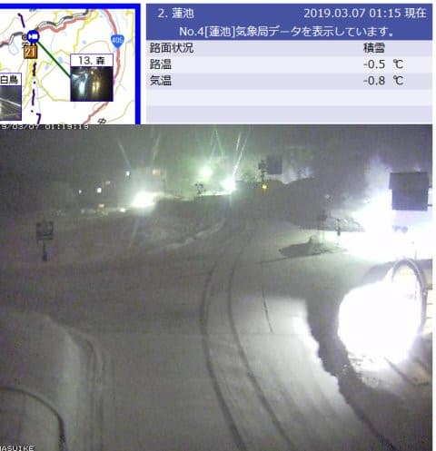
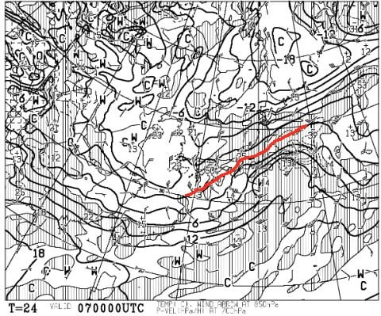
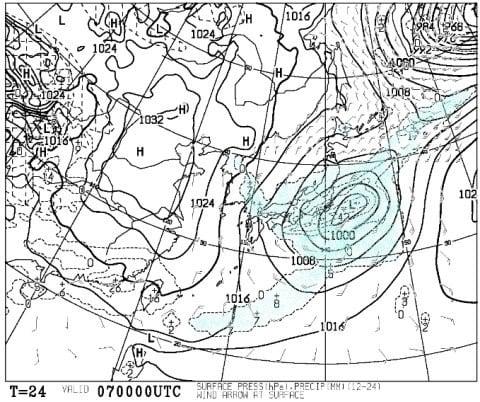
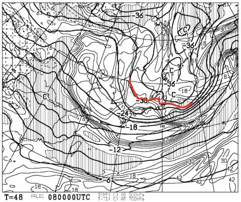
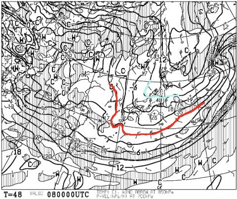
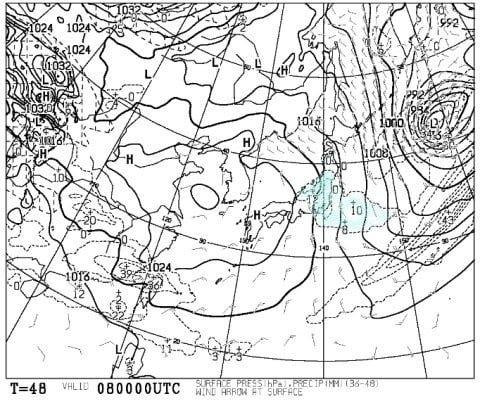
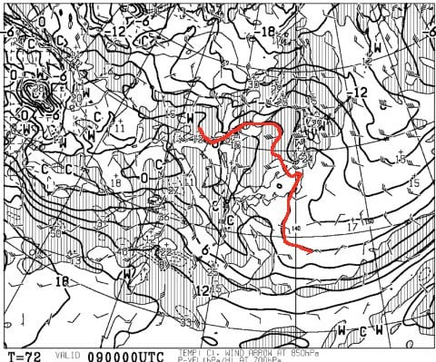
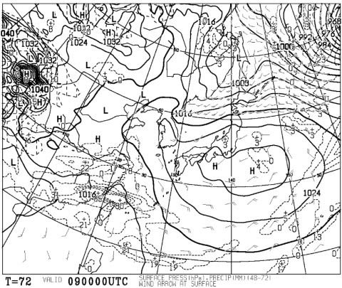
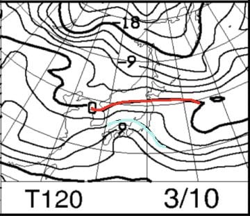
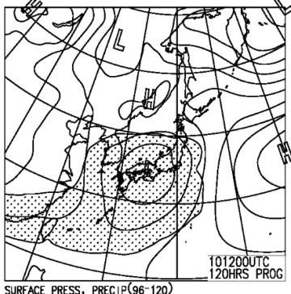

# 3月9，10日の週末の志賀高原スキー場の天気は？…土曜は晴れだけど，気温が上がりそう．日曜は…危険だ…(涙）

📅 投稿日時: 2019-03-07 01:32:18

えー．

どうやら，深夜1時現在．

志賀高原は雪が降り始めていて．

蓮池近辺にも，うっすら雪が

積もり始めましたね…

降り始めは，かなり湿った重い

雪だと思いますが．

この雪はしばらく降り続け，

そこそこ積もりそうですよ…！

まず．7日木曜，朝9時の850hpa図を見ると．

うむ．

赤い0℃線は，志賀高原より南に下がり．

-3℃線が志賀に近づいてくるくらいなので…

雪質はトップシーズンより重そうですけど．

液体の心配は無さそうで．

…降れば雪ですね．

…そして．

地上天気図では．

水色の降水域が，志賀高原近辺を覆ってます．

それも，水曜夜から木曜朝まで，

20mm以上の降水予想なので．

積雪に直せば，20cm以上積もるかな？

7日木曜は，終日雪が降り続け．

昼間も雪が積もっていきそうですよ～！！

…そして．

8日金曜の朝9時の500hpa気温図を見ると．

うむ！

この時期にしては珍しい，-30℃の寒気が

志賀高原近くにまで下がってますよ！

そして，850hpa気温図を見ると…

なんと！

水色の-9℃線が志賀にかかっているので…

これは，志賀高原．

久しぶりに，朝は-10℃以下に下がりそうですね．

で，地上天気図を見ると…

地上天気図は縦縞だし．

志賀高原に降水域はかかっているし．

これは．

金曜朝も．

冷えた雪が積もってそうです！！

8日金曜は．

朝までに冷えた雪が20cmほど積もり．

昼ごろには晴れてきそうなので…

かなりいいコンディションに

なるんじゃないかな！

…このまま週末まで，このペースで

行ってほしいところ…

と，期待して．

肝心の週末，

9日土曜日の850hpa気温図を見てみると．

…なんだか．

赤い0℃線．

志賀高原より北に上がってしまって

いるのですが…（涙）

そして．

地上天気図を見ると．

…まぁ，概ね高気圧に

覆われているので．

液体が降ってくる心配は

なさそうですが…

ただ，日差しが強い東斜面は．

雪がちょっと緩むかも…

で．

翌日曜の10日ですが．

850hpa気温図を見ると…

は，はぐぁっ！！！

水色に塗ったのは…+6℃線！？？？

そして．

地上天気図は…

…

…

チーン．

ダメです．

やっぱり，この日はダメっぽいです．

朝から高温の曇り空で．

どの段階で降り始めるかはまだ

分かりませんが…

午後には降ってきそう．

…それも．

高温の液体が（泣）

ってなことで．

まとめると．

8日金曜：朝は-10℃以下まで冷えこむ．

　冷えた雪が20cmほど積もっているか？

　今シーズンラストの冷え冷えパウダーかも…

　昼間も気温が上がらず，それなのに昼ごろからは

　晴れていきそうで，おそらく最高の一日．

9日土曜：朝は-2～3℃程度．朝から晴天！

　雪は前日までの雪が圧雪された，

　いい感じに締まった圧雪．

　朝イチは最高でしょう．

　ただ，昼に向かって気温は上がり．

　最高気温は+2℃程度まで上がりそうなので．

　日が当たる東斜面は，雪が緩み始めて．

　午後は重めの雪になりそうだけど…

　奥志賀みたいな北斜面，一の瀬の

　ような西斜面は，午後までわりと

　いい雪質で滑れそう．

　天気も良く，雪も一部を除いてそれほど

　緩まなさそうなので．

　まぁいい感じの一日．

10日日曜：朝からプラス気温の曇り空か？

　朝は割と締まった圧雪．

　前日に日が当たる東斜面は，ちょいと

　コロコロが出るかもしれないけど，

　朝イチはいい感じ！

　ただ．

　気温はぐんぐん上がり，昼間に+7℃～8℃

　まで上がってしまい．

　昼前後，どこかの段階で降り始める．

　…降るのは，残念ながら山頂でも

　液体です．

　降り始めたら，シトシト降り続ける．

　おそらく，翌月曜までひたすら雨…（涙）

　雪は雨でぬれてザブザブになっていく…

ってな感じなので．

金曜は最高．

土曜はそこそこ楽しい感じ．

日曜は…あさイチ一発勝負．午後は…考えたくない

というところでしょうか…

あぁ…週末がもう一日早ければ…（涙）．

…しかし．

まだわからない！

まだ，日曜に降るが液体とは限らない！←いや，残念ながらもうほぼ確定

降ったとしても，リフト営業終了まで

降らずにもってくれるかもしれない

のだ！！←残念ながらそれもかなり期待薄（泣）

とりあえず．

皆様方におかれましては．

そろそろ踊り飽きたころかと

思いますが．

これまでよりもっと激しく．

雪が解けるほどの熱く情熱的な

冷え冷え踊りを．←なんだか矛盾してないか？

引き続き全力で踊り続けて

くださいますよう，

よろしくお願い申し上げます…

## 💬 コメント一覧

### 💬 コメント by (若杉勲71)
**タイトル**: Unknown
**投稿日**: 2019-03-07 11:56:34

志賀高原情報

本日もオリンピックポールポジションは某H多ご夫妻。二番手はゆみりんご夫妻。我がレインボーは今日もその後塵を浴びました。やっぱり何をしてもあのプリンスプラチナ会員には勝てない。恐るべし！

### 💬 コメント by (ホンダ)
**タイトル**: Unknown
**投稿日**: 2019-03-07 14:58:27

今日のヤケビは？朝イチオリンピックは、5cm程度のゆき❄️がありましたが、ガリガリの上の湿った雪でかなりひっかかりがありました。GSは少々柔らかでしたが快適な一本でした。奥志賀高原エキスパートはヤケビよりは雪質は若干良いもののひっかかりが気になりました。一番は高天ヶ原のポール練習バーンでした。パフパフに近い軽い雪質でした。残りすくないシーズンあと何回パフパフに恵まれるのか、パフパフ踊りをして祈るしかないですね。以上焼額山特派員報告でした。

終わりはレインボーの特派員でした。

### 💬 コメント by (レインボー特派員)
**タイトル**: Unknown
**投稿日**: 2019-03-07 21:38:34

志賀高原情報

午前中はまずまずの雪質だけど、午後はみぞれで意気消沈。ヤケビのシーズン券を持つ妻が昨日から初参戦。ハイレベルな友人達の指導のおかげで、スキーをやる決断をしてくれました。明日、長野のゼビオで靴を買います。今日まではネット中古の2000円の靴でした。嬉しい反面、自分はちっとも滑れませんが、年間250泊以上は留守する私にとっては家庭円満の追い風になります。

この週末は、またも法事で留守します。某本Dご夫妻、某加Tご夫妻のように、夫婦でリズム良く滑れるようになりたーい。妻は7歳も若く64歳。日に日に上達するし、まだまだ夢があります。スキーって、楽し過ぎですね。

### 💬 コメント by (若杉勲71)
**タイトル**: Unknown
**投稿日**: 2019-03-07 22:53:28

志賀高原情報

木曜日朝はオリンピックで積雪15。湯田中では昼間から雨で、今23時には雪になっています。まだ積雪は2ー3センチ。エス様の予報通り明日はよさそうですよ。

### 💬 コメント by (Ozxys.xyz)
**タイトル**: 冷え冷え踊り大感謝です
**投稿日**: 2019-03-08 00:27:50

毎年参考にさせて頂いています。コンディションのいい時をピンポイントで狙って行けるので大感謝です！

2010年ごろから志賀には年1で行っていますが、今シーズンは志賀に1度も行かずに終了！と諦めていましたのですが、冷え冷え踊りのおかげで週の初めに急遽土曜日に行くこと決めました！前泊して朝一からにしたかったのですが、ちょっと家族の都合がつかなくて。。朝5:30に小千谷から向かいます！

奥志賀がスノボ滑れるようになっていた事把握していませんでした。両刀なので土曜はスノボで奥志賀も行ってみようと思います！

とにかく感謝しかないです。こっそり5年以上前から毎年拝見させていただいていました。

昨年からブログを書き始めたので、ブログを更新したらリンクを貼らせもらいます。

URLを書いたのですがエラーになってしまいました。

### 💬 コメント by (Skier_S)
**タイトル**: 日曜も液体は降らずにもちそう！…月曜は降るけど（涙）
**投稿日**: 2019-03-08 02:32:13

＞若杉さま＆レインボー特派員さま

あら…

午後はみぞれだったんですか（涙）

奥様もシーズン券お持ちなんですね．

志賀高原常連さんは，Gokuさん始めHご夫妻，はなげ親分さんなど，

ご夫婦でかっ飛んでいる方が多いので，

ぜひこれからはご夫婦でかっとんでください(笑)．

＞Ozxys.xyzさま

初めまして～！

コメントありがとうございます．

今週，土曜はそこそこ楽しめそうですよ～！

できれば，朝早いうちがいいと思うのですが…

むしろ，朝6:30からの焼額第1ゴンドラの

早朝営業で滑ってほしいくらいです．

今は，志賀高原は全面ボード可なので安心してください．

奥志賀第6リフト沿いには，すごいパークもありますよ！

ブログリンク機能は，確かGooブログの仕様変更で

つい先日から利用できなくなったようです…

PC版ではURL記入欄が残ってますが，2月から使えなくなっているんじゃないかと…

土曜日，志賀高原で私を見かけたら声をかけてください～．

あさイチは焼額．

雪が緩んだら，奥志賀エキスパート滑ってると

思います…

