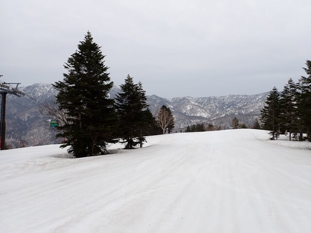
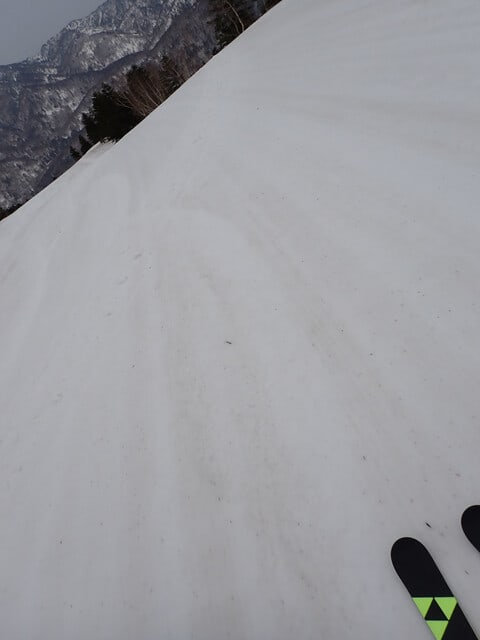
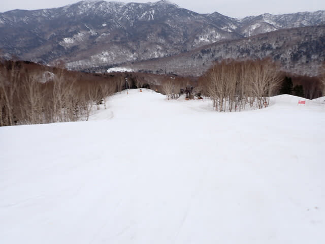
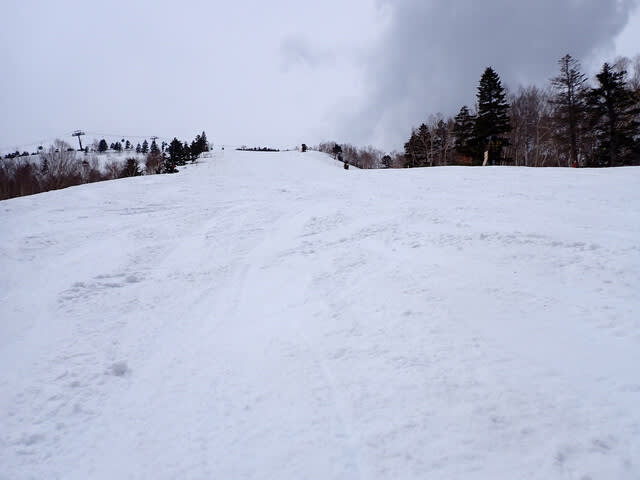
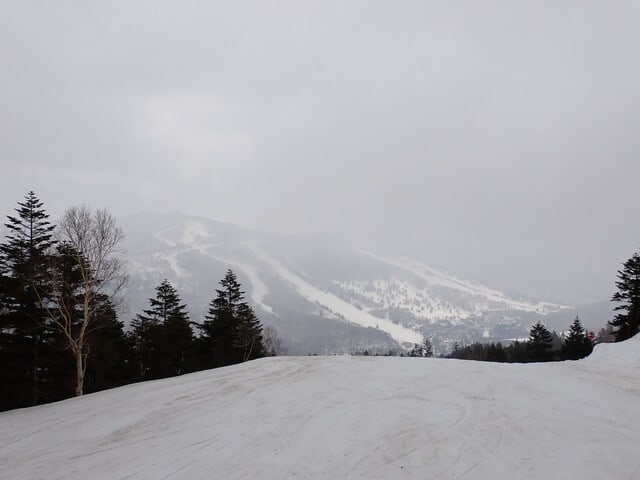
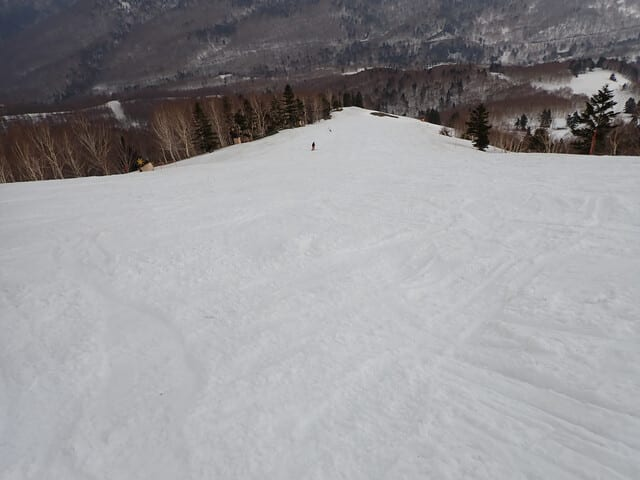
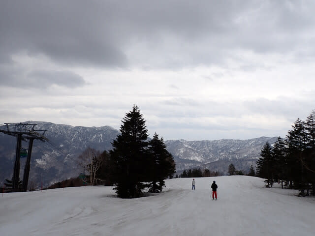
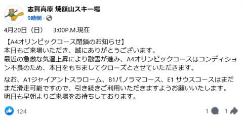

# 2025/4/20(日)の志賀高原焼額山スキー場速報レポート！…

📅 投稿日時: 2025-04-21 01:51:19

🏷️ カテゴリ: [2025スキー滑走日記](cacd3fbf84d4a679ee61a5894c3f95e14.md)

えー．

今日も朝6時の早朝から滑りはじめ．

ラストまで滑って帰ってくると，

23時過ぎで．

帰宅後いろいろやっているともう

1時過ぎ…（泣）

今日も起きてからの活動時間が21時間を

越えてて，もう眠い…

だもんで，帰宅日の定例，本日の志賀高原の

速報レポートです！！

まず．

本日の早朝営業は曇り空でスタート．

天気予報が悪かったからか，お客さんは

かなり少なかったですね…

…そして，早朝の時間から気温は+7℃と

異常に気温が高く．

雪は早朝の1本目から汚れが浮いてるん

ですけど（泣）

でも，朝イチは表面が柔らかめながら

下地はかなりしっかりした感じで，

日差しがなかったので雪が緩むのは遅く，

9時過ぎくらいまでは結構いい感じの

ガラガラフラットバーンが滑れました~！

ただ，やはり気温が高かったので

10時ごろにはかなり雪が緩んできて．

そして雨の予想の割には昼頃に

薄日が射すタイミングもあったりして，

日が出ると雪が一気に緩み，

さらに雪の滑りも悪くなってきました（泣）

とはいえ，滑りが悪かったのは緩斜面

だけで，急斜面はストップ雪にならず

板は滑ったし．

午後は日がかげって緩斜面でも滑りは

多少良くなったし．

午後まで雨も降らず良かったな…

と思ったら，2時過ぎに怪しげな雲が

出始め，ちょっとぽつぽつと降って

きました…（泣）

降ってきたといっても，ホントにわずかに

ポツポツ来ただけで．

ウェアやゴーグルにわずかに水滴が着く

程度の，「あれ？今，降ってるのかな？」

という程度の降りが数回あった程度で，

全く影響なし！

…ただ，営業終了のころは，さすがに

バーンがかなり荒れてきました…

人が少なかったのでコブコブにはならず，

重い雪の凸凹がコース全面を覆った

感じ．

営業終了のころには，雨も止んで，

空も明るくなってくれたけど…

今日は終日滑っている人がかなり

少なかったので，人が滑らない雪は

営業終了のころには結構茶色くなって

いたのでした…（涙）

とりあえず，今日は雪が汚れた緩斜面で

板の滑りが悪くて，さらに高温で雪が緩み，

午後は結構バーンが荒れちゃってたけど．

だけども，朝イチのバーンは比較的

良かったし．

ずっとゴンドラが飛び乗りのガラガラ

だったし．

雨が終日ほとんど降らずにいてくれて，

営業が終わった後に駐車場で帰り支度を

している間にパラパラ降り始めるという，

ちょうどいいタイミングで雨を回避

できたし．

…まぁ，当初予想してたよりはマシな

一日だったかな…

でも．

昨日，コブ溝に1か所だけ土が出て，

わずかに岩が出始めていたオリンピックコース．

今日は土が出ている場所が増えて，

岩もかなり露出してきたので…

本日でオリンピックコースが終了と

なってしまいました（泣）

（[焼額山スキー場Facebook](https://www.facebook.com/yakebitaiyama/posts/pfbid0AaE7W7wADGZG6mMtSzv3gCTdSCaGdxvJ72enS2M2J1kMCYTXNxMnpLNHnx3eeZPyl)より）

…でも，4月下旬までオリンピックコースが

滑れたのは，記憶にある限りではこれまで

ほとんどなかったはず…

むしろ，これまでよく雪がもったと

褒めたい！！

とりあえず，オリンピックコースは

滑れないものの．

まだ，GSコース，パノラマ＆サウスコース，

さらにはSGSコース＆イーストコースや

ミドルコースもまだオープンしてます～！

焼額山，今年は雪が多いので，GW最後まで

問題なく滑れそうですよ～！！

…ということで，もう眠いので寝ます…

おやすみなさい…

## 💬 コメント一覧

### 💬 コメント by (いか)
**タイトル**: Unknown
**投稿日**: 2025-04-21 23:22:59

土曜日はご一緒させていただき、ありがとうございました〜

午前中から暑い1日でしたね。麓で車と桜並べて撮影もしましたが、まったく春の感じではなかったです笑 また来シーズンもよろしくお願いします！

なお、あの後、夕方には第2目的地に着いて、日曜日は無事キンメゲットでした！

### 💬 コメント by (Skier_S)
**タイトル**: ＞いかさま
**投稿日**: 2025-04-23 01:31:00

コメント回答遅れました～！

土曜は久々に一緒に滑れましたね．

無事第2目的地にも到着できて，獲物もGetできたようで良かったです…

これからは釣りのシーズンかもしれませんが，また来シーズン雪が積もったら

宜しくお願い致します！

