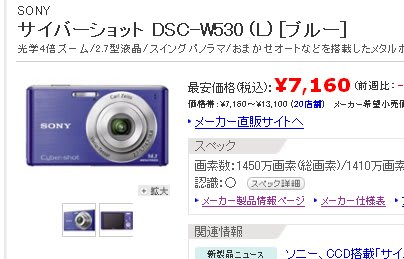
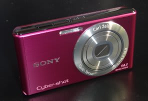

# SONY　サイバーショットTX10のバッテリーを買いたかったのだが

📅 投稿日時: 2011-11-17 01:03:02

あー．

今日は一日，いろんなスキー場で人工雪を降らせまくったみたいですね．

[かぐら](http://blog.princehotels.co.jp/ski/kagura/021962.php)，[熊の湯](http://ameblo.jp/kumakumanoyu/entry-11080325367.html)，[高天ヶ原](http://blog.goo.ne.jp/ginrei1/e/5e24aa18a2c68cee2fc867a2a38e8931)，[丸沼](http://www4.atword.jp/malnuma/2011/11/16/%E2%97%8F1116%E3%80%80%E9%99%8D%E9%9B%AA%E4%BD%9C%E6%A5%AD%E3%81%8C%E9%96%8B%E5%A7%8B%E3%81%95%E3%82%8C%E3%81%BE%E3%81%97%E3%81%9F/)，[アサマ2000](http://www.asama2000.com/inventry/fig01.jpg)などで，天然+人工雪で

真っ白になっていますね～．

でも，19日の雨でかなり溶けちゃうと思うんですけど…

19日，そんなにひどい雨にならなきゃいいなぁ～

さて．本題

[スキーの滑りの動画を撮影するために購入した](e825a293f36f7da31a8851b9be8b734dd.md)，

ビデオカメラ代わりのデジカメ，サイバーショットTX10．

昨日なんかのYetiの動画は，これで撮ったものですが．

こいつの欠点のひとつは，動画を撮影した際のバッテリーのもちが悪いこと.

だもんで，本格的シーズンが始まる前に予備のバッテリーを買おうと思っていたんだけど…

バッテリーが約4000円．

そして，このデジカメ．

[ここに書いたように](eeaa5caa0b3a71351813c7d734931dc0f.md)，充電器が付属しておらず，本体に電源ケーブルを

つないで本体内部のバッテリーを充電するスタイル．

これだと．本体を持ち歩いている間に，もうひとつのバッテリーを充電しておく

という使い方が許されない，と．

で，単体の充電器を買おうかなぁ…と思うと．

5000円以上するんですけど（涙）．

ということで，充電器とバッテリーを買うと，9000円を超えてしまう…

どうしようかと悩んでいたら．

SONYのサイバーショット，WSC-W530．

これが，7000円ちょっとくらいで売ってるではあーりませんか．

…このデジカメ．

欲しいバッテリーと充電器がついているんですが．

こ，これは．

バッテリーと充電器を買うより2000円近く安いのに．

おまけにデジカメがついてくる，ということかっ！？

なんなんだ．この良くわからない価格設定は…

ということで．

買っちゃいました．

しかし．

欲しかったのはバッテリーと充電器のみなので．

この本体は使うことはないなぁ…
