# 2018年8月，子連れ座間味で小5の娘とファンダイビング！その4…座間味着，いつものザマミセーリングさんの船でダイビングへ！

📅 投稿日時: 2019-09-03 01:53:07

なんだか．

無理な時期に夏休みを取った

反動で，やらなきゃならないことが

むちゃくちゃ溜まってしまい（涙）

…締め切りを過ぎてしまった

原稿を，机にしがみついて

必死に書き上げた，この土日．

久しぶりにK奈川県を脱出

しなかった…

というより．

土日2日間で，自宅から出たのは

歩いて5分のスーパーに一回

行ったっきり

という，私にとっては歴史に残る

記録に近い（？）

週末を過ごしましたが．

そのかわり．

明日・明後日の2日間．

まるで週末にどこにも行け

なかったのを穴埋めするように，

遠距離の出張が入ってます！

…が．これらの出張．

当然のごとくご無体出張（泣）

2日間，全く別な目的地に

日帰り2連発です（涙）

さらに明日は早起きして朝イチの

新幹線で出かけなくてはならない

だけでなく．

帰りの新幹線の中から電話会議に

出なくてはならない羽目になりそうとか，

（電話会議中，デッキにずっと

　立ってるしかないのかな…（泣））

明後日は現地での最後の打ち合わせ

終了が夜8時過ぎで，帰宅がいったい何時に

なるか分からないとか．

なかなか楽しい感じのスケジュールです（涙）

こんな訳の分からない状況なのに．

本日も，

一体何が自分にこんな長文のBlogを

書かせているのだろう…

と思わずにいられない，座間味旅行記．

では，どうぞ～！

明日，朝起きられるのかなぁ…

---

ってな感じで．

那覇，泊港を出港した，

フェリー座間味．

天気も良く，穏やかな港内を，

渡嘉敷行きのフェリーのあとに

着いて進んで行きますが…

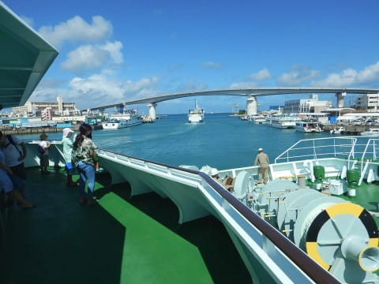

うーん．

天気もいいし．

海も荒れてるように

見えないんですが…？？

と，思ったら．

先に港の防波堤を超えて

湾外に出たフェリー渡嘉敷．

舳先に波がぶつかって，

えらく揺れてるようなんだけど…！？？

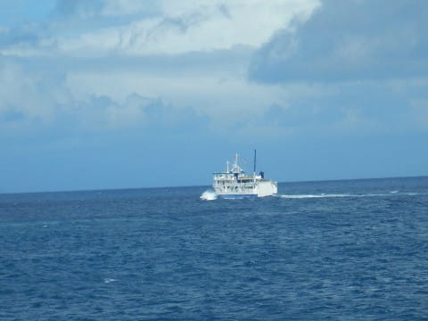

…と思う間もなく．

それに続いて湾外に出た

自分たちの船も，いい感じに

揺れ始めました…！

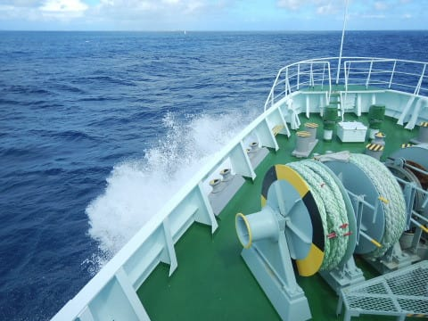

…さすがに高速船が欠航に

なるだけのことはある…っ！！

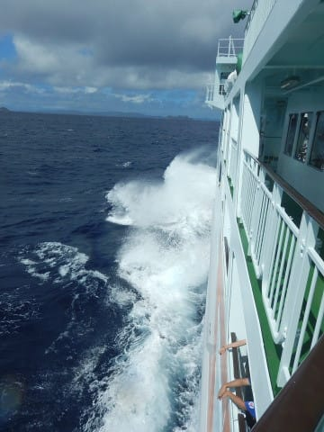

ってな感じの波に翻弄されること，

約2時間．

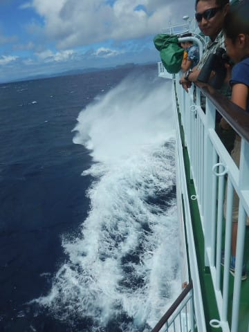

外海は荒れていたけど．

慶良間諸島の内海に入ってくると，

もう海は穏やかで．

12時過ぎに，無事，座間味港に入港！

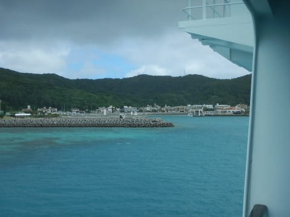

…今回は海況が悪く，

いつもは16時出航の帰り便のフェリーが

到着後ただちに折り返し出航なので，

帰りの人たちが港に並んでます…

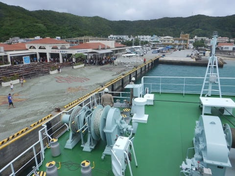

本来なら，もう少しのんびりして

いられたはずの，本日帰りの人たち．

ご愁傷様でした…

…まぁ，今日帰れたってだけ，

まだ良かったのかな．

ということで．

座間味に上陸して．

やってきました，いつもの

ペンション星砂さん！

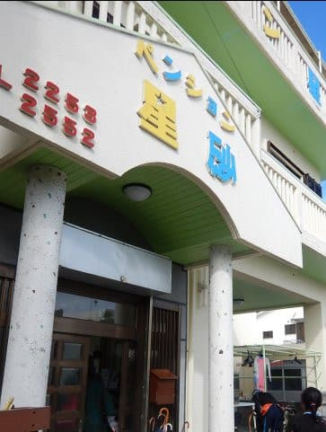

帰ってきたよ～！

今回泊まったのは，

久しぶりの洋室です．

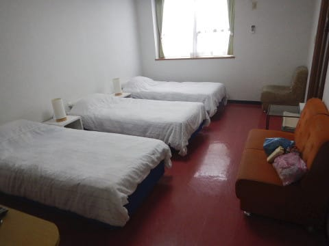

この部屋は，バストイレ付きなので，

和室よりちょっと割高．

だもんで，貧乏金なしの我が家は，

いつも和室を選んでいるんですが…

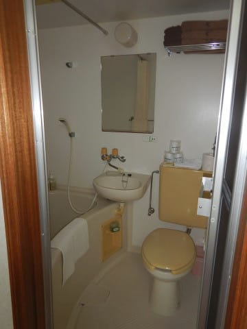

満室の今回，ベッドの部屋しか

あいてなかったので，

贅沢なバストイレ付きの部屋と

相成りました…

で．

急ぎダイビング器材の準備をしたら．

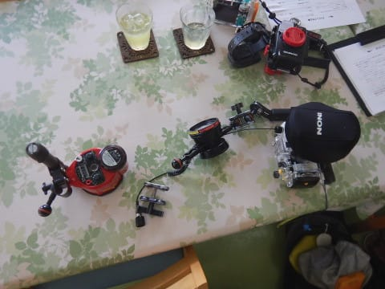

午後1時に，ダイビングショップの車が

器材をピックアップしてくれて．

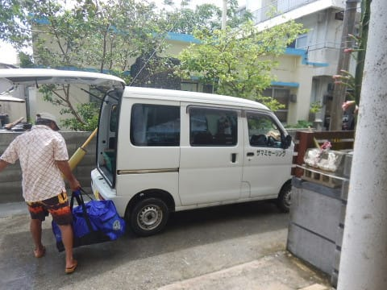

我々も歩いて港へ向かいます…

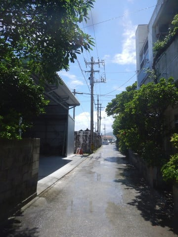

そして．

港には．

ザマミセーリングさんの船，

いつものティンガーラ号！

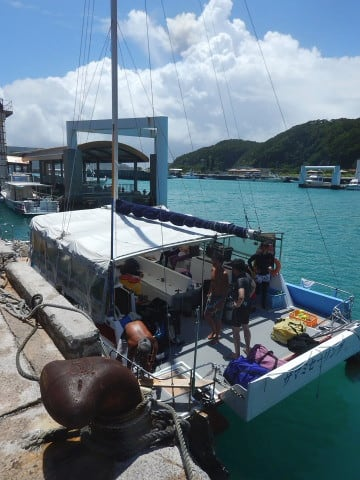

では，この船に乗って．

午後のダイビングに出発です～！！

まずは，器材セッティングなわけですが．

ダイバーになったわが娘．

実習をしてくれたアサミさんがいないところでの，

初めての器材セッティングですが．

…無事，セッティングできるのか…？？

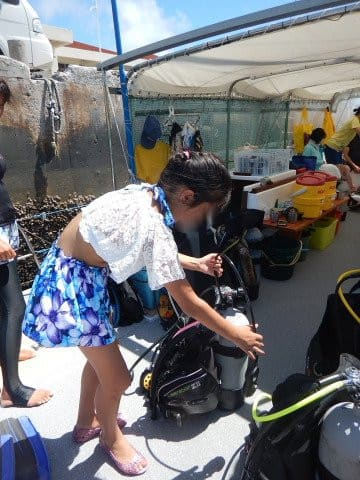

…どうやら．

モアルボアルから帰ってきて

まだ3週間ほどしかたってないので，

ところどころ怪しいところがあったけど，

手順は覚えていたようです…

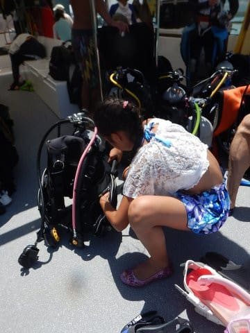

ってことで．

器材セッティングを終えたら，出航！

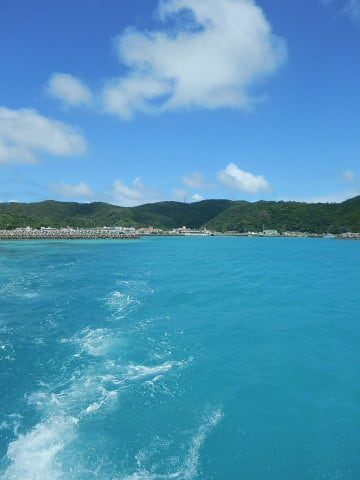

外海は，フェリーの運航もヤバいくらいの

荒れた海と思えないほど．

慶良間諸島の内海は穏やかで．

天気も最高の晴れ！

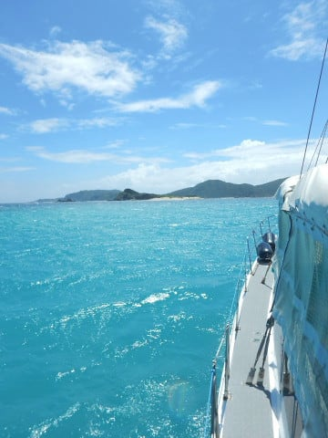

ってことで．

ボートは一本目のポイントまで

やってきました．

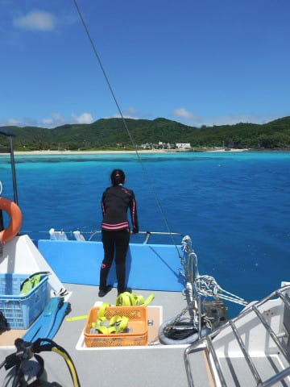
