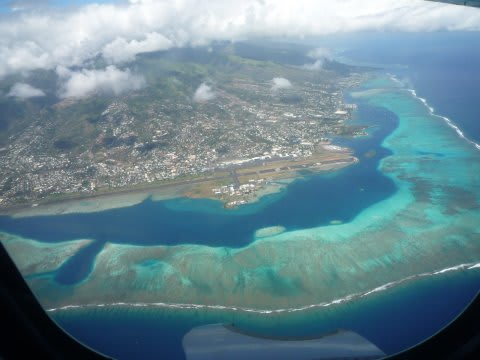

# 2009年　初の海外子連れダイビング旅行記　27　Good-bye, Rangiroa

📅 投稿日時: 2012-09-27 00:25:55

天国のような（天国に行った事はないけど）毎日も終わり，

今日から帰路のスタートです．

…楽しい日々というのは終わるのが早いもので…

今日の移動予定は，午前中にランギロアを発ち，昼ごろタヒチ島に到着，

午後は半日ゆっくりタヒチ島で過ごし，次の明け方にタヒチ発，

12時間のフライトで日本へ…というルート．

最後の朝食を摂り，

名残を惜しむようにホテルの敷地を

散歩して，きれいな海の景色を目に焼き付けます．

あああ．この景色とも，あと1時間ほどでお別れ…

悲しい…

途中，娘は異文化コミュニケーションを実践中．

無情にも，9時半のピックアップ時間がやってきました．

さらば，ホテル・キアオラ．

たった3泊だったけど，この世の景色とは思えない日々だったよ． 

空港に到着すると，娘はまた異文化コミュニケーション開始．

異文化コミュニケーションを実践していると，幼児を抱えている我々は

一般搭乗前に係員に「こっちにおいで」と手招きされて，

ぶっちぎりの優先搭乗．

飛行機は定刻どおり出発し，無情にもランギロアを

離れていきます．

さよなら，ランギロア…（涙）

娘はまた，フライト時間と昼寝時間が重なったため，

飛行機離陸前からぐっすり．

起きたのは到着後という．

なんと親孝行な娘よ…

1時間ほどのフライトで，飛行機はタヒチ島に近づきました．

眼下にここしばらく縁の無かった「街なみ」を見ながら降下．

フライト1時間ほどで，タヒチ・パペーテの空港へ到着です．
