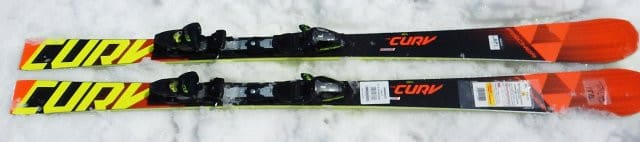
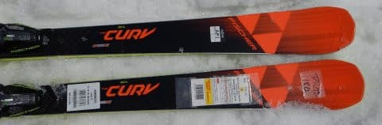
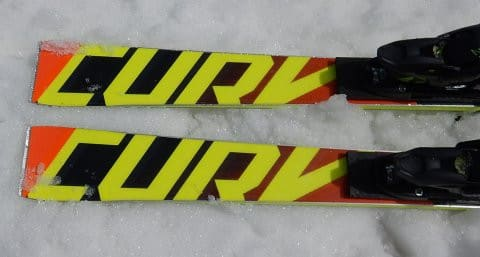
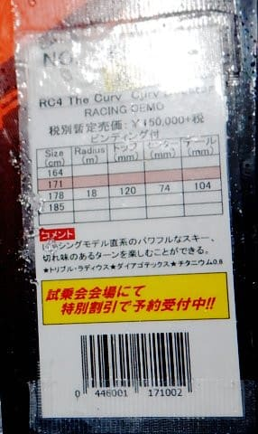

# 2020シーズンモデルのスキー板，試乗レポート…FISCHER編その２

📅 投稿日時: 2019-06-01 01:47:47

🏷️ カテゴリ: [スキー板試乗](c0bd8048615710cee890e403a36cc9a2b.md)

うううううーー．

かぐらが終わった今週末．

実に．

実に久しぶりに．

土日ともスキーに行かない

週末になるわけですが…

いや．

週末土日ともスキーに行かないのは．

1月の法事で関西某所へ行って以来，

4か月半ぶり…

果たして．週末スキーをせずに，

来週耐えられるのだろうか…（心配）

ってなわけで．

まだまだ続くスキーネタ．

今日の試乗レポートは，フィッシャー編です．

では，どうぞ～！！

○FISCHER RC4 The CURV Booster 171cm

基礎大回り

The CURVシリーズのうち，一番強いBoosterになります．

長さは171cmでR=17～18m程度と．

大回りの板ですね…

試乗したのは，大回りをするにはきつい

春の荒れた雪のゲレンデでしたが．

かなりどっしりとした，強めの板で．

荒れた雪を蹴散らしながら，しっかり安定感が

ある大回りをしていきます．

荒れた雪でも，山回りの足場がしっかり

作っていけるので．

怖さを感じることなく，谷回りに自然に

入っていけます．

いや．

荒れた雪と思えないほど．

ただ．

春の柔らかい雪でも結構しっかり

たわんで，かなり旋回していくので．

おそらく硬い斜面では，R=18前後と

思えないほどたわんで，小さい半径で

回っていきそうな感じ．

でも，少なくとも春の雪では，スピードを出して

行っても，グリップが弱いとか，板が叩かれて

ずれるとか，そんなことは無く．

かなり安定感を感じるので，高速耐性は

強そうです．

でも，板に安定感があり，長さがある分．

ちょっと小回りは辛いかな．

ずらして行けば，小回りも作れるけど．

重さをちょっと感じる分，軽快に小回りを

する板ではない感じ．

基本的に，その名の通り．

板なりにカービングに入れて，

その旋回半径に乗って滑って行けば

かなり快適で．

当然，R=18という板なので，

大回りは気持ちいいし．

R=18というサイドカーブから想像するより

小さい半径までカービングで作っていけます．

荒れた雪でも，荒れを感じずに，

整地であるかのごとく，楽に大回りで

下りていけるので．

硬い斜面をガンガン攻めるというより，

普通のゲレンデを，そこそこのスピードで

板なりに気持ちよくカービングしながら

ロングクルーズすれば．

荒れた午後のゲレンデでも，気持ちよく

ハイスピードクルーズができる板かな…

と思いました．
