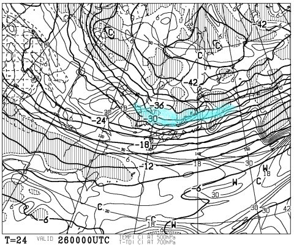
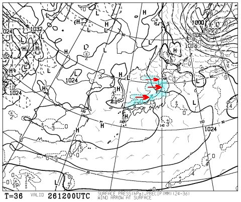
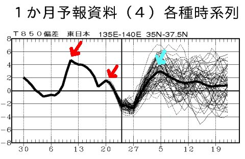
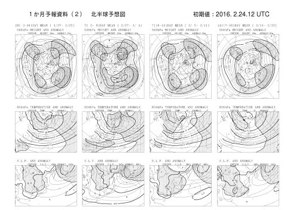
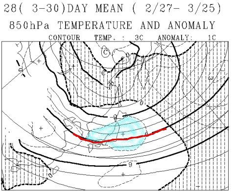
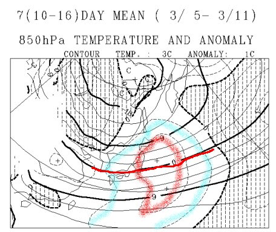
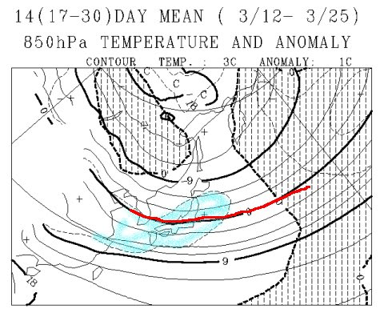

# 今シーズン．雪不足のまま終わるのか？もう一度冷えるのか？一か月予想天気図で，3月を予想すると…

📅 投稿日時: 2016-02-26 01:37:05

🏷️ カテゴリ: [スキー天気予想](c6554f5c3c106093b511a8daae23757e8.md)

うーむ．

なんだか，今日，木曜の志賀高原．

朝はチラチラ降ったようですが…

…どうやら，それほど積もらなかったようですね（涙）．

…そして．

金曜も，-30℃という，普通ならそこそこの雪が降る目安の

寒気が入っているのに…

…だのに．

強烈な西風で，志賀高原は積もらないパターンに入ってます（泣）．

（矢印方向に雪雲がたなびいてるのが分かる降水パターン…）

なぜだ…

なんてこった…

このままだと，土曜朝の10cm積雪予想もやばい状態…

土日は，午後になるとそこかしこに

アイスバーン下地が出てくる，

同時多発アイスバーンテロ状態になりそうな予感…（泣）．

金曜から土曜にかけて，積もってくれることを

祈るばかり…っ！！

…これは．

今度は．

降れ降れ踊りを踊らないといけないのか…？？

＃そろそろ踊り飽きてきた…

で．

先週の雨で，また雪不足状態に拍車がかかった

今シーズン…

このままだと，志賀高原は．

GWどころか．4月までももたないんじゃないか？？？

と，心配になる今日この頃．

これから3月にかけて．

雪不足のまま終わるのか？

それとも，冷え冷え雪がもう一度降ってくれるのか？？

…さてさて．

一か月予想図をみて，このあたりを予想してみましょう…

まずは，fcvx14から，東日本の850hpa気温傾向を見てみると．

ふむ．

ふむ．

…だめだ（涙）．

赤矢印で示した，4月並み高温が続いた2月12日前後と，

夜中にどしゃ降りになった2月20日前後．

…それに近い高温が，水色矢印で示す，

3月5日ごろに予想されてます…（涙）

んで．

そのあとも．

平年より冷えることなく．

一か月ずっと，平年より+1℃～+2℃高い予想が続いてます（涙）．

…だめだ．

この3月，かなりダメっぽい…

そして．

今度はfcvx12を見てみると…

この図の，2月27日～3月25日の一か月間の

850hpa気温傾向は．

…やっぱりダメだ．

平年より+1℃気温が高い，水色で塗ったエリアに

志賀高原はすっぽり覆われています…

わずか1℃と感じそうですけど．

月平均気温が1℃高いって…

異常高温です（涙）．

季節が半月以上早く進んだように感じるくらいです（泣）．

そして．

3月上旬，3月5日～11日の一週間の予想を見てみると．

…え？？

えええ？？

平年比+1℃の水色ラインどころか．

平年に+2℃の赤ラインが志賀高原を覆っているっ！？？？

…これは．

3月5日の週末は，かなりやばいかも…（涙）．

高温で，ヘタすると雨が降る日がまたやってくる可能性も…

3月後半，3月12日～25日の予想を見てみると…

うーむ…

5日～11日の予想よりましだけど．

でも，平年比+1度のエリアに志賀高原はすっぽり

覆われてます．

平年より気温が高い日が続きそうで．

3月下旬のこの時期，平年より気温が高いということは．

赤く印した0℃線も，かなり志賀高原に近づいており．

…降れば雨になる日が続出しそう…（涙）．

…ということで．

このままの天気図だと．

3月の奇跡の冷え込みは，期待薄です．

それどころか，3月も例年より気温が高い日が続き．

雪が解けていきそうです…（激烈涙）

…このままだと．

志賀高原の一部，3月中に滑れなくなっちゃうのでは…？？（恐怖）

なんてこった．

なんてこったっ！！！！！

そうです．

皆さんの祈りで，この予想を覆すのですっ！！

そう．

これから一か月間．

冷え冷え寒気がやってくるように．

ひたすらひたすら，止まることなく．

激しく祈り，

激しく冷え冷え踊りを踊り続け，

激しく寒気の歌を歌い続けるのですっ！！←なんか増えてる

## 💬 コメント一覧

### 💬 コメント by (FCAMEL)
**タイトル**: Unknown
**投稿日**: 2016-02-26 10:19:58

おつかれさまです

寒気の歌（笑）！増えてる（笑）！！

私も週末は行く予定ですが

なんか、このままだと今週で実質終・・

おっと危ない、危ない、言霊になってしまうところでした。

寒気の歌が歓喜の歌（っていう意味ですよね？）にかわるまでがんばって歌い続けます！

### 💬 コメント by (マルハバ)
**タイトル**: Unknown
**投稿日**: 2016-02-26 13:19:31

私がいつも利用しているバスツアーなんですが・・

3月からの催行が全てキャンセルになっているコース

がいくつかあるんですよね～

旅行会社は今シーズンを既に諦めたのか！？

### 💬 コメント by (べべ)
**タイトル**: 天気予報ほんとに助かります。
**投稿日**: 2016-02-26 18:33:06

いやー、3月もダメですか(T_T)

3月辺りに暖冬の揺り戻しとかないかなーと淡い期待を抱いてましたが、見事にぶち壊されそうな…

もうやけくそで歌って踊って祈ります！

### 💬 コメント by (takac)
**タイトル**: 一の瀬にいます
**投稿日**: 2016-02-26 20:30:49

寒気の歌、かなりの方々が歌っておられるようです。

一の瀬、寒いデス！

しかし… 雪、降ってません…

ダイヤモンドは降雪機、動いてました。

### 💬 コメント by (Skier_S)
**タイトル**: 今週末は冷えるんだけど…
**投稿日**: 2016-02-26 21:52:20

＞FCAMELさま

もう，歌ってください．

歌い続けてください．

その通りです．歓喜の歌になるまで，歌ってください！

…この土日は，歌うまでもなく

冷えるんですけどね～

でも，あんまり積雪がなさそう…（涙）

＞マルハバさま

ええ？

3月のバスツアーが取りやめ？？

…今シーズンは，例のバス事故でキャンセルが

相次いだらしいので…

そっちの影響もあるのかも．

スキー場にとっては，辛いシーズンです…

＞べべさま

3月，このままだとダメです．

ヤバいです．

ただ，予想は変化するものですし．

1，2日ググッと冷えてドカッと降るだけでも，

そのあとがぜんぜん違うので…

とりあえず，歌って祈って踊ってくださいっ！！！

＞takacさま

いや～．

今週末は冷えてくれるんですよ．

今週末までは…

でも．

降らない（涙）．

冷えると降らない，温まると降る（雨が…）という，

今年は地獄のようなシーズンです（涙）．

ダイヤモンド，降雪機が動いてましたか…

ファミリーも人工降雪打たないとやばそうな

感じですよね…

うーん．

今シーズン，どうなることやら…（泣）．

