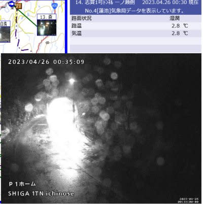

# 4月25日(火)の志賀高原スキー場特派員情報！

📅 投稿日時: 2023-04-26 06:02:47

えー．

本日も，いろいろご無体で更新時間が

取れなかったので（涙），

いつものおこみん特派員からの

志賀高原情報のみで更新！

ってなことで．

昨日，25日火曜の焼額ですが…

いい感じで晴れていたようです！！

そして．

焼額は昨日から平日も朝6時からの

早朝営業をスタートしていて…

朝6時の段階では，結構締まった

いい感じのシマシマに見えますね！

ただ，今日はここ数日に比べると

気温が高かったようで…

朝7:30には，もう気温は0℃近くまで

上がってます（涙）

だもんで，ゲレンデは8時前には緩み始めた

みたいですが…

でも．

本日終了のGSコース．

土曜からそんなに雪は減らず，まだまだ

滑れそうに見えますね…！

うーん．

結構狭くなってきたとはいえ…

土日の午後に雪が剝げかけた部分も

ちゃんと雪を入れて補修されてたみたい

だし．

まだまだ滑れそうなんだけど…

ちなみに，一の瀬正面バーンはまだ

雪が残って見えますが，動いてるのは

下半分のペアのみ．

高天ヶ原は平日は動いてませんが…

まだ一見滑れそうに見えますね…

ただ．

志賀高原．

現在すでに，雨が降り始めているようです（涙）

そして，この雨は…

26日(水)の一日降り続きます．

それも，かなりの勢いで降ります…（激涙）

ただ．夜になると雪になるかも…？？

27日(木)の朝は，雪がうっすら数cm積もって

いるかな…

でも．昼間は気温が上がりそうなので．

積もった雪が日差しで融けて，滑りが

悪い雪になりそう(泣)

そして，28，29日は…

気温が上がります(泣)

29日は…昼過ぎから夕方にかけて．

また雨が降り始めそう…

うーん．

29，30日まで，雪がもつかな？？？

とりあえず，明日26日の雨でどこまで雪が

もつかにかかってます…

そして私は，どうしたことだか，GWの

29，30日が出張になってしまいました(涙)

なぜ…

なぜ，GWの．

それも，焼額の最終営業日に仕事になるかな～（泣）

ってなことで．

私は日曜が今シーズンラストの焼額

だったようです…

あぁ…明日降る雨がすぐ雪に変わって，

50cmくらい積もってくれないかな???←無理だから
