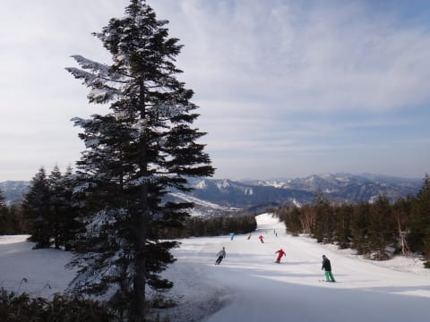
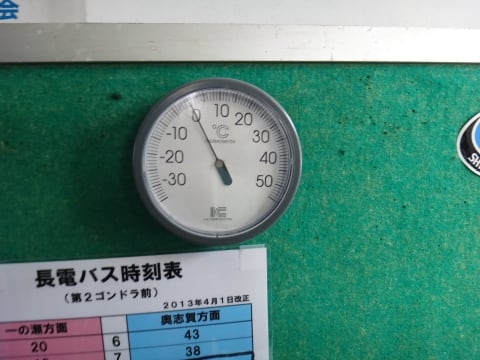
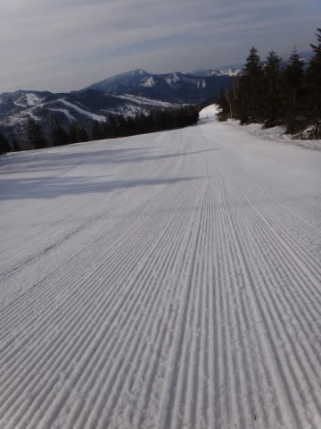
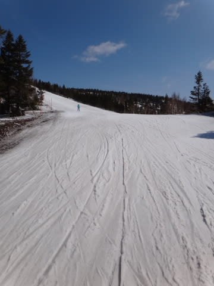
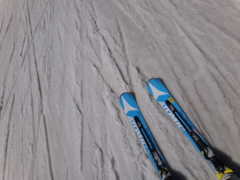
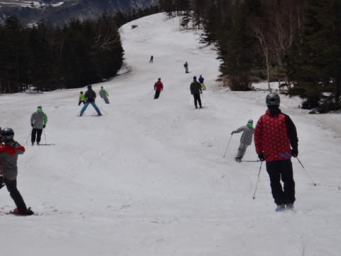
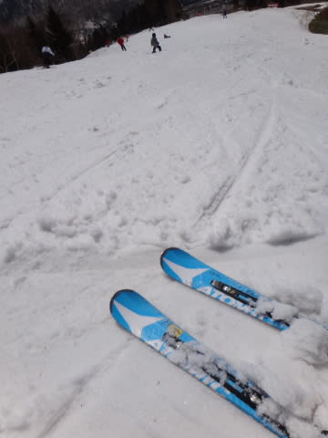
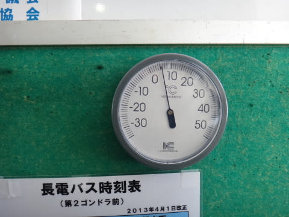
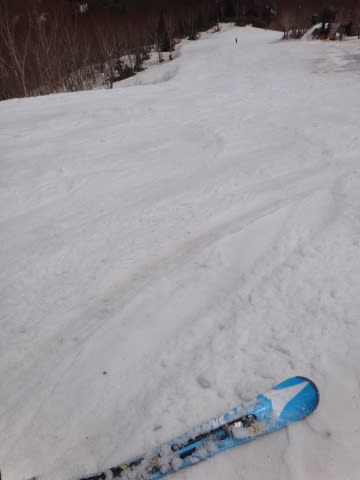
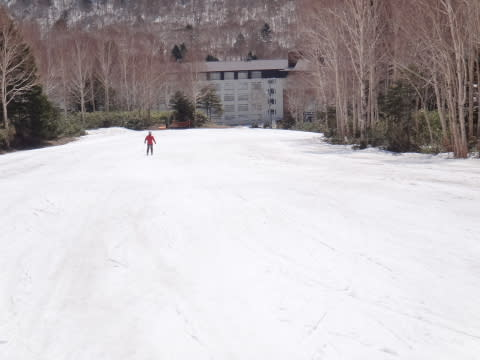

# 4連休2日目，5月4日の志賀高原は…午前中はまぁまぁのコンディション

📅 投稿日時: 2013-05-04 20:52:16

えー．

本日，4連休2日目の焼額ですが…

今日も朝から晴天！

7時の早朝スタート時に，気温もほぼ0度と，そこそこの冷えで…

よく締まったシマシマバーンのお出迎え！

うひょひょひょひょなハイスピード大回りがしたい放題っ！！

いやーーーー．

やっぱり，この時期は早朝が良いですな～．

…ただ．

例年よりは気温は低いんですが．

昨日よりはちょいと暖かかったので，

8時ごろにはところどころ表面が緩み始め…

9時ごろには，ちょいとクリーミーな雪になっていきます(涙)

で．

今日はさすが4連休の2日目，コースの人が多いですね～

…まぁ，ゴンドラは搬器2-3個待つか待たないかくらいで，

そんなに混んでなかったんですがね～．

10時近くには…

かなり雪も緩み，ネットリとした感じに…

徐々に板の走りが悪くなっていくよ…(涙)

…うむ．今日は，午前10時までが快感でしたな．

朝の2度寝の快感もよくわかりますが，朝早くに滑るのも良いものですよ…(^＾）＞ ゆうこさま

んで．

昼前の山頂の気温はプラス5度まであがりました…．

まぁ，この時期としては低めの気温ですが．

…雪はやっぱりウェットな感じになってきます(涙）

でも，午前中は「妖怪板つかみ」が出現するほどは悪化しなかったのが救い…

…って感じで．

今日は．この私が．

大変たいへん，たーいへん珍しいことに．

午前中で切り上げたので，午後の状態はわかりませんが…

とりあえず，今日の午前中は．

雪はやわらかくなったものの，板がどうしようもなく滑らない～っ！ってほどにはならず．

そこそこ楽しめましたよ～．

PS1.現在，志賀高原から500km離れた場所にいますが…明日の朝までに

　　志賀高原に復活します～．

PS2.今日も一緒に滑ってくれたkomuさん，どうもありがとうございました～

　　1泊2日で滑って関東へ戻った後，中一日でまた志賀に戻ってくるなんて…

　　サルですね～(感動）．またよろしくです～

## 💬 コメント一覧

### 💬 コメント by (いか)
**タイトル**: Unknown
**投稿日**: 2013-05-04 21:34:56

朝イチ気持ちよさそうですね～(^^)

ただちょっと人多めですかね…？

私は昨日八方に行ってシーズンを終えました。

朝は整地で大回り、小回りを楽しんで、午後はコブ祭りでした。朝の整地はかなり固めでよかったですよ！

### 💬 コメント by (ゆうこ)
**タイトル**: 明日は
**投稿日**: 2013-05-04 21:44:45

明日は二度寝しないで、宿の朝食を食べたら滑りに行きます！

お気をつけて志賀高原まで起こしください。

### 💬 コメント by (komu)
**タイトル**: Unknown
**投稿日**: 2013-05-05 00:13:10

関越道が渋滞で今帰着です。

一日も空けないＳさんに比べればまだまだ子猿ですよ。

三日間ご一緒いただきありがとうございました。またよろしくお願いします。

ゆうこさん、早起き頑張って(=゜ω゜)ノ

### 💬 コメント by (れぇ)
**タイトル**: Unknown
**投稿日**: 2013-05-05 07:02:04

初めまして…というか、初コメントさせていただきます。

昨日AMご一緒させていただきありがとうございました。猿達追いかけただただついていくのに必死でしたが、ヤケビ早朝は想像以上に気持ち良く、 シーズン終盤にこんな状態で滑れるとは…本当にSさんの日頃の行いに感謝ですヽ(*´▽)ノ♪

そして一晩明け、脚腰背中がっ((((；゜Д゜)))

またご一緒できる時まで、一から鍛え直さねばです…

今日もお気を付けて楽しんで下さい。

### 💬 コメント by (Skier_S)
**タイトル**: みなさま，おつかれさまでした…
**投稿日**: 2013-05-05 21:24:27

>いかさま

八方シマシマ，よさそうですね～！

兎のクワッド降りたところですね…

今シーズン，お疲れ様でした．

私のシーズンはまだまだ続きますが（笑)．

シーズンが終わっても，引き続きこのBlogをよろしくです！

>ゆうこさま

ちゃんと朝起きられましたか…？

やっぱり朝がいいでしょ？

朝滑って，昼寝したほうがいいですよ～っ！

私は無事8時半の通常営業開始に間に合うよう，

戻ってこれました…

>komuさま

渋滞の運転，お疲れ様でした…

私は渋滞にまったく巻き込まれること無く，無事1000kmを

運転しきって，予定通り朝8時半には焼額のゲレンデに

立っていました…

また，今後も機会がありましたら，またよろしくお願いします！

>れぇさま

初コメ，ありがとうございます＆先日はありがとうございました…

いや，やはり私の日ごろの行いが…（違うでしょ)．

でも，猿ペースに巻き込んでしまったようで申し訳なかったです．

来シーズンは毎週朝から晩まで休まず滑ったら，体が鍛えられますよ！

…無理ですよね．やっぱり…（汗)．

また来シーズン，よろしくお願いします！

PS.最後の一枚の写真に後姿を忍ばせてみました（笑)

