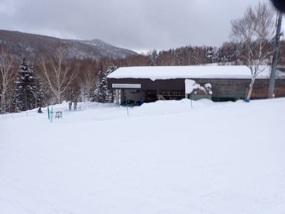
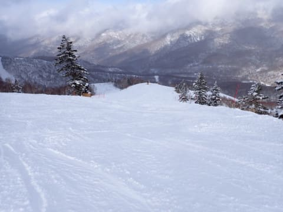

# 2024/3/9(土)の志賀高原焼額スキー場は…曇り時々晴れ間も，朝は20㎝程度の冷え冷え雪！午後は雪は荒れたよ

📅 投稿日時: 2024-03-10 00:35:22

🏷️ カテゴリ: [2024スキー滑走日記](c453f687e8a0f05679e95831d0a02cd0c.md)

今日は２週間ぶりの志賀高原に舞い戻って

きました～！！

志賀高原は完全に冬に逆戻りですね…

２月より冬っぽいんですが？？

とりあえず．

今朝は，危惧された関東の積雪はなく．

関東付近は問題なく脱出できたの

ですが…

朝の高速道路が，東部湯の丸あたりから

除雪車が入っていて，かなりゆっくり

走行だったのと，

長野ICからのチェーン規制渋滞，

そして，志賀高原の上り坂が本格

雪道で・

登れず死に絶えた車がたくさんあったとか，

長野県内に入ってからが結構大変で…

焼額山に到着して準備をしていたら…

営業開始の８:30から13分ほど遅れるという，

私としては致命的な失態（涙）

慌ててゴンドラに飛び乗り，山頂まで

登りますが…

山頂の気温は-12℃！！

3月も半ばになりつつありますが，

トップシーズン並みの冷え冷え！

今シーズンは2月があったかかったので，

2月より寒いんじゃないかな？？

そして天気は…

早朝はすごい吹雪だったらしいけど，

ゴンドラ営業開始後は吹雪いておらず，

薄曇り．

うっすら明るくて，バーン状況も

そこそこ見える天気！

朝までの積雪は予想通りの20㎝程度．

コース横はブーツパフ！！

圧雪コースも，圧雪の上に10㎝ほどの

軽い雪が乗っていて…

いや，これ，2月より2月っぽい…

完全トップシーズンのゲレンデコンディション

ですよ！！

殆どのコースでは，圧雪の上に雪が

5－10㎝乗ってましたが．

圧雪した時間が遅いコースでは，柔らかい

シマシマが残っていたりして…

あさイチは人も少ないし，ガラガラだし．

それでいて，雪質は冷え冷えだし…

天気はすっきり晴れじゃないけど，

今シーズン一番トップシーズンらしい

コンディションでは！？？

ただ．

時間が過ぎるにつれ．

バーンの上の新雪が荒れていくし．

時々雪が強く降るタイミングが

あったりして…

雪は冷え冷えだけど，気持ちよく

かっ飛ばせるかというと，ちょいと

惜しい感じ…

とはいえ，終日雪降りの予想が，

時折青空が見えるタイミングがあったし…

ゴンドラもガラガラだし…

リフトもガラガラ！！

気温が全く上がらず，最高気温が-10℃と

かなり冷え冷えだったので．

今日は根性のないスキーヤーふるい落とし

デーになるかと思ったところ…

雪は降ってもちらちらで吹雪くことはなく．

時折日が射す天気だったので．

根性のないスキーヤーふるい落とし

機能は働かず…

時折日が射す中，3月としてはかなり

恵まれた…

というか，今シーズンの週末で最も

冷えたいい雪かも！！

でも…

冷えたいい雪だけど…

圧雪の上に乗った新雪が蹴散らされて．

昼過ぎには，志賀高原全面，すべて

バーンがボコボコになってきました（涙）

さすがにこのバーンでは，大回り板の

トップスピードでかっ飛ばすのは

絶対無理です…（涙）

雪質はいいけど，トップシーズンの

柔らかい雪はすぐにボコボコになるのを

久しぶりに思い出しました…

しかし，

今日は第3高速も復活し，

SGSコース，イーストコース，ミドルコースのほか，

オリンピックコースも復活したし…

夕方になると悲しいくらいの全面

ボコボコバーンになったけど，

雪降りの予想を外してバーンは

見やすかったし．

ボコボコになったとはいえ，最後まで

トップシーズンの冷え冷えのいい雪で．

薄日もさす，予想よりいい天気で

ガラガラのゲレンデを，今日も

日が暮れる16時15分まで滑り倒した

のでした…

いやーーー．

異常に高温だった2月よりも

よっぽどトップシーズンらしい3月の

週末でした～！！

明日もまた20㎝くらい冷え冷え雪が積もり

そうなので，明日もトップシーズンらしい

コンディションで滑れると思います…

絶望の2月から考えれば，こんな3月の週末が

迎えられるとは，感謝の限り

明日も楽しんできます～！！

## 💬 コメント一覧

### 💬 コメント by (地元民)
**タイトル**: Unknown
**投稿日**: 2024-03-10 02:10:39

夜中の2時⇒郷も吹雪で10㌢。目覚めたら、予想より大量の雪だったのでは?

### 💬 コメント by (新米パパ)
**タイトル**: Unknown
**投稿日**: 2024-03-10 03:03:25

お久しぶりです。

今朝はパフパフでしたね！

西館獅子前にS様の板がポツンと一本ありましたので取りに来れられるかと、お待ちしておらりまさしたか゛、

、おあいて゛きす゛。今日も、ピンク色のヘンテコ小回りのチビと滑ってまーす。

### 💬 コメント by (Skier_S)
**タイトル**: 今週は良かったよ！
**投稿日**: 2024-03-11 01:55:26

＞地元民さま

日曜の積雪は50㎝でした…

長野地方気象台の勝ちです（涙）

まぁ，いい方向にはずれたということで…

＞新米パパさま

昨日は試乗板を借りて第1ゴンドラ駐車場の車に戻ったので，あの板は試乗会会場に

一旦置いていき，帰りに車で回収したのでした…

今日も滑ってたのですね．

ニューヤケビキッズたちが滑ってましたが，ご覧になりましたか？？

### 💬 コメント by (Masakish)
**タイトル**: Unknown
**投稿日**: 2024-03-11 05:08:58

苗場も2月より冬らしい3月でした。日曜日、1日で積雪が30cmほどあり、新雪フカフカパウダーでした。この雪で、各スキー場は、延命出来たのでは。

### 💬 コメント by (Skier_S)
**タイトル**: ＞Masakishiさま
**投稿日**: 2024-03-12 02:29:16

コメントありがとうございます~！

苗場もいい雪だったんですね…

スキー場にとってはまさに恵みの雪になりましたね…！！

