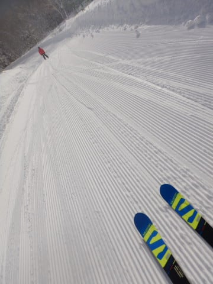
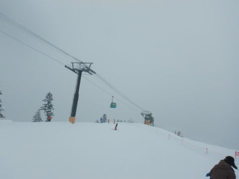
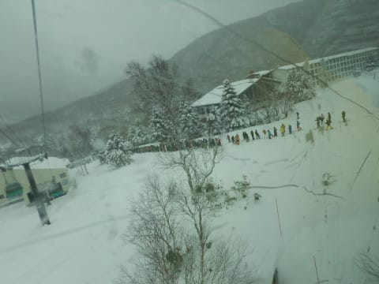
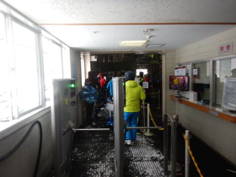
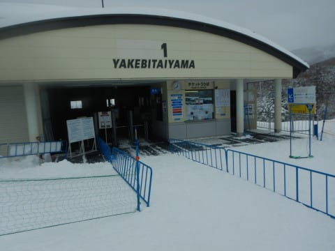
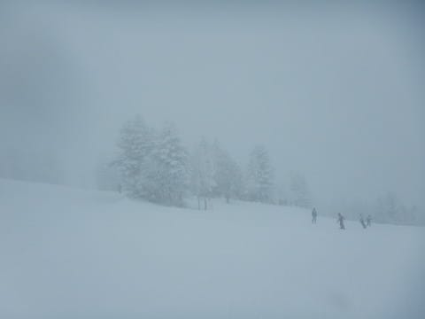

# 2021/12/19(日)の志賀高原焼額山スキー場，速報レポート！…ついに1ゴン営業開始．1ゴン一瞬混んだけど，冷え冷えGoodな一日

📅 投稿日時: 2021-12-20 01:26:05

🏷️ カテゴリ: [2022スキー滑走日記](cc9cb73e4320f6a97af6fccc37587a61a.md)

ということで．

今日も志賀高原で滑ってきて．

日付が変わる直前くらいに帰宅しました…

眠い…

だもんで．

今日も速報モードにて！

まず．

今朝は晴天のシマシマバーンでスタート！

昨日積もった雪が圧雪された，トップシーズンの

柔らかい冷え冷えシマシマ！

12月の20日になってないこの時期に，こんなにいい

雪質で滑れることはめったにないな…

晴れたのは朝1時間ほどで，9:30ごろには曇り

空になってきたけど…

本日は10時から，待ちに待った第1ゴンドラと

GSコースのオープンです！

帰ってきたよ…

久しぶりに，我が住み家に戻ってきたよ！

と，思ったら…

どうやら，今日焼額に来ている人のほとんどが

1ゴン狙いだったのか．

10時のオープン直後に人が1ゴンに集まり，

ゴンドラ待ち最長30分に…(涙）

これまでの史上最凶の列かもしれない…

でも，1ゴンに人が集中したからか．

この時間の2ゴンは結構ガラガラで…

しばらく2ゴンを回していたら．

イチゴンオープン後3時間，午後1時ごろには…

1ゴンもガラガラ飛び乗りになってきました！

午後は結局，1ゴン，2ゴンともにほぼ

飛び乗り状態で．

コースも結構空いていて．

雪質やゲレンデ状況は，完全トップシーズンの

コンディションだった…という一日でした！

…そして．

今日も，夕方から雪が降り続く天気となり…

明日もまたいいコンディションで滑れそう…

また明日，詳細レポートやります！

…今日はもう眠い…

## 💬 コメント一覧

### 💬 コメント by (Hide)
**タイトル**: さすがです
**投稿日**: 2021-12-20 07:46:04

S 様

おつかれさまです。

志賀高原から相○原へ帰宅後、きっちりブログ更新までされる素晴らしい体力の持ち主！

私はやっとこさ27日に初出動予定です。

月曜なのでいらっしゃらないですかね？

Sさん、25日から10日間志賀高原に住み着いているなんて・・・まさか？（笑）

### 💬 コメント by (真美子)
**タイトル**: Unknown
**投稿日**: 2021-12-20 16:50:36

４、5回分をまとめて読みました。Web会議3つ同時には、吹き出してししまいました。

またおにぎりしか食べられない日々（２日間）なんて可哀想なの!と。

でも、焼額で滑っている時間の嬉しさが、強く伝わってきましたよ。

私も27日か2泊3日で焼額です。待ち遠しいです。

### 💬 コメント by (レインボー74)
**タイトル**: Unknown
**投稿日**: 2021-12-20 18:44:05

月曜日の志賀高原情報

湯田中は5cmのさらさら雪。上林-2℃　蓮池-5℃。すっきり晴れ渡り期待感を抱かせる。

パノラマから唐松へ。あれっ、唐松の非圧雪が、ない。全面整地で広々してる。だけど雪面は完璧なシマシマふかふか。

すぐに初イチゴン。GSサイドの非圧雪をカズさんが華麗に滑ってる。GSもめっちゃ快適。

あれこれ滑ってファミリーへ。ダイヤはノー非圧雪でパス。ファミリー正面バーンは非圧雪だけど柔らかいのでなんとか。でも乳酸が！

タンネはまさに極楽バーン。

高天は残念なことにクワッドが故障とかで停止。点検だとか故障だとかで、残念な日が多い。

銀嶺昼食のあとは、快適タンネ。よそ見して滑っていたら、目の前に段差の山が！

ボコッと頭から突っ込んだけど、根曲がり筍にはまだ早いようで、みんなに笑われました。

何だかんだで、シーズン初のレインボー上がり。身体はなんともないけれど、下界での仕事(温泉、料理、洗濯、宴会など)が忙しすぎる。

これをラスリフまで、しかも毎日、やり続ける鉄人も、志賀には存在するんですよね。私の周りは異常な人が当たり前で、もはや正常なおかたが異常に感じざるをえない状況になってしまいました。

### 💬 コメント by (モイストシルバー)
**タイトル**: Unknown
**投稿日**: 2021-12-20 20:03:00

S様　第1ゴンドラはすごい待ちで、1本滑ってサウス・カラマツに戻ってしまいました。午後は雪質も良く、ガラガラで良かったですね。

日曜日は営業終了まで滑り、夜帰着しましたが、お昼休んでこの疲労感ですので、数時間睡眠で往復し、かつ滑り続けるのは信じられません。。。

### 💬 コメント by (かず)
**タイトル**: Unknown
**投稿日**: 2021-12-20 23:37:33

シーズンイン無事終了帰宅しました！久々で帰りがきつかった…

昨日の事故自分が通過した時15台位滑ってたようでした  自分の直前の車180スピン壁に…自分はブレーキロックして少しすべりましたが普通に回避できました…この差ってタイヤ？横滑防止装置？車マニアSさんどうでしょう？

### 💬 コメント by (Skier_S)
**タイトル**: 今週末も降る！積もる！パウダー！
**投稿日**: 2021-12-21 01:36:01

＞Hideさま

27日は仕事です…

でも，28日は日帰りで滑ってるかも！

さすがに25日から連続は無いです(笑)

＞真美子さま

Web会議3つ掛け持ちは二度とやらないと誓いました(笑)．

27日から志賀ですか！

28日は私も滑っていると思います…もし見かけたら声をかけてください～！

＞レインボー74さま

今日もコンディション良かったみたいですね…

でも，高天ヶ原，クワッド故障？？

すぐ直るんでしょうか…

あと，週末だけならまだしも，毎日ラスリフまでは人間じゃないでよすね…その某氏は(笑)．

＞モイストシルバーさま

コメントありがとうございます～

今回は乗り合いで移動して，運転は途中交代できるので，

一人で運転するよりは楽しています…

でも，土曜は夜まで飲んでいたのでそっちのが体に厳しいかもです(笑)．

＞かずさま

シーズンイン，お疲れ様でした．

シーズンインとしては恵まれた週末だったのではないでしょうか…？

目の前の車が壁につっこまれたらびっくりしますよね．

あの車，横滑り防止装置は加速時のスリップにしか効かないと思うので，

おそらく回避できたのはABSのおかげでしょうか？

