# 2024シーズンのスキー場の天気と積雪量を振り返ってみた，その4…焼額は奇跡的（というかスタッフの甚大なる努力で）GW最後までもったけど，その後はかぐら・渋峠・月山もあっという間に終わり

📅 投稿日時: 2024-06-23 02:51:50

ってな感じで．

[前回](e8b0239db0593684b6ca915086e005d3b.md)は，そんなに冷え込んだわけでも

ないけど，平年並みに戻ってくれたうえに

雪が降る日が続いてくれて，

雪不足状態から一気に平年並みにまで

積雪量を戻した，奇跡の3月のお話でしたが．

ただ．

3月末ごろには気温が上がっていくという

すごい悲しい天気予想が当たってしまい．

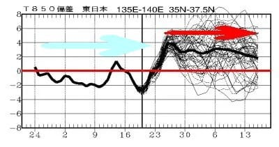

3月末になると，予想通り気温が上がりはじめ．

雨が降るようになってしまいました…（泣）

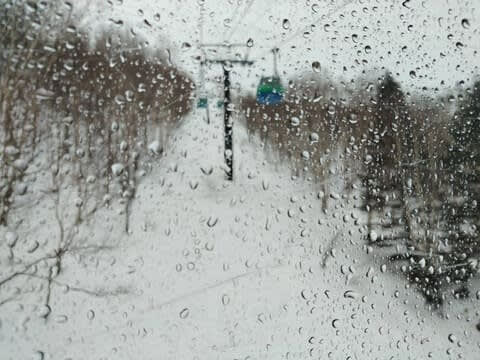

そんな中でも．

冷えてくれた夜は，もうすぐ4月という

3月28日前後にも人工降雪を

打つという営業努力！！

すごいぞ，焼額！！

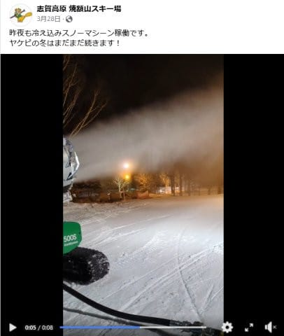

とはいえ…

やっぱり予想通り，3月末から4月はかなり

高温になっていき．

3月30，31日は朝からプラス気温で昼間は

10℃を越えるような気温だったし．

その上4月4日，9日に雨が降り，さらに

そのあとも高温が続き．

2月末にクローズ後に大雪で劇的な

再オープンしたオリンピックコースも，

10日にはシーズン終了．

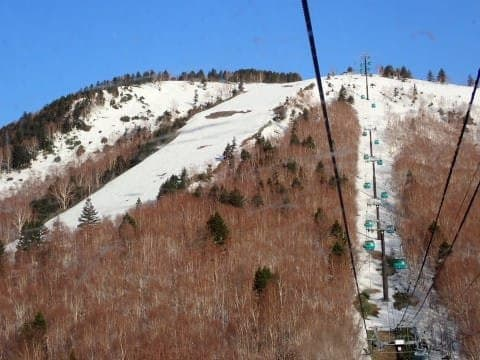

…まぁ，2月末に土が出てクローズになった

コースが，よく4月10日までもったものだ…

と，ここは褒めておくところかな．

ただ．

オリンピックコースがクローズになった

あたりで，焼額もかなりやばいところが

出てきましたが…

2月末にクローズしたまま再オープン

しなかった白樺コースとかから

雪を運んで，穴が開いた翌日には

何もなかったかのように復活してたし．

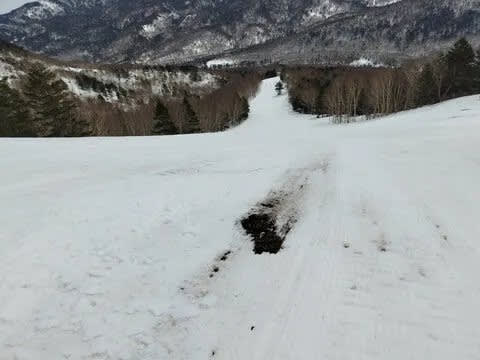

4月に入り，最高気温が15度を越えるという，

普段の4月ではありえない，

「夏スキーか？？」という，6月並みの

超高温の日々が続いたけど…

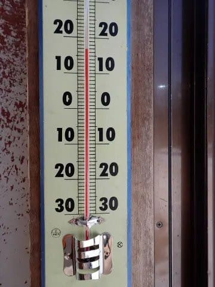

でも．

そんな中でも，奇跡の3月の積雪のおかげで，

イーストコースをはじめとして，

いつもなら早めに終わるSGSコースも

4月15日ごろまで営業してくれたし．

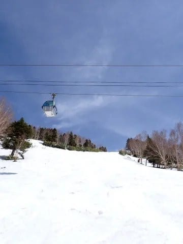

さらに，GSコースやパノラマコースは

4月後半に突入しても，コース幅いっぱいに

滑れて，真っ白だったので…

この4月は昨シーズンの同時期より雪が多く．

「これだけ高温が続いても，昨シーズン

　より雪が多いって，実は3月の積雪，

　すごかったんだな…」

と，奇跡の3月だったことを再認識したのでした．

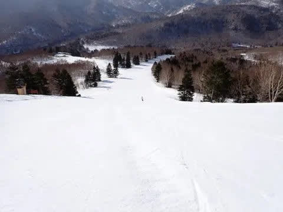

ってなことで．

4月20日くらいまでは，GSコース側にも

結構雪がたっぷり残っていた焼額ですが．

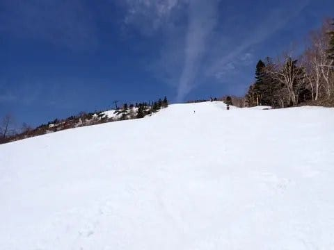

やはり，3月25日ごろからGWまで，

ひたすら平年比+3℃以上の温度が

続いた，記録に残る高温だったこの4月．

平年並みの4月だったら，GWまで何の心配も

なく雪はもちそうだったのに…

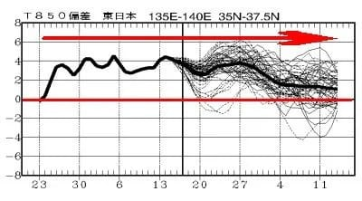

下旬になってからも高温がひたすら

続いたのと．21日や24日に結構な雨が

降ったというのもあり…

20日を過ぎると，コース外の雪はかなりの

勢いで解けていき．

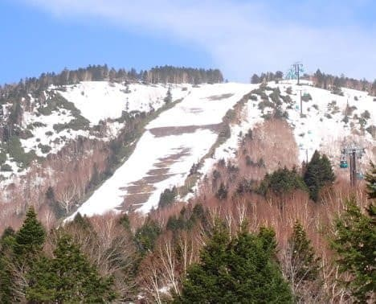

そのせいで，4月21日ごろには雪が一部

薄くなってきたGSコースが…

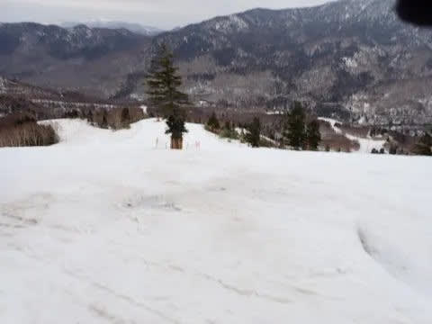

25日にはこんな感じになっちゃってたし．

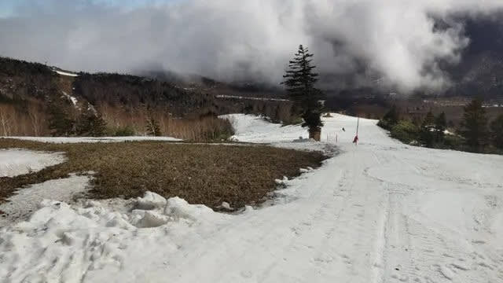

4月25日には，一ノ瀬ダイヤもこの状況（涙）

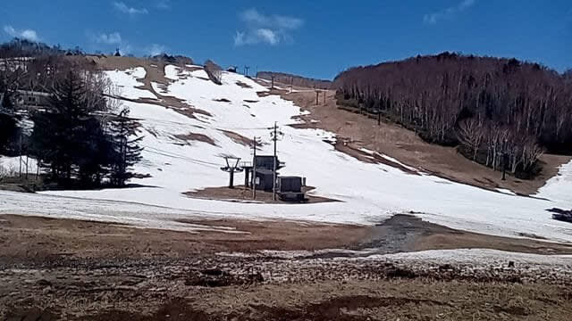

一ノ瀬ファミリーの正面バーンも4月29日に

終わっちゃいました（泣）

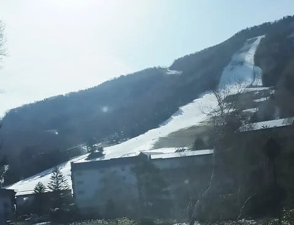

そんな中でも，焼額のコースは

かなりの手間暇をかけた徹底した

雪付けが行われて．

ものすごいコース維持の努力の結果，

GW前半になっても，GSコースは

まだこんな感じで維持されていて…

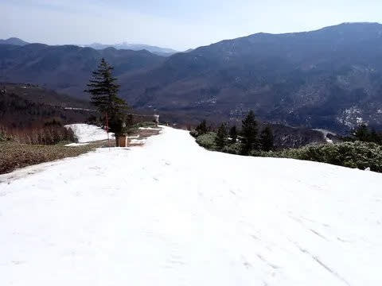

サウスコースは3月末まで人工雪を

大量に打ったおかげか，GW前半では全く

問題なく滑れ．

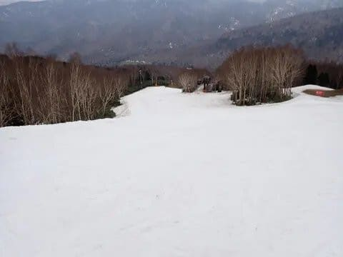

4月30日まで第1ゴンドラ・第2ゴンドラの

ゴンドラ2台が動いてました～！！

（まぁ，4月30日の1ゴン側はかなりヤバかったけど）

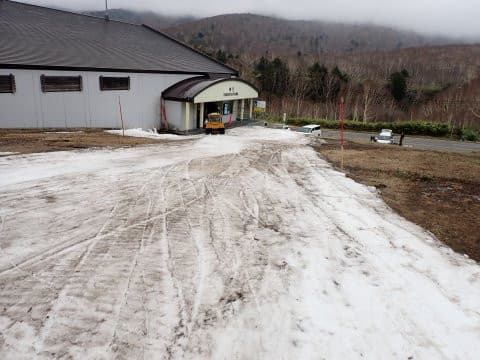

その後，GW中に何度も雨が降り．

一ノ瀬エリアはGW後半の4連休まで

もたずに終わっちゃったにも関わらず．

焼額はGW後半も，かなりヤバい感じの

ところもあったとはいえ…

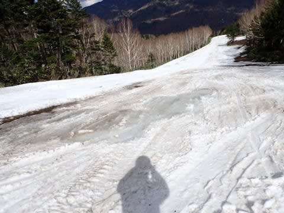

必死の雪付けで，GW最終日前日まで

ゴンドラのコースを維持して．

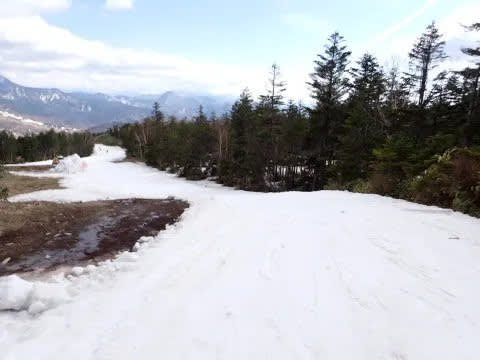

GWの最終日も，何とか第4ロマンス

1本は維持して．

この雪不足の年としては奇跡と言っていい，

GW最終日までの営業を完遂したの

でした…

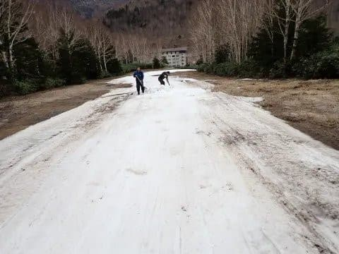

…いやーーー．

今シーズン，GW最後まで滑れるとは…！！

ってな感じで．

GWまでは良かったものの．

その後がよろしくなかった（涙）

やはり雪が少ない今シーズン．

5月19日まで営業予定だったかぐらが，

予定を前倒しして，

GW翌週の5月12日で終了（涙）

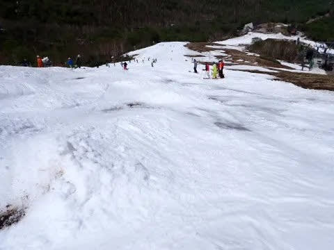

雪が多い年なら6月まで営業する渋峠も

同じ5月12日にクローズ

となり．

その後，人工雪のおかげで何とか営業を

引き延ばしていた横手山海和ゲレンデも，

5月17日に営業終了

と，例年に比べて早いシーズン終了となり．

5月下旬で残るは月山のみ

というヤバい状況になったのでした…（泣）

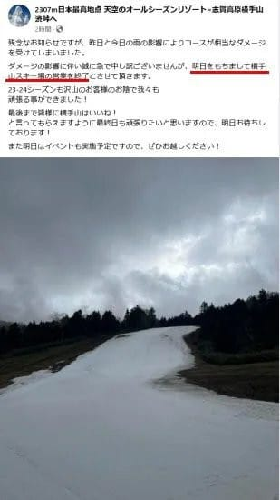

（横手山スキー場Facebookより）

そんなこんなで，私としては初めての，

6月を待たずして5月に月山に行く

ということをしたわけですが．

5月25日の時点で例年の6月上旬並みの

雪の量で．

普段より2週間雪解けが早い感じ…（涙）

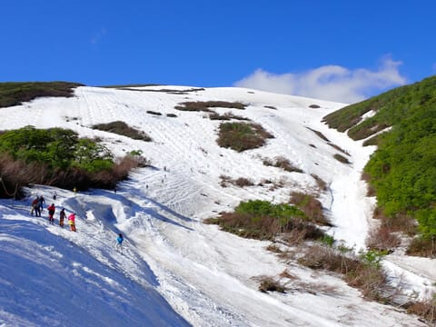

さらに，まだ6月第1週というのに，

6月7日には大斜面に藪漕ぎが入る

という．

近年まれにみる恐ろしい状況で．

今シーズンは，GW後はあっという間に

終わってしまった感じだったのでした…

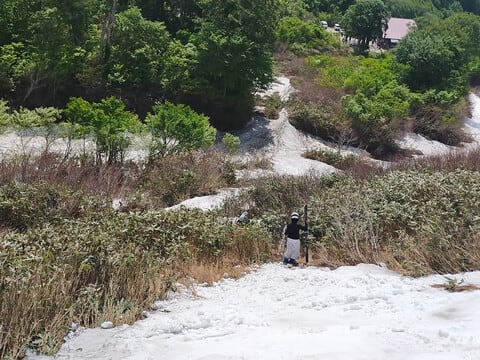

ってなことで．

振り返ってみると．

スタートも遅く，

１，２月にあんまり雪に恵まれず，

残念な感じのトップシーズンだったけど．

奇跡の3月にたくさん雪が降り．

焼額も何とかGWまでもってくれたので．

前半がっかりさせて，後半に復活する

という感じだった2024シーズンだったかな，

と．

その逆で，前半良かったけど

後半に地獄を見るよりは，シーズンが

終わった後のガッカリ感が少なく済んで

良かったのかも…

とりあえず．

来シーズンは，

シーズン最初から最後まで冷え冷え雪が

たっぷりある

というシーズンになるよう，

みんなでこれから，来シーズンに向けた

冷え冷え踊りを踊りためておきましょう…
