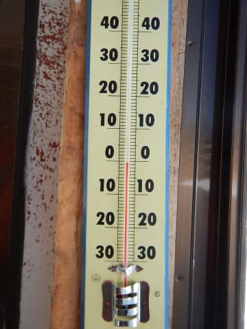

# 2019/3/9(土)の志賀高原スキー場は…終日晴天！昼間は気温が上がったけど，それほど雪もひどく緩まず，久しぶりのやわらかい雪で滑ったよ！

📅 投稿日時: 2019-03-09 23:12:51

🏷️ カテゴリ: [2019スキー滑走日記](c3e4496fc0fb7f9c17ff21214a35b1ace.md)

ということで．

本日の志賀高原ですが．

一言で言えば．

最高でした．

ええ．

もう，最高でした！！！

この2月．

ずっと硬めの雪ばっかり滑ってましたが．

久しぶりに柔らかい雪の上を．

それもぴかぴか晴天の中，

滑った気がする…

ってなわけで．

朝ですが．

道路はかーーーーなりつるつるで．

途中で息絶えてる車，多数…

途中でチェーンをつけている車が

いっぱいいましたが．

明日もツルツルの可能性が高いので，

明日志賀に上ってくる方は

お気を付けください…

でも．

登ってくる道路から，

天気はすっきり晴れ！！

いやーーー．

今日は期待できますよ～！！

ってな感じで．

いつも通り，やってきました焼額！

今日から，6:30スタートの早朝営業を

やっていますので．

8:30の通常営業開始前に

並んでいる人は，それ程では

なかったですね…

で．朝イチの山頂の気温は…

-4℃と．

まぁまぁの冷え込み！

そして．

焼額山頂も．

雲一つないすっきり快晴っ！！

早朝営業をしていたので．

通常営業開始時には，もう

かなりシマシマが崩れて

ましたが…

でも．

まだシマシマが残ってますよ！！！

それも，今日は．

トップシーズン並みの，かなりやわらかい

シマシマ！

柔らかすぎて，スピードは

それほど乗らないけど．

でも，板が気持ちよく食い込んで，

ぐいぐい彫り込んで曲がっていける，

いつもの志賀高原のトップシーズン

っぽい，「ああ，雪だ！！」

って感じの雪です！！

この2月は．

ずっと硬い雪ばっかりだったけど．

実に久しぶりに，こんなに柔らかい

シマシマを滑ったよ…（感動）

で．

今日の焼額は．

朝のうちは人も少なく．

シマシマは崩れてきたけど．

日差しにも関わらず，冷え冷えの

柔らかい雪のままで…

いや，めっちゃ快適なんですけどっ！？？？

こんなすっきり晴天で．

コースはガラガラで．

ゴンドラも待ちなしで．

リフトもそれほど待ちがなく．

雪はアイスバーンが全くなくて．

冷え冷えの柔らかい雪が全面を

覆ってくれて…

こんないいコンディション．

シーズンそうそうありませんよっ！！？？

…ただ．

オリンピックコースは．

昨日，ウインチ付き圧雪車が故障して．

非圧雪だったので…

昨日積もった雪がぼそぼそに

固まって．

無茶苦茶重い，すごい難しい

荒れ荒れバーンになってたのが

惜しいけど…（涙）

でも，今日は終日晴天すっきり

気持ちいい晴天が続き…

昼間の気温は0℃をわずかに超える

程度と，それほどひどく上がらなかったので．

午後になったら緩むかと思っていた

のですが．

意外と雪は午後まで，

柔らかくていい雪質を保ってくれたのが

嬉しい誤解！

ただ，朝日が強く差し込む，

東側の一部斜面は，ちょっと

ダマダマ状に固まったところも

あったり．

コース上の一部，タイミングによっては

人も多い時もあったし．

コース上のごく一部，昼間にちょっとだけ

緩んだところが，夕方に荒れてたりもしたけど．

でも，今日は朝から夕方まで，

だいたいコース上もガラガラで．

雪質も良く．

いつも通り，日が暮れる夕方まで．

トップシーズンのやわらかい雪と．

ガラガラのゲレンデと．

晴天の日差しを楽しめた．

超贅沢な一日だったのでした…！！

あぁ…

良かった…

今日は良かった…

こういう日が，毎日つづいてほしいんだけど．

これからずっと，毎週末こんな

コンディションだったらいいなぁ…

こんないいコンディションの日は．

まだまだ滑り足りないのだ！！！

…ということで．

いつも通りやってきました．

ダイヤモンドナイターへ！

先週はダイヤモンドナイターに

圧雪がかかっていなかったらしいんですが．

今日は圧雪がかかってます！！

…が，ちょっと圧雪が荒いかな．

細かな凸凹やころころがいっぱい

あるんですが…（ちょっとだけ涙）

でも，シマシマゲレンデ．

美味しくいただきま～すっ！！

と，飛び込んだものの…

なぬ！？？

シマシマがボロボロ崩れて，殺人

コロコロになっていくんですけど！！

なんだーーー！？？

足場がゴロゴロ崩れていって，

滑りにくいんですけど！？？？

ってことで．

昼間は最高だったのに．

なぜかナイターでは，バーン全体を

殺人コロコロが覆う，殺人バーンを

滑ることになったのでした…（涙）

…ってな感じで．

ナイターはちょっと残念だったけど．

何にしろ，今日の昼間は良かった…

いや，

これはもう．

分かってますよね．

私の冷え冷え踊りのおかげですから！！

皆さん，私に感謝…（ドスっ）←読者に撲殺される音

## 💬 コメント一覧

### 💬 コメント by (レディママ)
**タイトル**: Unknown
**投稿日**: 2019-03-10 17:27:56

はじめまして！今年のお正月に初めて志賀高原スキー場に行ってみて

すっかり虜になりました🤗バラエティに富んだコースをこれからゆっくりと滑り込んでいきたいと思います。

「徒然スキーヤー日記」楽しみに読ませていただきます！どうぞよろしくお願いします❤️

### 💬 コメント by (なるなる)
**タイトル**: Unknown
**投稿日**: 2019-03-10 22:37:58

いや～昨日は最高でしたね。

もう今シーズンは、まともな雪では滑れないと諦めていました。

志賀まで行こうか迷っていましたが、S様の土曜は良くて日曜も雨は降らないという予報を信じて行って良かった。

予報と踊り?ありがとうございました。

### 💬 コメント by (Shiosuke)
**タイトル**: Unknown
**投稿日**: 2019-03-11 00:20:04

土曜日の9時前位に1ゴンでご一緒させていただいた者です。短い間でしたがとても気持ちの良い時間を過ごすことができました。又、私の帰り際(このブログ的にはレインボー)にまたお会いでき銀のお札も頂戴しありがとうございました。

しかしS様のおっしゃるレジャースキーヤーとは何ぞや、じゃあ自分は何スキーヤーなんだろうと考えながら帰路につきました。

今後もブログの更新、楽しみにしています。

### 💬 コメント by (Skier_S)
**タイトル**: 眠い…
**投稿日**: 2019-03-11 03:47:13

＞レディママさま

始めまして～！

志賀高原，いいところですよ～！

今シーズンもまだまだ滑れます．

またの機会を見つけて，志賀高原に滑りに来てください．

では，これからもよろしくお願いします～！

＞なるなるさま

いや．

この週末．

かなりいい感じでしたよね…

日曜もリフト営業終了まで雨に降られることもなく．

もう，今シーズンの1-2を争う良さだったと思います．

それもこれも，私の踊りのおかげですから～！←違うと思う

＞Shoisukeさま

コメントありがとうございます！

土曜はお世話になりました～！

…私はお金を稼ぐでもなく，大会に出るわけでも無く，

検定を受けることもなく，必死に練習するわけでも無いので．

典型的なレジャースキーヤーだと思っています（笑）．

皆さんもレジャースキーヤーだと思いますよ…

