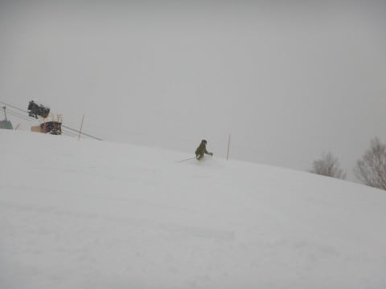
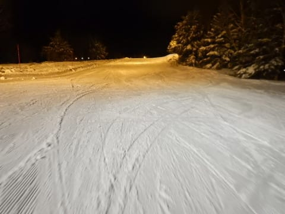

# 12月30日の志賀高原，焼額山は…吹雪のち曇り．朝は冷え冷えパウダーなれど混雑（涙）

📅 投稿日時: 2017-12-30 22:55:03

ということで．

昨日一日は，スキーをせずに

年末のモロモロをこなしてきたわけですが．

本日．

志賀高原に舞い戻ってます！←志賀高原に「戻る」んだ…

ってなわけで．

昨晩から，かなりの勢いで降り始めたらしい

雪のため．

上信越道は須坂長野東ICからチェーン規制で．

朝7時前から，須坂長野東IC手前で，

チェーン規制渋滞が…（涙）

5分もかからずに抜けたから良かったものの．

さらに信州中野ICでもう一度チェーンチェックが入っている

ようで．

信州中野でもさらに5分渋滞との案内が（泣）

だもんで，

信州中野まで行かず，小布施スマートICから降りて，

下道を走りますが．

中野の市街の道路も，本格積雪路ですな…

そして．

志賀の登り坂も当然バリバリ積雪路なわけで．

朝7時半ごろはそれほどでもなかったけど，

8時ごろにはかなりの渋滞になっていたようです…

朝イチを狙う方は，早めの出発をおススメ！

ってことで．

ゴンドラ開始10分前に並ぶと．

うひゃー！

すでにかなりの列が…

で．

8:30営業スタートのゴンドラで山頂に出ると…

ふむ．

気温は-11℃ですか．

　朝は-10℃くらいの冷え込み

という予想，ほぼ当たりだな…っ！

そして．

山頂は吹雪いてます（涙）

でも…今日はパフパフデーのはず！

今日も太板出動だっ！！

やってきたオリンピックコースは…

うはーーー！

きたーーーーーー！

今日も膝パフっ！！

連日の膝パフ！

昨日から，別料金で30分早くからゴンドラに乗れる

ファーストトラックが営業されているので，

完全ぴかぴか新雪とはいかなかったけど…

まだほとんどトラックがついてない，

膝パフパウダーをGet～っ！！

…ただ，志賀にしてはちょっとだけ重めの

雪だったかも…

でも，2本目までは最高のディープパウダーっ！！

…だったんだけど

今日はちょっと人が多く．

4本目くらいには，もう完全な荒れ荒れ斜面…（涙）

ところどころ残った新雪も，1時間も経つと

「あぁ…終わった…」

という感じでした（残念）．

ということで．

新雪タイムは終わったので．

圧雪コースを滑ってみましょうか…

と，ジャイアントスラロームコースへ出てみると．

なんだ？

この人口密度は…っ！？？

久しぶりに，こんなに混んでるゲレンデを

見たよ…！

視界が悪く，吹雪いて激寒のゲレンデで，

これだけ人口密度が高いとは…

さすがの私も，ちょっと戦闘意欲を失うんですが（涙）

そして．

今シーズン．

ついに出ました，ゴンドラ待ちの列が！

ガーン．

ついに今シーズンもゴンドラ待ちが出るような

時期になりましたか…

（第1ゴンドラは，最大待ち時間5分程度だったけど）

まぁ．

でも．

リフトは混まなかったし．

第1ゴンドラは，午後になるとちょっと人が

へってきたかな…

冷え冷えの本日．

昼間も-10℃近くと冷え込んだため．

雪はスゲー良かったんですけど．

でも，さすがにこれだけの人が滑った

コースは．

午後になると，かなり荒れ気味凸凹バーンと

化してしまいます…

1ゴンのGSコース，2ゴン側のサウスコースとも，

かなりの凸凹バーン化…（泣）

結局この日は，午後まで雪が降ったりやんだりの，

ちょい吹雪気味の天気が営業終了まで続き．

ゴンドラ以外は乗りたくないな～…

という一日でしたね～．

そして．

雪質は良かったけど．

午後はぼこぼこで，人口密度も高く．

気持ちよく飛ばせなかったな～…

うーん．

なんだか，滑り足りないなぁ…

…

…

そうだ！

こんな日は，ナイターに行けばいいんだ！！

ということで．今シーズン初のナイターです．

焼額第3高速のナイターに参戦だっ！

うはははは！

昼間の憂さを晴らすかのような，

シマシマバーンだ～！！

ってことで．

今シーズン初ナイター．

結局，ナイター営業終了までたっぷり

楽しんだのでした…

うーむ．

やっぱり昼間にゲレンデが荒れた日は，

ナイターがいいなぁ…

明日は朝は晴れ，午後から崩れる…

と書きましたが．

朝から雲が多いかも…

でも，すっかり晴れないけれど．

午後遅くまで，雨や雪は降らずに済みそうです．

という感じで．

明日も志賀を滑ってます～！

## 💬 コメント一覧

### 💬 コメント by (ほっぽ)
**タイトル**: 初遭遇
**投稿日**: 2017-12-31 00:13:36

Ｓさん

今日はしょっぱなからお会いできてよかったです。

短い時間でしたがゴンドラでご一緒させて頂きありがとうございました。

私は１本でオリンピック戦意喪失したので、ＳＧＳへ逃げて、ミドルを滑って、あとは旅に出ました。

西館山でコブ滑っていたら、maeさんに声かけてもらいました。

ヤケビに戻ってきたら、yamaさん、まうちゅうさんとゴンドラでご一緒して、最後はyamaさんにお付き合い頂いて終了です。

明日もヤケビスタートなのでお会いできたらよろしくお願いします。

### 💬 コメント by (鈍足メタボランナー)
**タイトル**: いつも楽しく拝見しています。
**投稿日**: 2017-12-31 06:49:23

島根在住の元一般スキーヤーです。

いつも楽しく拝見しています。

スキーのレポは文面から楽しさが沸き上がっていていますね。おかげさまで志賀とか行ったことないのにズイブン詳しくなりました。

年末年始ほぼスキー三昧ですか。

そして物欲選手権・・・・・確かに毎シーズン板買って増しあ。まるで過去の自分を見てるようです。

もっとも今はスキー板がランニングシューズに代わってますけど。

なにはともあれ怪我せず、スキーを楽しんでください。

### 💬 コメント by (michi)
**タイトル**: Unknown
**投稿日**: 2017-12-31 10:57:03

昨日は朝一しかお会い出来ませんでしたね。

１ゴンが混み始めてから３高に逃げたりしてました。しかしあまりの寒さに早めにあがりました。

娘さんと滑れず残念でした。

今年はありがとうございました(^^)

また来年も宜しくお願いします。

ちなみにいつまで志賀に居る予定でしょうか。

自分は年明けいつ行こうか迷ってます。しばらく天気が悪そうなので、、、

### 💬 コメント by (olaf2125)
**タイトル**: Unknown
**投稿日**: 2017-12-31 14:28:02

10時少し前に1ゴンスタートしましたが、久しく見ない混雑ぶりと視界不良と苦手な新雪に悪戦苦闘で、お昼過ぎに撤収しました。

また年明けに参上しますので、よろしくお願いします。

良いお年を。(^o^)/

### 💬 コメント by (はっち)
**タイトル**: 天気予測検証用リンク
**投稿日**: 2017-12-31 21:51:20

を自分のブログ記事に勝手に貼らせてもらいました。m(_ _)m

お互い良い（スキーの）年になりますように(^^)/

### 💬 コメント by (Skier_S)
**タイトル**: 2018年もよろしくお願いします~！
**投稿日**: 2017-12-31 23:19:30

＞ほっぽさま

初めてお会いできて良かったです~！

ゴンドラ1本だけしかご一緒できず，

ちょっと心残りでしたが…

今回子連れだったのでゆっくりお話し

できませんでしたが，

いつも1ゴンぐるぐるしていますので，

またゆっくりお会いしましょう！

＞鈍足メタボランナーさま

いつも読んでいただいてありがとうございます~！

スキーが大好きなので，スキーさえしていれば

楽しいんです…

ただ．

滑りすぎると，板が次々と死んでいき．

道具の代金が…

板がもう少し安いとうれしいのですが．

今はあまりスキーをやらないのですか？？

ぜひ，機会があれば志賀高原へお越しください！

＞michiさま

昨日はあれからお会いできず，娘もちょっと

残念がっていましたが…

早上がりされていたのですね．

私は3日まで家族で志賀，

その後3連休も滑っています．

また来年もよろしくお願いします~！

＞olaf2125さま

あら…

お会いできず残念です．

今度こそ一緒に滑りたかったのですが…

でも，混んでましたよね．昨日は…

今日はもっと混んでましたよ（涙）．

また年明けにお会いしましょう！

2018年もよろしくお願いします！

＞はっちさま

どうぞ，ガンガンリンク張ってやってください．

2018年もよろしくお願いします~！

次の志賀参戦はいつでしょうか？？

