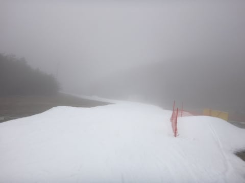

# 2016シーズン，スタート！10月17日Yetiオープン翌日の初滑りレポート…混雑しなくて，空いてたよ！

📅 投稿日時: 2015-10-17 22:44:47

🏷️ カテゴリ: [2016スキー滑走日記](c70c67ed5248e9432b899dcd5747048bb.md)

ふははははは．

ついに．

ついに，始まったのだっ！！

そう．待ちに待った，

待ちすぎて死にそうになった，

2015/2016シーズン，ついにスタートなのだっ！！！！！

いやーーー．

耐えがたきを耐え，忍び難きを忍んだ，←モアルボアルや西表に行ってきた人が言うことではない気がするが…

4か月のオフシーズンを終えて．

本日，イエティにて，ついに初滑りです！

…でも．

朝，8時の営業開始時間を狙って，イエティに向かう間…

うむ．見事に，ずっと雨ですな（涙）．

しかし．

ラッキーなことに，イエティに到着すると，

雨はほとんど止んできました!

いやー．

私がイエティに到着したら，雨が止むなんて…

やはり，これは．

私の日ごろの行いが良かったおかげですね！←違う．絶対違う．

ということで．

日本初スキーの地で…

久しぶりに，雪上に立ちましたよ！

いやーーーーーー．

実に4か月ぶりの，雪の感触…（感動の嵐）

朝の天気が悪かったからか．

ゲレンデは，この時期としてはガラガラ！

かなり空いてます…

＃コース幅は廊下状態だけど

いつもは結構混雑する，初滑りの週というのに．

朝10時くらいまでは，リフト待ちもこんな感じで，

待ち時間ほとんどゼロ．

コースも空いてて，かなり気持ちよく飛ばせたので…

もう，初滑りだから，大切にゆっくり

感覚を取り戻しながら滑ろう…

という思いもつかの間．

あまりもの人の少なさに，2本目からトップスピード！

朝は気温も低めで，板も走る雪なので，気持ちいいっ！！！

…

…と，思っていたら．

あら？

10時過ぎに，ちょっと雨脚が強くなってきました…（涙）．

コースもちょっとガスってきたんですけど…（泣）．

ああ…

今日，天気が良かったのはこれまでか…

ここからは雨の一日になるのかな…

と，悲しんでいたところ．

あれ？

11時過ぎには，日が射してきましたよ？？

そして，昼前にはすっきり青空も覗いてきましたよ？？？

ををを！

素晴らしいっ！

やはり，私の日ごろの行いの良さのおかげですねっ！！←だから，違うってば

天気が良くて，人が少なくて…

この時期のイエティ，こんなことめったにない！

天気がいいのに，昼過ぎでもリフト待ちが無く．

もう，気持ちよくリフトグルグルできます．

いや，シアワセ．

シーズン初日から，シアワセすぎる…

さすがに，午後は日差しのおかげでかなり暑く感じるほどになり．

雪もチョット緩み始め．

さらにリフト待ちも増えてきたけど，

でも，リフト待ちはこの程度．

雪は柔らかくはなったものの，人が少なかったので，

それほどひどくは荒れず…

まぁ，リフト乗り場近辺の急斜面のみ，

一部雪が薄くなったところは出てきましたが…

それ以外の部分は雪の厚さも十分．

コースの混雑具合は午後もこの程度で．

昼間営業が終了し，ナイターに向けて圧雪車が入るために

コースクローズする午後4時まで，たっぷり滑ったのでした…

いやーーーー．

朝の天気が悪かったおかげで，

午後までガラガラで．

おかげで雪も荒れず，リフト待ちも無く．

かなり満足な初滑りでした！！！！

土曜に行って，大正解だったな～．

PS.気温は，日が陰って雨が降ったりすると「ウェアのジャケット

　着てもいいかな？」ってくらい，寒く感じます．

　でも，日が当たると暖かく，トレーナーで十分なくらい．

　着ていくものは，かなり天気に左右されます…

## 💬 コメント一覧

### 💬 コメント by (ひろちゃん)
**タイトル**: 外足荷重レッスン
**投稿日**: 2015-10-18 12:48:11

午後から、良い天気で、日頃の、行いの賜物でしたね（笑）、外足荷重は、内足操作に、あり、レッスンありがとうございました。

### 💬 コメント by (Skier_S)
**タイトル**: ひろちゃんさま
**投稿日**: 2015-10-18 21:19:16

昨日はお世話になりました～．

シーズン初日から，いきなり濃い目の

お話をしてしまいましたが…（笑）．

参考になりましたでしょうか？？

また，一緒に滑りましょう！

