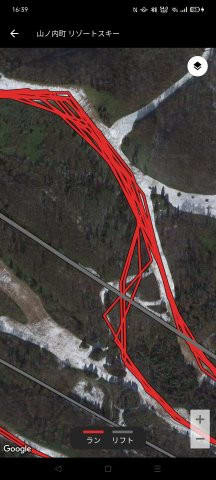

# Garmin fenix7Xのスキーモードが12月にアップデートしたよ…かなり変化してよりいい感じになった！

📅 投稿日時: 2024-03-06 03:25:14

🏷️ カテゴリ: [PC,カメラ&小物](c0d8caed13e597efe97b661a8ae56bed0.md)

えー．

5日の火曜深夜現在．

志賀高原は，結構雪が降ってますね~！！

焼額山のライブカメラを見ても，

もう10～20cmくらい積もってるかな？？

（[焼額山スキー場ライブカメラページ](https://www.princehotels.co.jp/ski/shiga/livecamera/)より）

このまま明日の午前中くらいまでは

降り続けてくれそうなので．

明日朝までに30cmくらい積もってくれる

かも…？？

そして，もう一ついいニュースが．

先週末で営業休止とアナウンスされていた

焼額の第3高速ですが．

先週から少しは雪が積もってくれたので，

今週金・土・日の3日間のみ，

焼額第3高速を営業再開してくれる

ようです…！！

（[焼額山スキー場ホームページ](https://www.princehotels.co.jp/ski/shiga/winter/)より）

今週末は結構いいコンディションに

なりそうなので，滑れるリフトが増えるのは

ありがたい限り…

とりあえず，今週末の志賀高原の天気は，

いつも通り水曜深夜の明日の記事で

予想します～！

…ってなことで，本題へ．

私がここ1年半ほど愛用している，

GarminのFenix7X．

昨年12月に大幅なアップデートが入り，

スキーモードの動作が大きく変わりました…

いや．

もともとこうあってほしいなぁ…という

ところがその通りに変わってくれて，

私としては大満足なアップデート！

リリース後時間が経ったモデルでも，

しっかりアップデートされて，

機能がこまめに追加されたりするのが

Garminのいいところですね～．

とりあえず．

今回のアップデートを説明する前に，

Garminのスキーモードを説明しますが．

私は画面をカスタマイズして，

こんな感じで…

現在時間，

現在のスピード，

最高スピード，

高度グラフ，

総滑走標高差，

今何本目か，

滑走距離，

心拍数グラフ

を見ることができるようにしていて…

画面を切り換えると，

気温（腕につけてるから高い温度になってるけど…）

消費カロリー

滑走距離，バッテリー残量，

日の入り時刻，さっきの1本の平均スピード，

GPS信号強度

の画面や…

マップを見れるようにしています．

マップはこれまで滑った軌跡も見えるし，

コースマップも載っているので，

（コースが水色で表示されている）

結構便利です．

で．

スマホで細かいデータを見ることも

できて…

平均スピードや最高速度，

滑走時間やリフトに乗った時間とか，

標高差が見えるのは当然として．

それぞれ1本ごとの滑走時間と

滑走距離，標高差を見ることが

できたり…

標高差や速度，心拍数のグラフを

見ることができたりします．

あと，マップ上で滑走ルートを

見ることもできますが…

スマホで滑走ルートを見ると，

かなり飛び飛びのデータで描画

されているみたいで，ちょっと

コースから外れたみたいな表示に

なっちゃってます…

まぁ，これはスマホ表示が間引いた

データで表示しているだけで．

元のデータはかなり精度が高いので，

PCで見るとどこのコースをどう

滑ったか，1秒ごとの記録を

1mくらいの誤差で正確にたどることが

できます．

コースのどっち側を滑ったかとかが

はっきりわかるレベルです！

…で．

今回どんなアップデートがあったかというと．

こちら．

スキーアクティビティのスプリット記録に対応

というものです！

（[Garmin Fenix7X アップデートページ](https://www.garmin.co.jp/products/wearables/fenix-7x-sapphire-dual-power-black/#updateTab)より）

これが何かというと…

以前のスキーモードは，自動ラップ機能を

ONにすると，こんな感じで滑っている

時間だけしか記録が残されず…

右下がりの滑走記録が終わったら，

リフト時間は0で一瞬でリフトの上に

移動しているグラフになってます．

高度グラフを見ると，滑っている

時間の記録のみで，登りの時間の記録が

全く残されない仕様だったんですよね…

自動ラップをOFFにすると，登りの

時間とか，滑っているとき以外の

心拍から高度，スピードの記録を

残してくれるんですが…

いま何本目かとか，さっきの1本の

滑走距離がどれだけだったかとかの

記録が残らなくて，ちょっと残念な

感じだったのですが．

今回のアップデートで，自動ラップを

ONにしても，リフトに乗ってる

時間や滑っていない時間の記録も

残るようになりました…！！

ちょっとわかりにくいので拡大すると，

アップデートした後では，

滑っている時間だけじゃなく，

リフトの時間や休んでいる時間も記録

に残っています！！

これなら，赤矢印のところで

リフト待ちが長かったとか，

水色矢印のところでトイレに寄って

いたとか，そういうのもわかるし．

これまで記録に残らなかった，リフト

乗車中や休憩中の心拍記録も残るので，

休んでいる間にどのくらい心拍が

落ちていたのかとかも確認できます…！！

いや…こうあってほしかったんだよ！！

滑走時間だけの記録しか残らないと，

こんな感じでいつどのくらい休んだのか

とか，滑ってない時の心拍がどうだったか

とかわからなかったりと…

やっぱり下のような古いバージョンの

仕様だと，ちょっといまいちと思って

いたので．

今回のアップデートはありがたい！

時計のほうに表示される高度グラフも．

以前のバージョンだと滑っている

ところだけしか表示されなかったのが…

新しいバージョンだと，リフトに

載っているときの高度変化も表示

してくれるようになりました！！

いやー．

Garminのスキーモードで唯一の不満

だったところが，完全に解消されて．

かなり満足度が高いアップデートでした！！

…ただ，このアップデートされた直後，

標高差が正しく表示されないとか，

一部不具合が発生したんですが…

これ，12月7日のアップデート直後1週間で

標高差バグの修正アップデートがかかり，

さらにその後また1週間で，

追加の修正が入るなど．

かなり迅速にバグが修正されました～！！

（[Garmin Fenix7X アップデートページ](https://www.garmin.co.jp/products/wearables/fenix-7x-sapphire-dual-power-black/#updateTab)より）

いや…Garmin，すごい．

スキーモードのバグ，それも標高差

表示がおかしくなるというバグだけを

直すバージョンをわずか1週間でリリース

してくれるとか，

さすがユーザーが多いだけある…

Garmin，やっぱりすごい．

ってなことで．

Lineやメールの通知も，滑っている間に

スマホを取り出すことなくGarminさんで

見ることもできるし．

Garminさんは，私のスキーに欠かせない

パートナーになりました…

山歩きだけじゃなく，スキーでも

かなり便利ですよ～！！！

## 💬 コメント一覧

### 💬 コメント by (1kamakura)
**タイトル**: Unknown
**投稿日**: 2024-03-06 07:54:23

江戸の秋

すごい時計ですね！

そして、時速70キロで滑るSさん！

すごい‼️

車並み〜。

って、上手い方はみなさんこんなスピードで滑っていらっしゃるのですね。

ドヒャ〜😳

### 💬 コメント by (副院長)
**タイトル**: Unknown
**投稿日**: 2024-03-06 13:39:44

fenix7は充実してますね、僕のは6xなんですが、アップデート出てるみたいなんで、自宅で、接続してみます。気がついたのですが、私の滑走記録は、かなり、グニャグニャターンしてるんですが、Sさんの記録は、ほぼコースなりの直線ですね。速いはずだ。月曜日、火曜日は　今シーズン初のパフパフさせてもらいました。でも、火曜日帰りは　また、南岸低気圧で、通行止で、北陸周りでした。今週末は今シーズンラストの志賀高原になります。最後のご挨拶できるように頑張ります。よろしく。

### 💬 コメント by (モイストシルバー)
**タイトル**: Unknown
**投稿日**: 2024-03-06 20:45:16

久々のガーミン記事ですね！こちらはForrunner955ですが同じようにアップデートされていました。Sさんほどカスタマイズできていませんが、今回の目玉であるリフト検知ですが、オートストップの動作がイマイチで、これまではリフトは100%検知していた(リフト時間は記録していなかったようですが)のですが、今回のアップデートでリフト検知が上手くいかず、恐らくオートストップ機能の不具合と思いますが、アップデート以降は手動ラップで対応するようになりました。参考まで。

### 💬 コメント by (Skier_S)
**タイトル**: Garmin便利！
**投稿日**: 2024-03-07 02:56:03

＞江戸の秋さま

Garminは便利ですよ～！もう，365日24時間，お風呂に入るとき以外はずっと着けてます．

そして，滑走スピード70km/hは…我々の仲間では遅い方だと思います（笑）．

＞副院長さま

6Xも同じアップデートが出ていると思いますよ．

スマホアプリ，昔の記録だと結構ぐにゃぐにゃなんですが，最近の記録は

表示する際にどうもかなり間引きされるようで，まっすぐになっちゃいました…

で，今週末がシーズンラストですか！！

早いですね…

まだまだ滑れますよ～！！！

＞モイストシルバーさま

お久しぶりです～！

私のFenix7Xは，ラップ検出は完璧ですね…

リフトに何本乗ったかの判別はこれまで間違ったことはないです．

手動ラップは不便ですよね．私も今回のアップデート前は，全ての記録を残すため

手動ラップにチャレンジしましたが，ボタンを押し忘れるのでくじけました…

