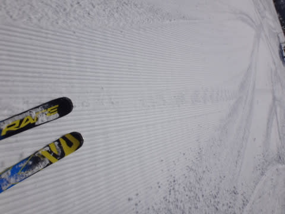
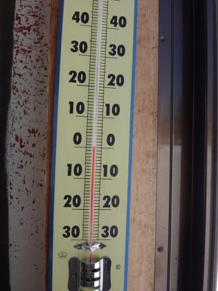

# 3月4日（土）の志賀高原は…晴天！朝はやわらか圧雪最高！午後はちょっとコブコブだったけど

📅 投稿日時: 2017-03-05 00:20:12

本日も志賀高原に来てるわけですが．

…結構Goodな一日でしたよ～！！！

まず，朝．

志賀高原の登りは，ちょっと氷で滑り気味の

圧雪道路…

でも，途中で息絶えている車もなく，

無事焼額へ到着！

朝イチの焼額山頂の気温は…

ふむ．-6℃ですか．

2月に比べると，気温がちょい

上がりましたか…

で．

天気は…

ふはははははは！

予想通り，すっきり晴天っ！！

そして，ゲレンデは…

ファーストトラックのあとが多少あるものの…

シマシマっ！！

柔らかい，ふわふわシマシマっ！！

うはーー！

昨日の午前中に積もった，柔らかい雪が圧雪

された，もうよだれじゅるじゅるものの，

ふわふわやわらかシマシマバーンっ！！！

こんな最高の天気で…

こんないいシマシマバーンが滑れるなんて

最高ではありませんかっ！！

…シマシマが崩れてきても．

朝のうち，雪はふわふわでかなりいい感じ！！

朝のうちは，

オリンピックコースも最高フラットバーンだし…

GSコースも気持ちいいフラットバーンが続きますが…

でも．

やはり．

ざんねんなことに．

10時ごろには人が結構増えてきて…

うむ．

ちょっと快適に飛ばすのは厳しいかな～（ちょっと残念）

でも．

今日は焼額第1ゴンドラは，ゲートの外まで

人が並ぶことはなくて．

ゴンドラ待ちは終日少なめだったので．

そこは良かったかな～．

で．

ありゃ？？

昼頃には，気温も0度近くまで上がっちゃいました…（涙）

以外と気温が上がったなぁ…

だもんで．

強い日差しもあり．

雪はちょっとしっとりとした感じになってきて…

そして．

気温が上がって緩んだ柔らかい雪，

ゲレンデには多くの人…と来れば．

そうです．

ゲレンデの凸凹化，一気に進捗です…（涙）．

午後は，奥志賀方面へも遠征してみましたが…

エキスパートコースは，午後2時ごろには

もうかなりのコブ化が進んでおり…

コブ溝には，残念ながらアイスバーンが

コンニチハしてきました…

午後3時過ぎにわが生息地，焼額に戻りましたが．

焼額全域もコブ化が完了（涙）

ここも，急斜面部分の，コブとコブの間には．

エッジを研いでない板を履いている人を

恐怖のズンドコに落とす，硬めの雪が一面に…（涙）

＃あ，私は新しいSXなので問題なく滑れましたよ（笑）

ってことで．

午前中は最高やわらか雪質．

午後は荒れ荒れ，アイスバーン下地にぼこぼこコブ…

という，午前と午後のコントラストが激しい一日だったけど．

まあ，天気も良かったので．

楽しめた一日だったかな～．

で．

当然．

まだ終わらない．

…そうです．

いつものダイヤモンドナイターへ！

なぜ，睡眠不足なのにナイターまで滑るのだろう…

と，疑問を感じてはいけません．

リフトが動く限り，滑るのです！

そのような良い行いの人に報いるべく，←なんのこっちゃ

ナイター斜面で待っていたのは．

ナイターに来た人たちを祝福する，

最高級グレードのやわらか冷え冷えシマシマ圧雪の，

超快楽官能バーン！！

いやーーー．

最高っ！！！

今シーズン一番コンディションいいナイターだったのでは

なかろうか…

ということで

朝イチ最高バーンと同じくらいの快感を，

またナイターで味わえる…

という幸せをかみしめて．

本日も終わったのでした…

明日も晴れるから，朝イチは締まって最高だろうなぁ…

午後は気温が上がるので，ちょいと春っぽい湿り雪に

なっちゃうかな～．

でも．

ちょっとずつ春っぽくなってきてますね～．

## 💬 コメント一覧

### 💬 コメント by (michi)
**タイトル**: 今週もお疲れ様でした
**投稿日**: 2017-03-05 20:23:17

Sさま

昨日は朝一でお会いしてから会えませんでしたね。友人と１日ぐるぐるしてました。

朝はホントにフカフカで最高の雪質でした。

午後はコブだらけで疲れました。

自分も物欲に負けてウェアを買ってしまいました。

今は板を物色中(^^;)

今年は我慢かなぁと思いつつ、、、

### 💬 コメント by (Skier_S)
**タイトル**: michiさま
**投稿日**: 2017-03-06 01:39:34

日曜は，ヤケビ→一の瀬→ヤケビ→奥志賀→ヤケビ，

と一日いろいろ移動してました…

しかし，物欲選手権．

見事に負けてしまったようですね（笑）

連敗にならないよう，お気を付けください…

