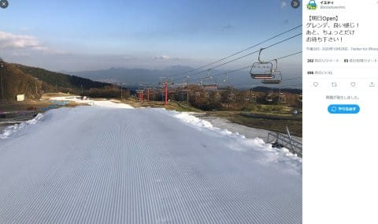
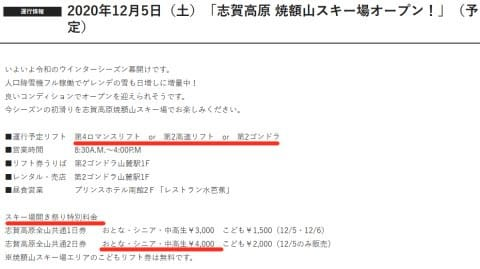
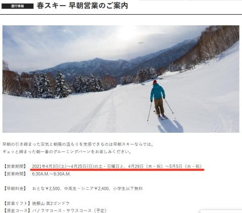
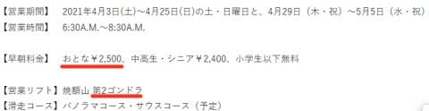

# 焼額山スキー場，今シーズンも4月から早朝営業してくれるけど…なに！2500円！？そして2ゴンなの？？

📅 投稿日時: 2020-10-30 01:36:20

🏷️ カテゴリ: [スキー雑談](c1f9d2cb7478308da16419928ea3945e9.md)

えー．

ついに，明日（っていうか，これを書いている

日付的にはもう今日だな）…

Yetiがオープンします！

ついに，2021シーズンスタートですっ！！

Yetiは，ゲレンデももうほとんど準備が

できているようですね…！

（[スノーパークYetiTwitter](https://twitter.com/snowtownYeti/status/1321694556648218624/photo/1)より）

うぅ…シマシマ…

シマシマだ…

シマシマ滑りたい…！！！

そして．

私の土日の予定がどうやら無くなった

ようなので．

10月31日の土曜に初滑りに行けそう…！

なんとか今シーズンも10月中に初滑り

ができそうです…！

ってな感じで，シーズンインへの気分が

高まったところで．

ちょっと残念なニュースが…

いつも通り，焼額山スキー場のWebページを

巡回していたところ…

うむ？？

2021シーズンの情報がいくつか出てるよ！

…ということで，見てみると…

12月5日オープンのコースは…

まぁ，雪の量によって4ロマのみか，

2高も行けるか…ってところでしょうが．

雪が積もれば2ゴンまで動かす予定

で準備してくれるようですね～！

（[焼額山スキー場ホームページ](https://www.princehotels.co.jp/ski/shiga/informations/open/)より）

…そして，12月5，6日のスキー場開き祭は

無いものの，今年もリフト特別割引を

やってくれます！

全山2日券4000円はお買い得っ！！

で．

ふむふむ．

今年も焼額は4月3日からの土日とGWは，

早朝営業をやってくれるのね…

（[焼額山スキー場ホームページ](https://www.princehotels.co.jp/ski/shiga/informations/spring_skiing/)より）

…って．

ちょっと待て．

なんだこれは！？？

大人2500円っ！？？

そして，営業は2ゴンなの！？？

ええええーーーー！

すごい値上げ…

全山共通シーズン券が使えない早朝が

2500円とは，モロにお財布に

響くんですが（涙）

あぁ…昨シーズンの早朝営業が

無くなったのが惜しい…

そして．

早朝営業がGSコースじゃなく，

また2ゴンのパノラマーサウスに

戻るのね…（涙）

1ゴンのGSコースの方が好きなん

だけど…

これが何を意味するかというと．

数シーズン前から春営業が

第1ゴンドラ＋第2高速になったので，

オリンピックコースやGSコース，

そしてパノラマ・サウスも全部

滑れるようになって嬉しかったけど．

今シーズンの春営業は昔の

2ゴン＋第2高速に戻って．

GSコースやオリンピックコースは，

雪があっても滑れなくなる，

ということですね…多分…（涙）

すごい楽観的な期待として．

4月3日以降も，2ゴンと1ゴン両方

とも営業してくれて，

早朝は2ゴンのみ動かす…

という可能性もありますが．

…その可能性は低いでしょう（涙）

乗車定員が3人に制限された2ゴン

だけでは，4月とはいえ，週末やGWは

輸送力が足りず混むんじゃなかろうか…

…まぁ，混んでくれるくらい人が

来てくれないと，営業的にはヤバい

でしょうけど．

うーむ．

果たして今シーズン．

どうなることやら…

## 💬 コメント一覧

### 💬 コメント by (naoちゃんねる)
**タイトル**: Unknown
**投稿日**: 2020-10-30 05:29:30

ええええええええーっ！！

早朝２ゴン＋２５００円ですか…(涙)

ショックでこんな時間(４時半)に起きてしまいました…

(起きてからブログ読んだでしょ…)

ＧＳが滑れないのはショックです…

イチゴンも動かしてくれればいいですが、コース整備やリフト係員の人件費を考えれば可能性低いですね…

今シーズン一体全体どうなる事やら…

あっ、イエティ参戦おめでとうございます！！

10月中にシーズンイン出来て良かったですね。

楽しんできてくださ〜い！！

### 💬 コメント by (はなげ親分)
**タイトル**: Unknown
**投稿日**: 2020-10-30 15:16:16

早朝が復活しても、ヤケヒシーズン券では滑られないんですね。

なんだかな〰️

### 💬 コメント by (Goku)
**タイトル**: Unknown
**投稿日**: 2020-10-30 19:22:42

一度、イチゴンの早朝営業に味を占めた身としては、2ゴンに2500円は払えない・・・

なぜ、元に戻っちゃうかな～(T_T)

### 💬 コメント by (Skier_S)
**タイトル**: 春営業，1ゴンと2ゴンの両方動いて欲しい…
**投稿日**: 2020-10-31 00:13:45

＞naoちゃんねるさま

そうなんですよ…2ゴンになった上に2500円（涙）

そして，焼額シーズン券を持っていても滑れない，と．

小学生タダは続くみたいですが，かなり痛い…

とりあえず，明日Yeti楽しんできます~！

＞はなげ親分さま

そうなんですよ！シーズン券で滑れないのは痛いですよね…

私も早朝2500円ってのを見た時，一瞬早割シーズン券買おうかと思いました（笑）．

でも，2ゴンだし，微妙な感じですよね…

＞Gokuさま

返す返す，昨シーズン予定通り早朝をやってくれていたら…

と思います．

春営業と早朝，イチゴンに戻してほしい…（懇願）

### 💬 コメント by (ゆーき)
**タイトル**: Unknown
**投稿日**: 2020-10-31 22:46:09

ポジティブにとれば、

一ゴン側は融雪がはやいから！

でも、コースはやはり一ゴンなほうがいいですよね。

### 💬 コメント by (Skier_S)
**タイトル**: ＞ゆーきさま
**投稿日**: 2020-11-01 02:13:48

イチゴン側，人工降雪が少ないから，雪をもたせるのは

サウスより厳しいかもしれませんが…

でも，GSコースの方が北向きなので，人工降雪機があればGSコースの方が雪がもつんじゃないかな？

と思っています．

やっぱり1ゴン側GSコースの方が面白いですよね

