# 1月29日（日）の志賀高原詳細レポート…朝は超絶晴天だったけど…午後は私のせいで天気が崩れたのかな？？

📅 投稿日時: 2017-01-31 02:23:02

…なんということだ．

今日の未明から朝にかけて．

…志賀高原，雨になったようですね（激烈涙）．

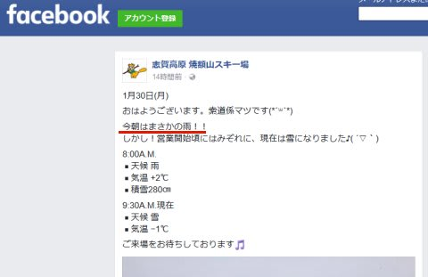

（[焼額山FB](https://www.facebook.com/yakebitaiyama/posts/1207557339339610:0)より）

…[金曜日の記事](ebe3448f75c2401bb71f60a9f5d4008a1.md)で．

　まぁ，志賀高原の標高なら．

　降り始めはみぞれっぽいけど，じき

　雪になる…って降り方だと思うんだけど…

…って書いたように．

　「おそらく，みぞれっぽいかもしれないけど．

　　冷える明け方に降るから，雨にはならんべ～」

と，安心しきっていたので．

すっかり，冷え冷え踊りを踊らずにいました…．

…そうです．

私が冷え冷え踊りを踊り忘れたので，雨になってしまいました（涙）．

志賀高原の天気を決めている私が，しっかり冷え冷え踊りを

踊っていれば，雨にならずに済んだのに…っ！！！

と．

今となっては悔やまれるばかりです（後悔）．←…違うから．あなたが志賀高原の天気を決めてるわけじゃないから

まぁ．

今はかなり冷えて，雪が降っているはずなので．

明日の朝には新雪が積もって，コンディションは復活するはず…

…とりあえず，今週末．

この雨で固まったアイスバーンが，ゲレンデのところどころに

顔を出す…という状況にならなければ良いのですけど…

ってことで．

本題の，日曜の志賀高原．

詳細レポートです…

実は．

この日曜日．

娘のリクエストにより．

いつもの焼額ぐるぐるじゃなく．

珍しく志賀高原内のいろんなところをさすらってみたんですね～．

だもんで．

なんと．

朝イチは一の瀬リフトを登って…

いきなりの寺子屋スタートです！

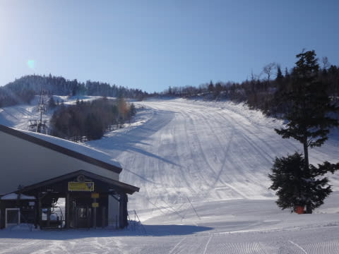

うーむ．

これまで，数え切れないくらいの日数，

志賀高原で滑ってるけど．

朝イチに寺子屋に来たのは初めてだよ…

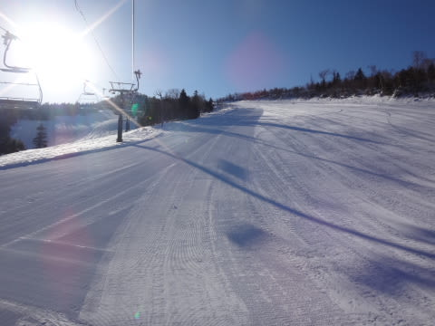

まだ誰も滑ってない寺子屋は，

見事な全面シマシマっ！！！

そして，超絶快晴で始まった本日．

山頂からの景色は…

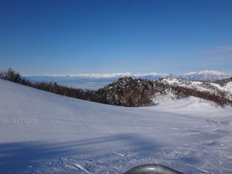

うほう！

絶景！

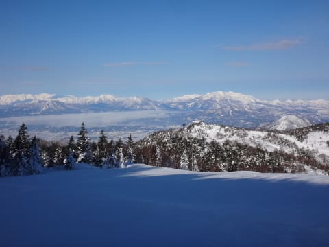

この景色だけで，今朝，

寺子屋に来た価値があったかも…

…ただ．

ピステンは，焼額クオリティと比べると

ちょっと荒めかな？？

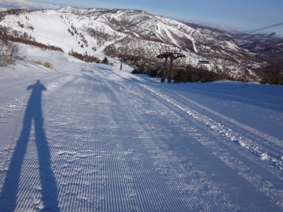

でも．

朝イチシマシマ，いただきま～す！！！

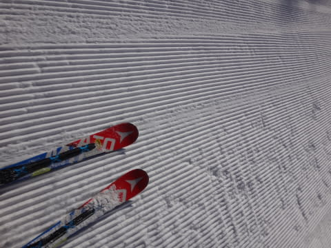

朝イチの放射冷却でしっかり冷えたシマシマバーンは，

フワフワというより，かなり締まったボソボソした感じの

圧雪でしたが…

でも，人が少ない寺子屋．

かなり気持ちよく飛ばせました～！

＃…でも．

＃やっぱり朝イチは，焼額のロングコースの方がいいなぁ…

ホントに人がいなかった，ガラガラシマシマ寺子屋を満喫したら．

気持ちいい景色を眺めながら，東館へ移動…！

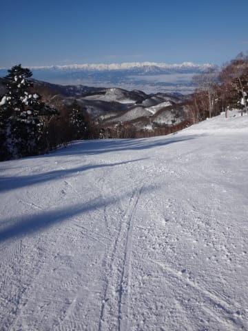

いやーーー．

人が少ないし，景色もいいし…

絶好のスキー日和ですな！！！

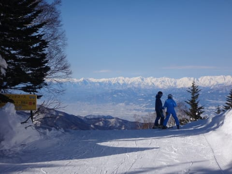

…こんな穏やかな日は．

カリカリ滑らず，のんびり滑ってみるのも，

いいものだよね…

うん．ゆっくり滑るのも，いいものだ．

きっと．

たぶん…←娘と一緒にゆっくり滑っている自分に暗示をかける

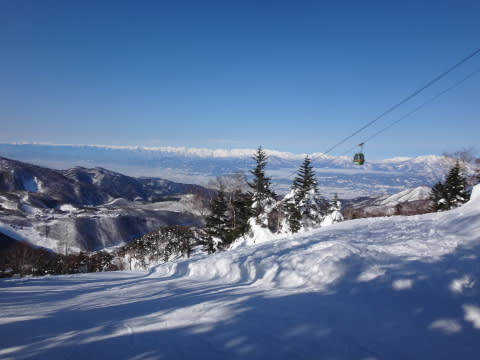

そして．

ブナ平へやってきましたが…

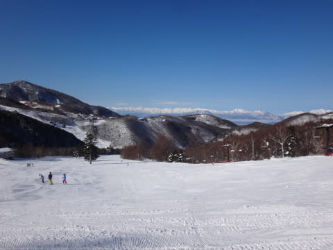

ここも激烈ガラガラ．

人が少なくて，10時を過ぎてもまだまだ

ゲレンデにシマシマが残ってます…

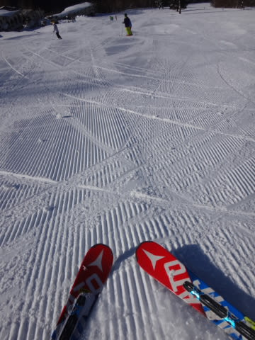

いや．

気持ちいいね～…緩いけど（ボソ）

そして西館へやってきて．

初級者コースを滑っていると…

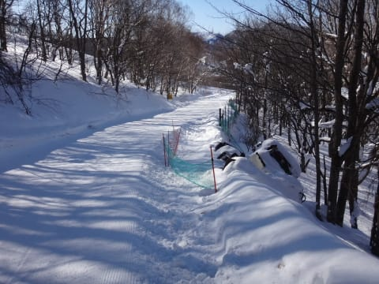

うむ？

なんか，あるぞ？？

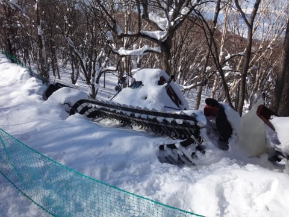

なんだ，こりゃ？？

圧雪車がコースから滑落してるんですけど…

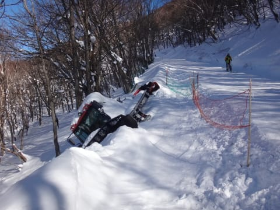

…雪のかぶり具合から見て，数日前に落ちたっぽいけど…

これ，どうやって助けるんだろう？？

という感じで．

大変珍しいものを見ながら滑っていたところ．

今日の気温は結構高めで，昼間は0℃以上まで

上がったんですけど．

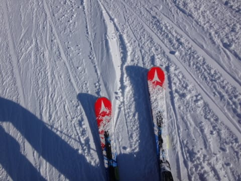

…でも．

昼になっても雪質は意外と緩まず，いい雪をキープ！

昼ごろには一の瀬ファミリーに戻ったのですが…

正面バーンは，しっかりパックされた感じの，

固めの圧雪で．

…これは，かなり滑り良いんでないかい！？？

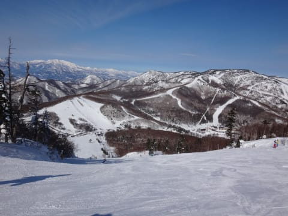

雪が柔らかいと，もう荒れ荒れになってる時間なのに，

昼でも，かなりのフラットバーンをキープ！

そして，ゲレンデもリフトもガラガラ！

タンネの森なんて．

昼になっても，まだシマシマが残ってますよ！？？

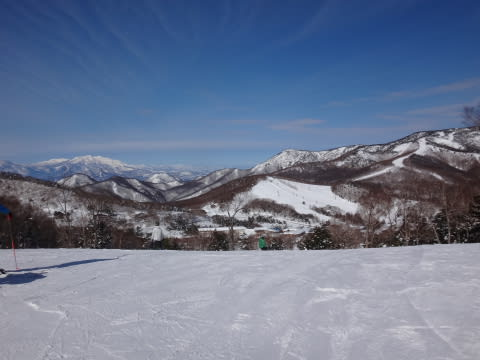

一の瀬ダイヤモンドも，昼になっても

気持ちいいしっかりパックのフラットバーン！

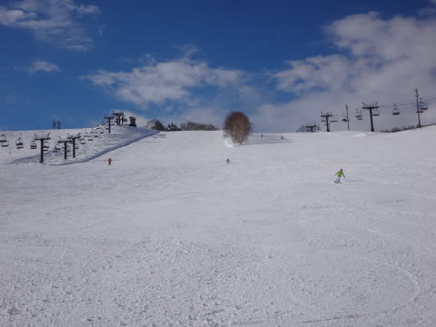

そして，ガラガラと来れば…

いやーー．

今日は恵まれてるよ！！

よし．

娘，ガンガン滑ろう～！！！

…って．

え？

なに？

キッズパークで，そり遊びがしたい？？

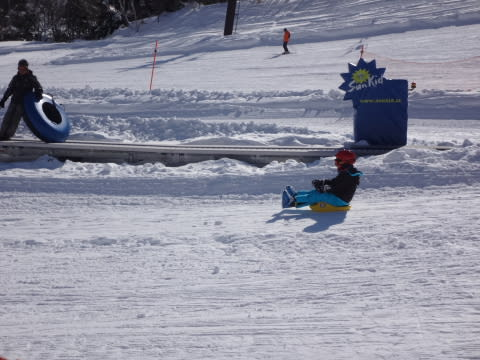

…（涙）．

…仕方ない…

そり遊びに，付き合いましょうか

と，しばらくそり遊びに付き合っていると…

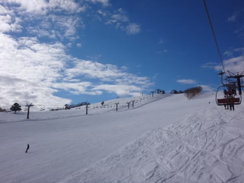

晴れていたダイヤモンドのゲレンデに雲が広がり…

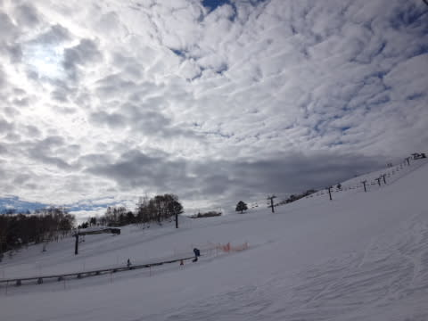

あれ？

天気が…

せっかくの晴天が，崩れていくんですけど…？？？

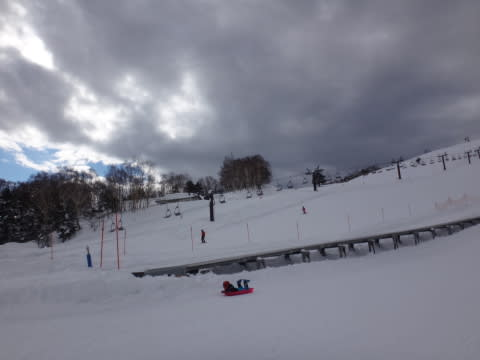

なぜ，あれだけの晴天がにわかに掻き曇るのか…

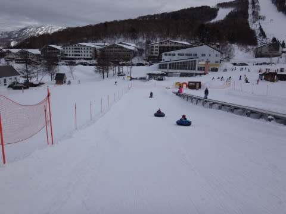

…これは．

きっと．

私がスキーで滑らずに，娘とそり遊びをする

という，大変珍しいことをしたからに違いない！

…たしか前回．

娘とそりで滑っていると，いきなりの雪に

襲われたんじゃなかったかな？？

…今回も．このままだと．

どんな荒天がもたらされるか分からない．

危険だ…っ！！

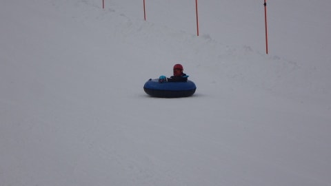

ということで．

1時間半ほどで，そり遊びを切り上げ，

わがホームゲレンデ，焼額へ移動！

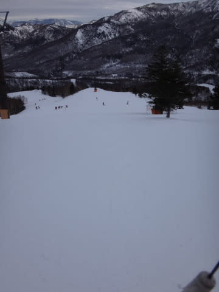

…でも．

曇っててゲレンデの起伏が良く見えないよ（涙）．

午後3時ごろのゲレンデの気温は，0℃近く．

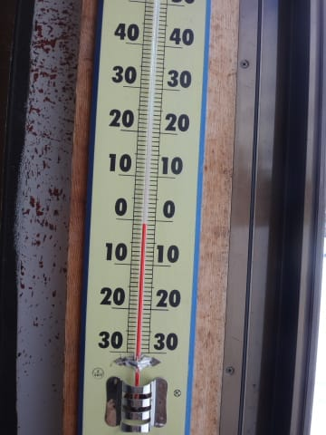

うーん．

意外と気温が高いけど．

雪質自体は，固まり気味のちょい固めの圧雪のため．

朝から緩むことなく締まったバーンをキープ！

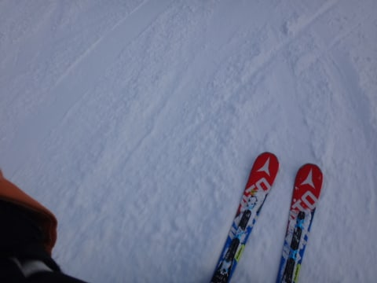

ってことで．

今週も奥志賀まで足を延ばして…

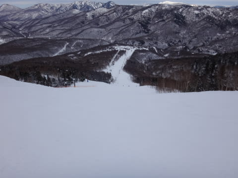

最後は日が暮れていく中…

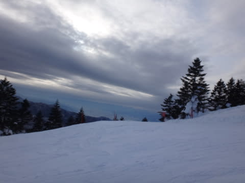

ラストの一の瀬ファミリークワッドまで，

しっかり滑りました～！

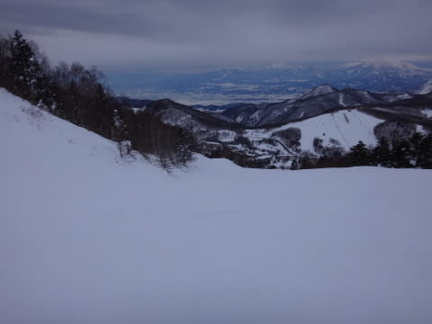

…

しかし．

道路の雪の融けっぷりを見ると．

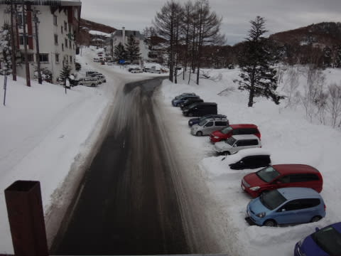

今日はやっぱり気温は高めだったんだな～．

でもまぁ．

午前中はすっきり晴れてくれたし．

午後も降らずにもってくれたし．

雨にならなくて，良かった…

と．

この時は思ったのだが．

じつは本日朝．

志賀高原に雨が降ったのは．

私が娘とそり遊びをした効果が，ちょっと遅れて出てしまったのではないか？？

という気になってきた，Skier_Sなのだった…←違うから．何度もいうけど，

あなたが志賀高原の天気を決めてるわけじゃないんだから

## 💬 コメント一覧

### 💬 コメント by (michi)
**タイトル**: こんにちは(^^)
**投稿日**: 2017-01-31 09:23:46

今日から3日間、東京出張中です。

今朝の長野市はパラパラ雪が舞っていました。

山は雪でしょう。

毎週土曜朝3時出発ですか⁈

早いですね。頭が下がります。

ヤケビは好きなスキー場ですが、長野に住んでると遠い方です。近場なら飯綱リゾートか飯綱高原で30分もあれば着くので(^^)

でも今シーズンはまたヤケビに行きます。

それと日曜に駐車場で悲劇が、、、

長文になるので詳細はまたお話しします。

ではまた。

### 💬 コメント by (Goku)
**タイトル**: Unknown
**投稿日**: 2017-01-31 16:00:23

月曜日の雨は間違いなくSさんがヤケビ以外に浮気したせいです(笑)

きっとヤケビスタッフも『今日は見ないね～？明日雨降るんじゃない…』と噂していたことでしょう。

### 💬 コメント by (まいる)
**タイトル**: 大会でした
**投稿日**: 2017-01-31 19:28:31

S さん、お疲れさまです。

雨とは、まぁ、気温が高かったからですが

私は土日、尾瀬岩鞍で大会でした。

雪はいい感じでしたよ

来月末、志賀高原では一緒に滑れそうです。

スキーを持っていこうと考え中です

### 💬 コメント by (マルハバ)
**タイトル**: この時期の雨は・・・
**投稿日**: 2017-01-31 23:34:20

シーズンを長くするありがたいことだそうです。

http://shigakogen-ginrei.com/blog-entry-704.html

昨シーズンの分までがんばってもらえるのでは？

私は2週間前に深雪でつんのめり

ふくらはぎの肉離れで休養中です。

3月11日の志賀までには復活させねば・・・

### 💬 コメント by (Skier_S)
**タイトル**: 今日もご無体時間に帰宅…
**投稿日**: 2017-02-01 03:13:39

＞michiさま

あ，東京にお越しでしたか．

こちらは暖かく感じたのではないでしょうか…？？

毎週土曜の出発時間の朝3時って，私だと

平日なら「これから寝ようか」って時間です（涙）．

そして，日曜も，ラストリフトまで滑ると，

帰宅は日付変更線を超える勢いです…（泣）．

日曜は何があったのでしょう？

またコメントお待ちしてます～！

＞Gokuさま

あ，そうか！！

ヤケビから浮気したって観点は無かったです…

ただ，午後3時ごろに1ゴンに行ったとき，

係員の方は私がいないことをちょっと

不思議に思っていたようです（笑）

＞まいるさま

あ，今週末は志賀高原ですか！

それも，今度はスキーなのですね…

私は先週が子連れであんまり

滑れなかったので，今週末は

本気かっ飛ばしモードでグルグル

してると思います～！

また見かけたらよろしくです～！

＞マルハバさま

肉離れですか！？？

治るまで，しばらくスキーはお預けですね…

早く治るように祈っています…

しかし，シーズン中の雨は確かに

ゲレンデを長持ちさせる効果がありますよね．

これで，今シーズンはGWまで問題なく

雪がもって，焼額も春営業してくれると

嬉しいのですが…

### 💬 コメント by (Unknown)
**タイトル**: Unknown
**投稿日**: 2017-02-28 02:52:01

＞圧雪車がコースから滑落してるんですけど…

2/25 に無事ピステンが発掘・引上げ済みなのを確認しました。

木曜の雨で積雪が緩んだ処を必死に掘ったようです。

毎週末「幸せの鐘」を鳴らしてピステンの冥福を祈った甲斐がありました。

### 💬 コメント by (Skier_S)
**タイトル**: Unknownさま
**投稿日**: 2017-02-28 03:20:02

冥福を祈っちゃダメですから～！！

まだお亡くなりになったわけでは無いですから（笑）．

しかし，無事救出されたんですね…

釣り上げるのかと思っていたら，

掘って救出するとは…

まさか，人力で掘ったんでしょうか？

