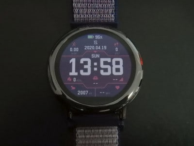
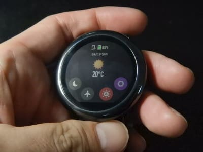
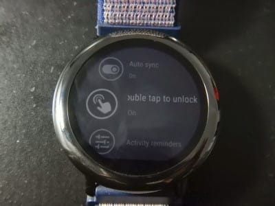

# スマートウォッチ，Amazfit PACEを買ってみた，その4…バンド交換してみた＆時計本体の表示と設定はこんな感じ

📅 投稿日時: 2020-05-14 00:20:53

えー．

明日14日，8都道府県を除き緊急事態宣言が

解除されそうな勢いですが．

…わが住まいを含む，首都圏はまだ

宣言解除されなさそう…（涙）

とりあえず，長野県は解除されるようですね～．

ってことで．

本日の志賀高原，横手山．

まぁまぁ天気が良かったらしく．

でも，朝はちょっとだけ冷え気味で．

板の滑りは，朝のうちは悪くなかったよう

ですが…

やはり，昼間の気温は+10℃くらいまで

上がってしまったようで，少し雪解けが進んで

ますね…（泣）

熊の湯の第1ゲレンデは，ここ数日で

一気に雪が消えたようです…

でも．

[横手山のホームページ](https://yokoteyama2307.com/news/8901/)を見てみると，

「今月末，いえ，なんとか6月の声を聞きたい」

ということなので．

6月まで雪がもってくれるといいなぁ…

（6月になったら，県境をまたいだ移動がOKになるのかどうか微妙だけど…）

ってことで．

本題へ．

…今回，[新たにGetした](ed3d5d801313ccbb4de704222aba3cdc0.md)，Amazfit PACE．

[前回に](ed1bf51c8f4791b77b1b4731aae9be689.md)スマホとの接続が終わり，時刻合わせなどの

初期設定が行われ，無事使えるように

なったので．

まずは，時計の基本機能を見てみましょう…

そうそう，その前に．

この時計の標準で着いてくるシリコンバンド，

結構着け心地がいいんですが．

この時計，幅22mmのバンドなら，

普通の時計用として売ってるバンドに

付け替えられるので，

スキーの時に取り付け・取り外しが

しやすいよう，マジックテープ式のバンドを

別途購入して，付け替えてみました～！！

Amazfit GTRも同じ22mm幅のバンドだったので，

一緒に購入しておいた，＄3程のAmazfit GTR用の

バンド．こいつに付け替えてみましょう…

このように，標準のバンドも，新しく

購入したバンドも，工具を使わずワンタッチで

外せるお手軽交換可能なバンドなので…

こんな感じで付け替えてみました～！

マジックテープのバンドって，片手で

付け外しができて，楽でいいんですよね～．

ってなことで．

バンドを付け替えたAmazfit PACE，さっそく

機能を見てみましょう…

…って，この時計．

むちゃくちゃ機能が多いです…

まず，一番基本となる時計画面．

このウォッチフェース，

数え切れないくらいの種類が選べて，

スマホのアプリから本体へダウンロード

できます．

スマホアプリに最初から入っているウォッチフェース以外にも，

[ウォッチフェースを自作するツール](https://amazfitwatchfaces.com/editor/watchfaceEditor/?bip)やら，

[ツールを使って作ったウォッチフェース](https://amazfitwatchfaces.com/pace/top)が，

無数と言っていいほど大量にウェブサイトに

上がっているので，好きなものを探して

ダウンロードすれば使えます！

（こんなのが数え切れないほどWebに転がってます）

私は，標準でスマホアプリに入っていた

こんなデザインのウォッチフェースを使ってて，

左上に今日の運動時間，右上に歩数，

真ん中下に天気予報，

左下に今日消費したカロリーや，

これまで運動した積算移動距離，

右下に現在の心拍数…などが表示される

情報量がかなり多いウォッチフェースです．

ちなみに，上の写真は，外が明るくて

バックライトを点けていない状態．

暗くなってバックライトが点灯すると

こんな感じに見えて．

ちょっと画面のコントラストが落ちます…

で．

画面が常時表示というのが売りの，このAmazfit Pace．

これが通常モードの画面なのですが．

ボタンや画面を操作しないで数秒間置いておくと，

Amazfit GTRなら，画面が消えてしまうところ．

Amazfit PACEでは，画面は消えずに，

電力消費を下げる「ロック画面」に

切り替わります．

このロック画面，画面の色数が下がり，

書き換え頻度が下がるうえ，画面のタッチ操作を

受け付けなくなるのですが…

この黒地の時計画面だと，通常画面と

ロック画面の差はほとんど

分かりませんね（笑）．

ちなみに，設定や何かのメニューを呼び出している

時でも，しばらく放置するとこの時計表示の

ロック画面に切り替わります．

このロック画面から，画面をダブルタップするか，

ひとつだけついているボタンを押すかすれば，

ロック画面から元の画面に戻ります．

で．

通常モードのウォッチフェース画面を

下にスワイプすると，現れるのは

こんな感じのメニュー画面．

右下の4つ並んだボタン，右から

ナットの絵があるのが設定メニュー，

右から2番目がバックライト明るさ調整，

その次が電波を出さない飛行機モードOn/Offボタン，

その次が通知をバイブで知らせないお休みモードOn/Offボタン

になります…

この，右下の設定メニューボタンを押すと，

かなり多くの設定メニューが出てきます．

まずはネットワーク接続のメニューでは．

Bluetoothだけじゃなく，WiFi接続の

メニューもあり，なんとAmazfit PACEは

WiFiも使えます！！

…って言っても，時計本体のファームウェア更新時，

WiFiで最新ファームをダウンロードするだけにしか

使えませんが…

…Amazfit GTRでは，Bluetooth経由でスマホから

ダウンロードするんですけど，

なぜわざわざWiFiをつかうのかな？

WiFiボタンを押すと，アクセスポイント一覧が

表示されるので，アクセスポイントを選択．

暗号化されている場合は，スマホにパスワード

入力画面が出てくるので，パスワードを入れればOK！

そして，言語選択のメニューでは，

英語，ドイツ語，スペイン語に…

中国語各種はあるけど．

日本語はありません…（涙）

日本語対応済みのAmazfit GTRと違い，

Amazfit PACEの全てのメニューは

英語など，日本語以外の言語を選ぶことに

なります（ちょい残念）

そうそう，メニューは日本語対応してませんが．

スマホのLINEやメールの着信通知は

ちゃんと日本語で確認できるので，

そのあたりはご心配なく！

そして，バックライトの設定メニューでは，

バックライトの明るさや，

腕を持ち上げた時に自動点灯するかどうか…

などが選べます．

基本的に，反射型液晶なので，外が真っ暗で

なければバックライト無しで十分見れますが，

周りが暗くなってくるとバックライトなしじゃ

見えなくなってくるので，

腕を上げて自動点灯を選びましょう．

さらに，ロック画面の解除方法を，

ボタン操作以外にダブルタップもOKにするか

とか…

そのほか，バイブレーションの強さだったり

心拍数上限アラームのOn/Offだとか，

ここに書ききれないほどのものすごい数の設定メニューがあります．

全ての設定メニューを書いてると

めちゃくちゃ長くなってしまうので．

まぁ，設定メニューの説明はこのくらいで

勘弁しといたろか…

って感じで．

設定項目だけで，すでにかなり遊べます（笑）．

…ってことで．

設定画面の説明までで，かなり長くなってしまったので．

この時計の各種機能の説明は，また次回！

（このシリーズも，一体何回続くことになるんだろうか…）
