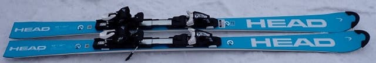
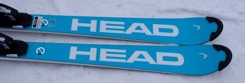
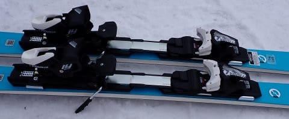
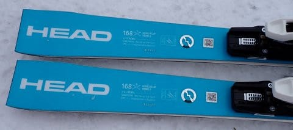
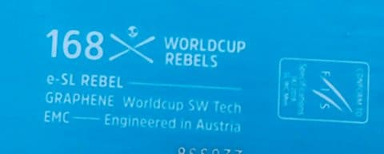

# 2024シーズンモデルのスキー板，試乗レポートその3…HEAD Worldcup REBEL e-SL RD EVO

📅 投稿日時: 2023-05-16 03:18:59

ってなことで．

かぐら・横手ともに，なんとか今週末までは

もってくれそうですが．

かぐらは予定通り21日が営業終了だし．

横手も今週末が営業ラストの週末になりそうな

感じがする今日この頃．

天気図を見てみると，かぐら・横手ともに

週末は土日ともギリギリ雨にならずに

済みそうな感じに見えてます…

うーん．

でも現段階では，土曜20日は雨が降るか

降らないかのギリギリと言った感じですが…

しかしここ数週間，

週末を狙ったように雨が降る

という，嫌がらせのような週末が

続きましたが…

もし，週末に雨が降らなければ，

4月22，23日の週末以来，1か月ぶりの

雨が降らない週末になります…！

…でも．

ちょっとくらい雨が降った方が，板が滑るし

混まなくていい

という気分になっている自分がいて，

ちょっと危険発想かも…

ってなことで，本題へ．

本日も，来シーズンモデルのスキー板の

試乗レポート．

今回はヘッド編です．

では，どうぞ～！！

〇HEAD Worldcup REBEL e-SL RD EVO　168cm

基礎小回り，SL競技用セカンドモデル

165じゃなく，168cmという微妙な長さながら，

FISマークがついていてSL競技にも使える

小回りモデル．

このうえに，

HEAD Worldcup REBEL e-SL RD FIS

というお値段19万4700円のトップモデルが

あるので…

一応，定価18万1500円のこのモデル，

e-SL RD EVOはセカンドモデルとなるようです．

滑ってみたところ…

結構いい！！

これまでのHEADの小回りモデルは，

ちょっと角を立てただけでサイドカーブで

クルクル回り始め，たわみよりもサイド

カーブで曲がっていく…という感じでしたが，

この板はしっとりとたわんで，たわみに沿って

曲がっていき，ターンの終わりに気持ちいい

返りがあります！！

今シーズンモデルと比べて，粘りと

しなやかさが増した感じ！

しっとりとたわむけど，決して板が柔らか

すぎるというわけではなく．

しっかりした踏み応えがありながらも，

板が突っ張るような感じがなく，

谷回りの早い段階から素直にたわんで

いき，そのまま強めのグリップで

たわみに沿って板が回っていきます．

これまでのHEADと違い，角をわずかに

立てただけでもしつこく回っていく

強烈なサイドカーブでの回転性は弱まり，

たわませなければ意外と縦目にも

落とせます．

わりとフレックスはしっかりしていて，

スピードを出していっても板がたわみすぎる

こともなく，高速耐性も結構高め．

それでいて，角をガッツリ立てて行けば，

小回り板らしく深いターンに入っていけます．

で，返りが異常に早くて強い感じではない

ので，スピードを出しても吹っ飛ぶような

反動をもらってピッチの短い小回りを

強制されることもなく，

安定して深いターンが刻めます．

見た目はこれまでのHEADと大きく変わら

ないのに．これまでのHEADと何か違う…

いい感じの粘りがある，ウェットな感じの

板になりました…

うーん．

HEADブーツを履くようになったから，

HEADの板と相性がいいわけではないよなぁ…

構造は大きく変わってないけど，トップシートが

変わったらしく．

これがしなやかさを増しているのかな？

私としては，もう少し早い返りがあってもいいかな？

と思ったけど．

グリップの強さに対して，この返りのマイルドさが

オールラウンド性を強めていると思うので…

小回りスペシャルじゃなく，小回りベースの

オールラウンド板を狙っている人は，

来シーズンモデルとしてはお値段も安めという

こともあって，この板は候補にする価値あり！
