# 9月連休石垣島ダイビングレポート　その2

📅 投稿日時: 2011-10-17 01:48:04

んで．

実に4年ぶり．

いざ行かん，我が愛する石垣の海へ！

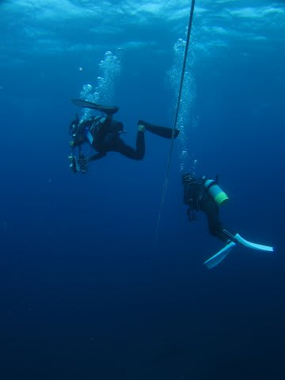

…

…

あれ？

…

あれれ？

なんだこりゃ？？？

ちょいとこれは…

曇っていて海が暗いのはいいけど．

…珊瑚が．

珊瑚が．

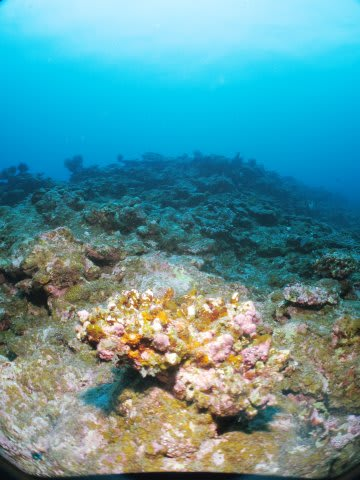

死んでる！

見渡す限り珊瑚の死骸…

4年前の白化もそこそこ被害があったとは聞いたけど．

去年のオニヒトデもひどかったとは聞いたけど．

全面珊瑚だった海は，いずこへ？？？？

…これは…

ひどい．

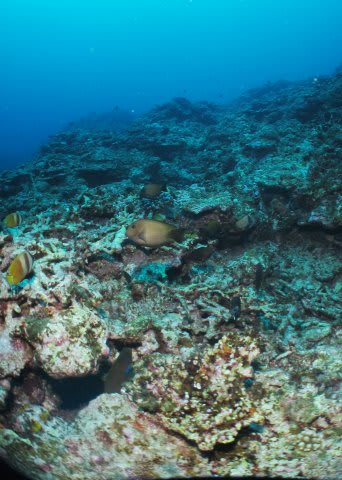

世界に誇れるダイビングスポットだと思っていた石垣の海が．

1998年の世界的な珊瑚の白化現象が起こった年でも，

見事に珊瑚礁が生き残り．

海外からでも潜りに来る価値があると思った石垣の海が．

世界のどこに行っても，「八重山の珊瑚のほうがすごいな」と思っていた．

私の大好きな，日本の誇りだと思っていた海が．

4年間の間にこんなにひどいことになっていたとは…！

昔はこんな海だったんだけど…

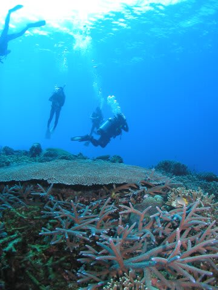

(5年前の石垣島で撮った写真）

それがいまや…

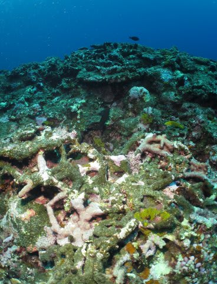

こんなエダサンゴの死骸が崩れ落ちる海に…

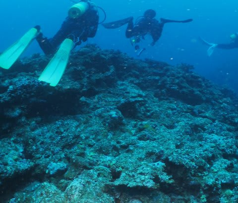

これなんかも．

見る人が見れば，昔は下の写真のような，一面のテーブル珊瑚だった跡だと分かるはず．

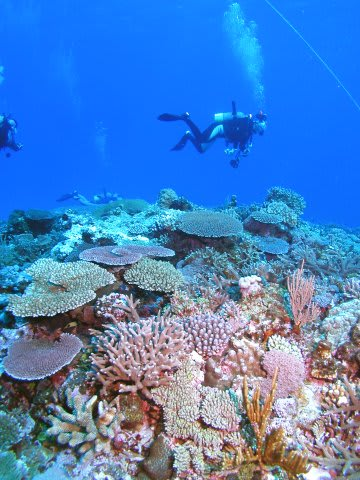

(これも5年前の石垣島)

魚も寂しいし．

特に，元気いっぱいのコモドの珊瑚を見てきた後だから．

この，殺伐とした風景は，心に突き刺さる…．

かなり．

というか．

悲しみにうちひしがれてエグジット．

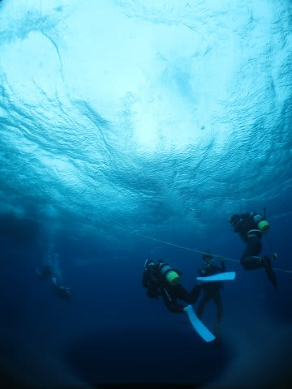

…他のゲストは，最も古い人でもダイビングを始めて3-4年，という人

らしく．昔の石垣を知らない人ばかりで，こんなものだと思っているのか…

しかし．

昔を知らない人は．

ここが，昔は一面カラフルな珊瑚礁だったんだよ，といっても

信じてもらえないだろうなぁ…

この状況は，この石垣島南エリアのみの現象で．

八重山の他のエリアはまだ珊瑚が元気なことを祈ろう…

どんよりした心で，

どんよりした雲の下．

ちょっとあれ気味の波に揺られるボートの上でお昼ご飯を食べて．

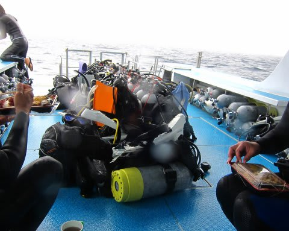

一休みしたら，午後のダイビング．

午後のポイントは，午前のポイントからわずかにずれた

「ビッグドロップオフ2」

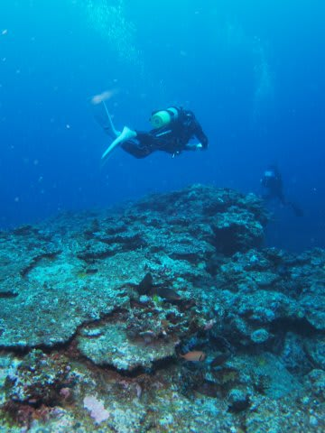

ここも，さっきと同じ感じ．

「昔は珊瑚がキレイだったんだろうなあ…」

という，珊瑚が崩れた瓦礫が広がるドロップオフ．

時たまハナゴンベや…

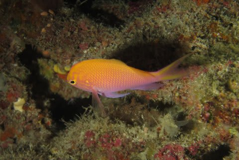

ハマクマノミとかもいたけど．

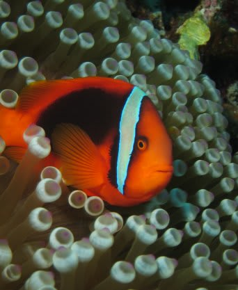

このダイビングでの撮影写真がトータル10枚ちょっとしかない，

というのが全てを物語っています．

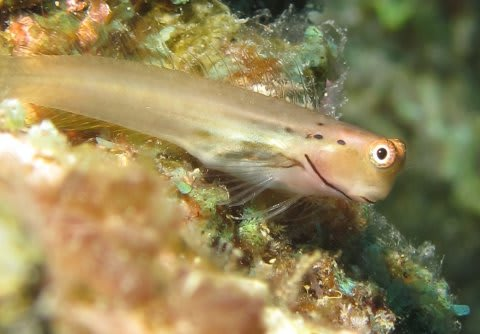

まさか．

まさか，石垣がこんなことになっていたなんて！！

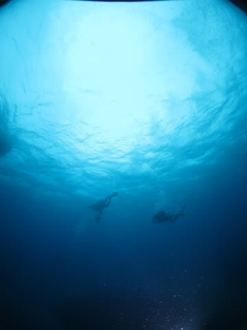

エグジット後．

ボートで港へ戻り．

ショップでのログ付けの後，ホテルに戻り．

その後，夕食も食べずに倒れるように寝てしまったのは．

ひとつは，

職場から夜3時に帰宅，そのまま朝4時半に家を出てきて

完全徹夜で今日のダイビングに挑んだ，という．

良い子はまねしちゃいけないことをやったから…

というのもあるだろうけど．

多分，それだけじゃない，脱力感があったんだと思う…
