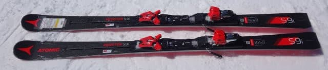
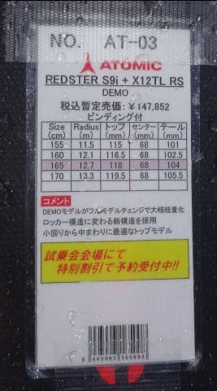
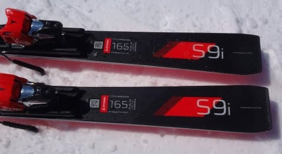
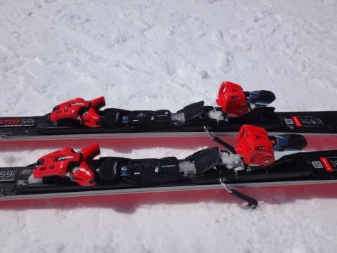
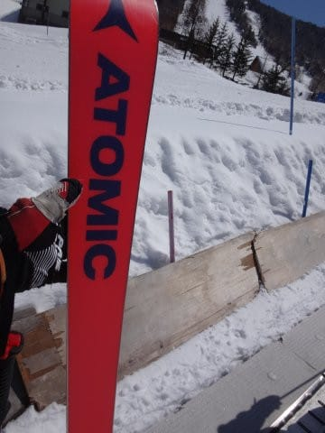

# 2018シーズンモデル，スキー試乗レポート第2回…ATOMIC編その1

📅 投稿日時: 2017-04-08 01:44:02

🏷️ カテゴリ: [スキー板試乗](c0bd8048615710cee890e403a36cc9a2b.md)

今週末ですが．

明日はスキーに行けそうにありません（涙）

日曜日帰りで行けたらいいんだけど…

ヘタすると，日曜も行けないかも（泣）．

とりあえず．

今週末の志賀高原の天気ですが．

土曜：朝から気温は高く．

　朝のうちから柔らかい春雪でしょう…

　おそらく，夕方近くまで雨は降らずに

　もってくれると思いますが．

　午後にパラパラと雨がぱらつくかも…

日曜：この日も朝から気温が高めで，

　朝の早くから雪は完全ザブザブ春の雪．

　天気は曇り．時折パラパラと雨がぱらつく．

　ザーッと降るわけでなく．

　「あれ？今，降ってるかな？」

　ってのが，時々パラパラ来る程度かな…

って感じかな～…

＃自分が行かないので，イマイチ天気図の読み込みに気合が入らない…

ってことで．

本日もスキー試乗レポートをば．

今日は大人気のアトミック．

さて．どんな板かな～？？

○ATOMIC Redster S9i 165cm

基礎小回り用．

…今シーズンのSXの後継機種となる，

小回り基礎用トップモデルのこの板．

試乗会での人気も高く，いつも2-3人の順番待ちが

あるほどの，一番人気の板でした．

SXを4台乗り続けた私としては．

かなり期待して乗った一台だったのですが…

ビンディングはXビンディングが選べず．

TLビンディングのみとなるようです．

フレックスがかなりしっかりした感じになる

Xビンディング付きSXに慣れている身にとって．

ちょっとフレックスが弱くなるTLビンディング．

この時点で，ちょっと板が弱いんじゃないかな…

という予感．

とりあえず，履いてみると…

軽い．

軽いよ．

これは，ATOMICと思えない軽さ…！

そして．

滑り出すと．

あれ？？

これは．

ATOMICらしくない．

…そして．

これは，SXとは全く違うよ！

SXの後継として期待するとちょっと違和感を

覚えるほど，乗り味が全く変わっているよ…！！！

まず．エッジグリップが圧倒的に優しくなり，

かなり板が動かしやすくなりました．

板の軽さと相まって，谷回りでの

板の動かしやすさはこれまでのATOMICから

想像がつかないレベル．

また，山回りでも，これまでのATOMICのSXのように，

ガッツリしたエッジグリップ感が弱まり，

その気になればいつでもエッジを外して

板が動かせる感じ．

スピードを出していった時のグリップ感も

SXよりかなり優し目になった感じで．

板のガッツリグリップ感が弱まり，

軽くて自由に気楽に動かせる板になりました．

その代り．

強烈なグリップと板の走りという，SXが

もっていた特徴はかなり弱まりました．

これまでのSXは，テール寄りポジションに乗っていけば，

張りの強いテールがガッツリグリップして，

ターンの後半に板が走って抜けていく…

という，板のテールを使っていく板でしたが．

S9iでは，SXほど板のテールは強くなく．

板の返り・ばね感も，SXと比べると比較的優し目です．

ポジションも，SXより前よりに乗る感じです．

スピードを出していったとき，板の軽さからか

ちょっと板が叩かれる感じがあり，

また，板のエッジグリップがそれほど強烈で

無いのもあって，トップスピード耐性は

残念ながらSXよりちょいと劣ります．

これまでのSXは．

ガッツリエッジグリップ・そこから板を

たわませて気持ちよくエッジに乗っていき，

それがテールの強さと反動の速さで，スポンと

切り替わっていく…

というアグレッシブな板でしたが．

今回の9Siは，軽く，動かしやすく，

ずらしていった中低速のコントロール性は

極めてよく．

意識して切っていこうと思えばしっかり切っていけるし，

反動もそれほど強くないので，リスクの少ない

安定した滑りができる…

という，穏やかな板になった感じです．

…いや，いい板なんですよ．

こういうアグレッシブさを求めない人にとっては，

かなり扱いやすいい板だと思うんですが．

強烈エッジグリップで，脳内麻薬が出るまま

ひたすら傾いて行ける…という，快楽系SXの

後継機として期待していたのとはちょいと

違う板だったので．

残念ながら，私の次期主力戦闘機候補には

ならない感じです…

どうでもいいですが，

この板．

滑走面，派手だなぁ…

## 💬 コメント一覧

### 💬 コメント by (いか)
**タイトル**: Unknown
**投稿日**: 2017-04-08 17:53:47

やはり物足りませんか…SXにXビンに慣れてる人(私も)にとって来年の板選びは難しそうですね。FISモデルかS9iでは極端すぎて、、、S9 Proというモデルがこっそり存在するようなので、私はこれにしました。足の感覚がかなり近いSX乗りからの報告を聞く限り、よさそうです。見かけたらぜひレポートをお願いします(^ ^)

### 💬 コメント by (Goku)
**タイトル**: 雨です
**投稿日**: 2017-04-08 19:02:26

今日の志賀高原、朝から雪はユルユルでした。

おまけに黄砂で午前中、緩斜面は全然滑りませんでした(T_T)

そして4時頃から雨が…

先週までが良かっただけにテンションは…(T_T)

### 💬 コメント by (Skier_S)
**タイトル**: 実は日曜じゃなく土曜日帰り
**投稿日**: 2017-04-09 03:41:17

＞いかさま

物足りませんでした…（涙）．

私も，黒いけど棒がついてない板の存在を最近知りました．

SL Proの後継機かな…？と思ってましたが．

意外とこいつがSXの後継機なのかな？？

S9FISではない，棒がついている方の赤いS9がSXの後継機

たりうるかと思ってましたが…

どっちが本命でしょう…？？

残念ながらALPENの試乗会には，どちらも出てなかったので．

今後試乗チャンスがあるといいんですが…

＞Gokuさま

なぜか今日．

私も志賀高原で滑ってました…

それも，午後の3時間半だけ．

昼過ぎに，一の瀬の道路に車が

止まってるの見ましたよ～！

しかし，先週からコンディションが変わりすぎました（涙）．

先週までは幸せでしたね…

