# 6月1日(水)の志賀高原渋峠スキー場，特派員情報＆コース状況の動画も…雪がある限り営業する渋峠の根性！

📅 投稿日時: 2022-06-02 01:59:02

🏷️ カテゴリ: [日記](cc4b5682fb7b8b144980957a978653fb0.md)

すでに6月に突入していることに気づき．

早くも2022年も半分近くが終わっている

という恐ろしい事実に恐怖を覚えている

今日この頃．

皆様いかがお過ごしでしょうか…

でも．

6月に入ったというのに．

志賀高原の渋峠，まだ営業してます！

月山もリフト乗り場の雪が無くなってしまい，

今日から板を脱いでリフト乗車に

なったというのに…

無事，予定通り6月まで営業できた渋峠，

すばらしい！！

…って思いながら．

本日も，志賀高原特派員より渋峠スキー場の

写真が送られてきたわけですが…

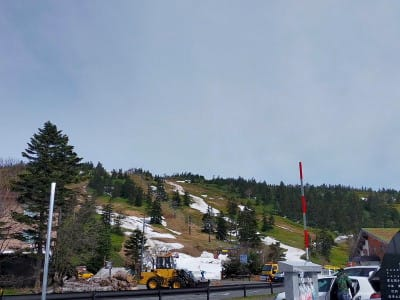

朝イチから，ゲレンデの雪はなんだか

すごい状態だったみたいです…

えーっと．

雪って，白いもんじゃなかったっけか？

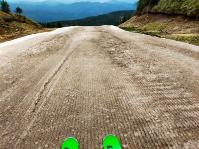

いや．

あさイチだというのに，雪が完全に

チョコアイス状態なんですけど…！

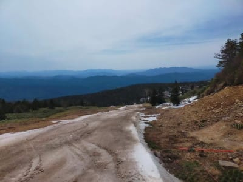

時間が経つと，シマシマだったチョコアイスも

だんだん緩んで解けていき…

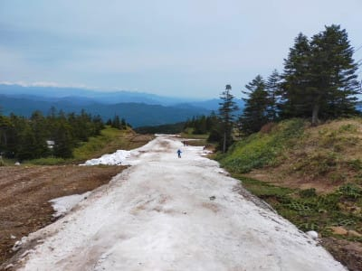

もう，途中は一部かなりヤバそうなことに

なってますね…(涙)

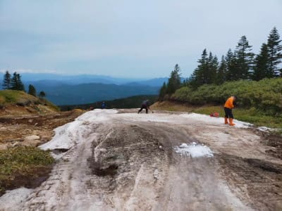

こ，これは厳しい…(泣）

これ…今週末までもつのかな？

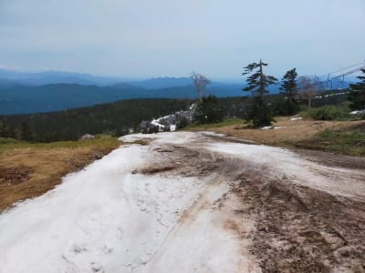

コース幅も，もうかなり狭くなってきて

ます（激涙）

オープン時のイエティよりタイトな感じ…

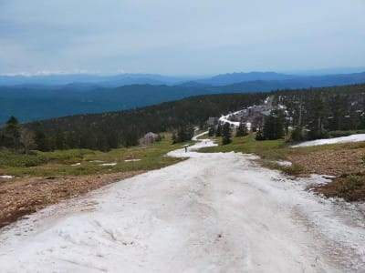

でも．

こんな状況でも，

6月まで必死に雪を搔き集め，

営業できる限り営業し続けよう

という，

渋峠の素晴らしい努力は感服モノです…！

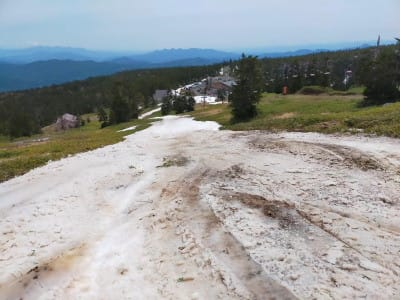

最後の方，リフト乗り場付近はまだちょっと

マシな感じに見えますね…

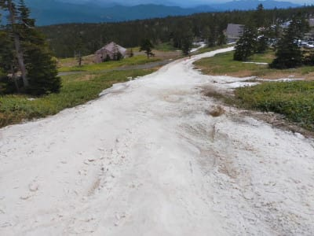

とりあえず．

まだいろんなところから雪を運んできて．

意地で営業を続けようというこの

涙ぐましい努力…

素晴らしい…！！

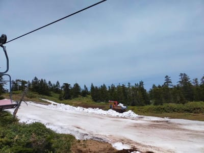

でも．

コース上はかなり厳しい状況なのは事実．

一見，穴に見えるこいつも…

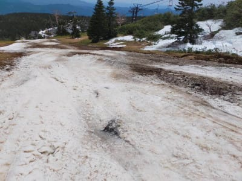

実は石だったりするようです．

板は，捨て板をもっていくのが無難でしょう…

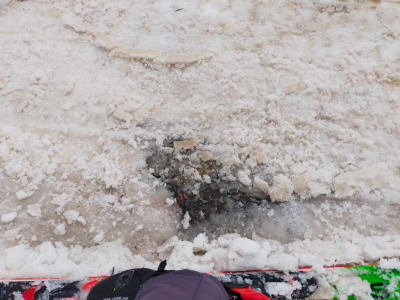

ってなことで．

今日は特派員から動画も送られてきました．

リフトを降りてから乗り場までの

コースの状況が分かる，

かなり衝撃の動画です…

いや．

渋峠のホームページにも，

「正直言って状況はよくありません」

と書かれているほどで．

そのせいで，

「一回リフトに乗って，これでもいいと思う人はリフト券を買ってね♡」

っていう初回お試し搭乗とかいう

のをやるほどだし…

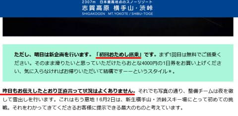

（[横手山ホームページ](https://yokoteyama2307.com/news/17761/)より）

うーん．

3日に降りそうだった雨は，それほど

降らなさそうな予想に変わってきてくれたものの．

雨が降らなくても，今週末は

やっぱりかなりヤバそう…

果たして．

渋峠スキー場．

今週末までゲレンデはもつのか！？？

## 💬 コメント一覧

### 💬 コメント by (大阪のK)
**タイトル**: Unknown
**投稿日**: 2022-06-02 08:33:59

スキー場のお試しセール、はじめて聞きました😅

### 💬 コメント by (Skier_S)
**タイトル**: ＞大阪のKさま
**投稿日**: 2022-06-03 01:40:50

私も初めて聞きました（笑）．

でも，お金払って滑ってみて

「騙された…」

とならないための良心的な経営だと思います！！

