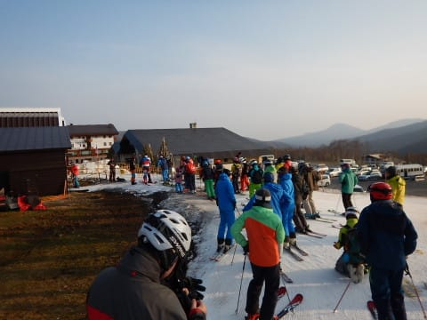
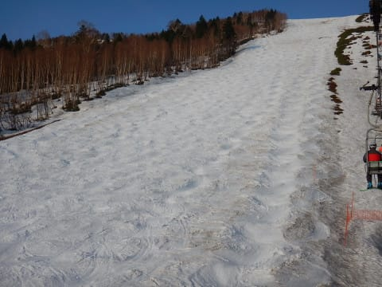
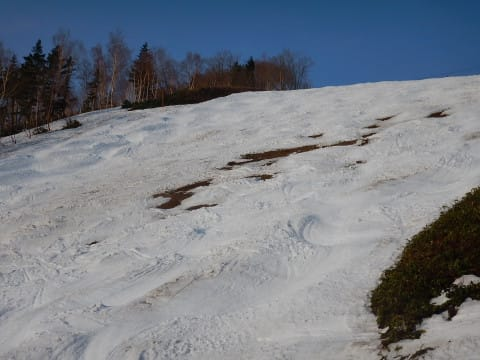
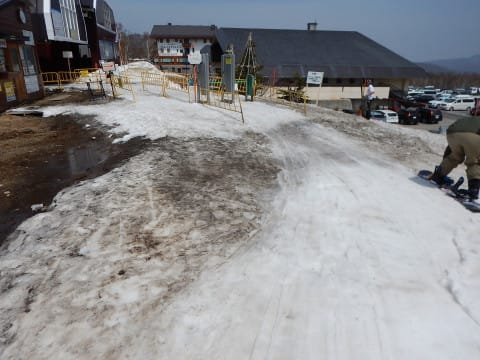
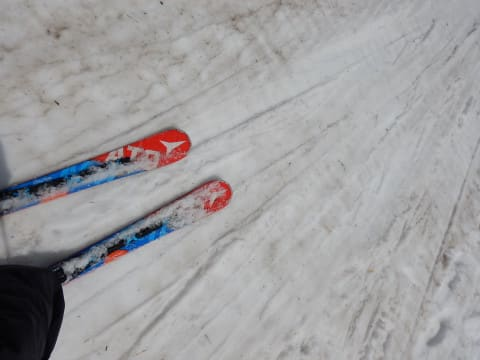

# 5月1日（火）GW谷間の志賀高原…営業している全スキー場のゲレンデ状況＆積雪をレポート！その1・奥志賀，横手＆渋

📅 投稿日時: 2018-05-02 00:04:53

🏷️ カテゴリ: [2018スキー滑走日記](c11b88dc181f34079ab41db74a3587646.md)

ということで．

まだ志賀高原に滞在しているSkier_Sです．

で．

本日．

衝撃のニュースが…

GW最終日まで営業予定されていた

奥志賀の早朝営業ですが．

本日をもって終了しました

繰り返します．

奥志賀の早朝営業．

雪不足のため，本日をもって終了です

…エキスパートコースが圧雪車を入れられないほど雪が減ったので．

明日からは早朝営業やらないそうです…（涙）

でも，まだ第3ゲレンデ，雪いっぱいあるでしょ！！？？？

この時期，早朝だけがまともなバーン状況で滑れるのに…（泣）

とりあえず．

そんな感じで．

次々とゲレンデが死に絶えていっている今日この頃．

この状況にもかかわらず，GW後半に滑ろうと思っている

奇特な方々がいらっしゃると思うので．

本日営業している，志賀高原の全ゲレンデ．

奥志賀，横手，渋峠，熊の湯を全部巡って，

大量に写真を撮ってきました～！

GW後半に志賀高原にスキーに行こうか

どうしようか悩んでいる方は．

これらの写真を参考にしてください…

ってな感じで．

本日．

早朝は+2℃と，ウェアのジャケットを着ないと

寒いくらいで始まったわけですが．

本日ラストの早朝営業．

そこそこ人が集まりましたね…

しかし．

奥志賀．

さらに雪がへってますね…

明らかに，昨日の朝より雪が

減ってます（涙）

早朝の段階でこれって…

ヤバくない？

そして，エキスパートコースですが…

本日から雪不足で圧雪車が入れなくなったとのことで．

全面非圧雪ですね…

そして，上の方は…

ヤバいです（泣）

ここと…

ここの2か所．

かなり土が露出してきました…（涙）

でも．

エキスパートより上部．

第3ゲレンデは…

まだ幅いっぱい雪がありますよ～！！

そして…

うはーーー！

シマシマっ！！

朝はかなり冷え込んだので，

しっかり締まってスピードが出るよ！！

これは楽しい～！！

いや．

これだよ．

このために，朝早くに来てるんだよ！！

なのに．

明日から早朝が滑れないとは…

だけど．

早朝の2時間が過ぎると．

残念ながら．

気温が上がり，雪が緩んで板が滑らなくなって

来ました…

あぁ…やっぱり楽しいのは早朝だけだったか…

ってな感じで．

通常営業タイムからは，エキスパートコースの

コブを攻めるのだ！

コース上部と中間の2か所．

かなり土が出てきてますが…

上部の方はこんな感じ．

右側3mほどは，何とか通れます．

ヤバいのは中間部．

ほぼコース幅いっぱい，コブ溝部に

土が出ちゃってます…（涙）

ただ，この中間部から下は．

朝のうちは結構きれいで，こぶ斜面を楽しむことが

できました…

でも．

昼近くになってくると．

ありゃ？？

ありゃりゃ？？

残念ながら，無事だったエキスパートの

下の方も，コブ溝が一部抜け始めて来ました…（激涙）

あぁ…

エキスパートも，楽しく滑れるのは今日か

明日が最後な感じ…（泣）

そして．

第2高速リフト下部の平らな部分，

第1ゲレンデも…

…そろそろ終わりげな雰囲気を漂わせています（涙）

リフト乗り場までの部分は，昨日から比べると，

かなり雪を運んだらしく，マシになってますが…

リフト乗り場近辺の雪は，かなりいろんな

モノが練りこまれた感じの雪です…（残念）

ってな感じで．

午前中で奥志賀は十分満喫したので←単純に飽きた，と言う方が正解では？

午後は横手山＆渋方面へワーーープ！！

まず，横手山．

山頂からの下山コースの，キングコース．

最初のうちはまだ雪があるように見えますが…

途中，ところどころ雪が薄くなってきてます…

うむ．

ここもそれほど長くはもたなさそう…

そして，第2リフト沿い，第2ゲレンデへ出ますが…

第2ゲレンデ上部，ショートカット側のこぶ斜面は

もう雪がないです（涙）

だもんで，迂回路へ回りますが…

こっち側は，まだ結構雪がありますね！

第2ゲレンデのメイン部分も，雪を寄せてあって

もうしばらくはもちそうな感じ…

横手の第2ゲレンデは，うまく行けば

GW後半までもちそうですね！

次に，渋峠．

横手からの連絡コースはまだ雪がありますが．

この，リフトの上から見て左側，ウェイバーコース．

本日はコース整備でクローズのようです．

今日は上から見て右側，幅の狭いゲミュートコース

のみ滑れました…

雪自体は，奥志賀と変わらず．

残念ながら，すべりの悪い雪です…

まぁ，狭いながらも，まだ雪は

残ってますね…

げミュートコースは，もうしばらくは滑れそうかな．

リフトに乗って，コース整備中のウェイバーコースを

見てみると…

…穴があいてますね…

その穴を必死に埋める圧雪車！

必死の雪出しで，コース整備絶賛実施中です．

穴の開いてないところも，必死に雪出しをして…

コースに雪を寄せてます．

ただ，雪を寄せてるので，ウェイバーコースも

幅が狭くなりますね…

ってことで．

横手・渋の偵察も終えたので．

次は熊の湯の状況偵察だ！←横手＆渋が面白くなかったので，速攻移動しただけという説

[その2](ee9df7b2a20036296c3ffadd6898e9ae5.md)へ続く…

## 💬 コメント一覧

### 💬 コメント by (もりや)
**タイトル**: 日々雪が・・・
**投稿日**: 2018-05-02 00:53:44

げげぇ(°_°)なんてこったぁ〜。奧志賀の早朝も終わりとは⤵︎早朝有りは熊の湯だけになってしまったのかぁ〜。さて、まずは3日何処へ行くか朝になったら子供達と検討せねば。

### 💬 コメント by (Skier_S)
**タイトル**: もりやさま
**投稿日**: 2018-05-02 01:09:46

もう，私の想像を超えるスピードで

雪が消えてます（涙）

まさか，早朝が終わるとは…

とりあえず，今日の写真を参考に，

どこに行くか考えてみてください…

私も5日どうしようか悩み中です．

### 💬 コメント by (ほっぽ)
**タイトル**: Unknown
**投稿日**: 2018-05-02 06:31:56

Ｓさん

凄い勢いで雪が消えていますね。

この当初、4/30、5/1で１泊を考えていましたが、１日早めて正解でした。

GW後半、5/2、5/3の雨でどうなるか？試練ですね。

### 💬 コメント by (黄色い人)
**タイトル**: 奥志賀高原
**投稿日**: 2018-05-02 16:30:19

５月１日はアーリーバードでリフトに同乗させていただきありがとうございました。しかもファーストトラックの写真まで（笑

今エキスパートが見えるホテルに泊まっているのですがすごい風で１６時を待たずしてリフトは止まりました。まだ雨は降っていませんが明日のゲレンデはどうなることやら・・・

### 💬 コメント by (井原勇治)
**タイトル**: 情報ありがとうございます
**投稿日**: 2018-05-02 16:43:50

5/2(水)に横手山･渋峠で春スキーを楽しむ計画をしていましたが、4/28(土)に計画を断念しました。現況の画像を拝見して決行しなくて良かったと思いました。

### 💬 コメント by (Skier_S)
**タイトル**: 果たして，明日の雨の影響やいかに？
**投稿日**: 2018-05-02 22:06:47

＞ほっぽさま

一日早めて正解でしたね…

今日は奥志賀早朝もなかったし，

私も昨日で帰っても良かったかな…

と思ってます（涙）

＞黄色い人さま

あ，昨日はお世話になりました～！

今日も滑ってらしたのですか？

お見掛けしなかったのですが…

今日は16時前にリフト終わっちゃったんですね．

夜からすごい雨になってるみたいですが，

明日の昼までの雨＆高温＆強風に，

ゲレンデがどこまで耐えるのか…

＞井原勇治さま

…計画を断念して，正解だった気もします．

滑れなくはないですが，あまり楽しくはない

感じです…

今年はかなり残念なGWでした（涙）

またこれからも，いろいろスキー情報発信

していきますので，引き続きご愛読のほど，

よろしくお願いします…

