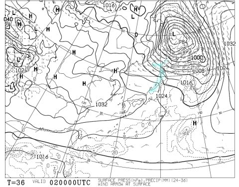
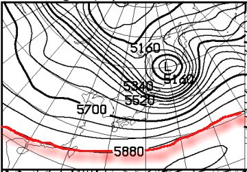

# なんと！もう12月だよ！この週末，12/3,4のスキー場の天気は？…晴れそうだけど，積雪は期待薄（涙）

📅 投稿日時: 2016-12-01 02:40:00

えー．

このBlogで何度も言ってますが．

天気関係の仕事もしてなければ，

気象予報士の資格も持ってないSkier_Sです．

…これは純粋に．

スキー場の天気がどうなるか，事前に知りたいっ！

…という執念によって身に着けた能力ですので…

ということで．

本日もこの執念によって身に着けた能力（？）を使って．

今週末の天気を予想してみましょう…

…しかし．

もう，12月ですよっ！！

12月っ！！！

早くも，本格シーズンの季節に入りましたよっ！！

…そうです．

今週末から，焼額山がオープンです！

ってことなので．

この天気予想も．

今週からは，定番．

「週末の志賀高原の天気予想」

です！

これから，私の身に着けた能力が

フルに発揮される，志賀高原に特化した

予想になります…

で．

週末の予想の前に．

とってもとっても気になる，

この週末までにスキー場に雪は積もるのか？？

…を明らかにするのだ．

…12月1日，木曜の850hpa気温を見てみると…

…

…

…やっぱり，ダメか（涙）．

赤く印した0℃線は北海道近辺．

志賀高原には，水色で記した+6℃線が…（泣）．

そして，地上天気図は…

…水色で塗った降水域が，志賀高原にも

かかってますね…（泣）．

850hpa気温が+6℃なので．

…そうです．

大変残念なことに．

この日，空から何か降ってきたら．

それは，液体です（涙）．

大変残念なことに．雪ではありません（悲）．

ただ，予想降水量はそれほど多くないので．

ほとんど降らずに済みそうかな～．

壊滅的に雪が融ける，という悲惨な状態には

ならないかな～．

で．

2日の金曜日，だ．

850hpa図を見ると…

をを！！！！

0℃線が，志賀より南に下がってるよ！

志賀には-3℃線がかかってるよ！

2日はガッツリ冷えるよ！！！

そして，地上天気図は…

ふむ．ほんのり冬型．

がっつり冬型ではないけど．

冬型っぽく，日本海側に降水域が予想されてます．

ただ，見事な西風になるので．

志賀高原は降らない天気図ですね…（残念）．

むしろ，晴れそうなくらい．

…でも．

昼間，結構冷えるので．

この日は一日中フルパワーで人工降雪機が

動かせるよ！

3日の土曜日に向けて，人工降雪機フル稼働だっ！！

そして．

3日の土曜日は…

…

…

…

…！？？？

志賀高原は，また水色で示した+6℃線が…（涙）．

ただ．

地上天気図を見ると，高気圧に覆われて

晴れそうなので．

雨に降られることは無く．

晴れたいい天気になりそうかな…

…気温が上がって日が射すので，

雪は融けそうですが（涙）．

で．

続く4日，日曜ですが．

850hpa気温は…

…ダメか．

この日も，ダメか…

0℃線は北海道の北．

+6℃線も，志賀高原より北まで上がっちゃってるよ…（悲）．

地上天気図はこんな感じなので．

まぁ，この日も晴れでスタート．

午後は雲が増えていく…って感じでしょうか．

てな感じなので．

まとめると．

3日（土曜）

　朝から晴天！朝はそこそこ冷え込み，

　前日の冷え込みでフル稼働した人工雪がしっかり

　圧雪された，結構締まった雪でスタート．

　朝イチは結構いいコンディション！

　でも．昼間はぐんぐん気温が上がり，

　+7～8℃まで上がるか…

　日が射して気温が上がるので，結構

　あったかく感じる一日．

　日差しがあたるゲレンデは，昼間は表面の雪が

　結構緩みそう．

4日（日曜）

　朝は晴れそう．3日夜は人工降雪機が動かせないだろうから，

　前日からの人工降雪の積み増しは無し．

　朝は固めに圧雪された人工雪．

　朝は晴れてれば一瞬放射冷却で冷え込む

　かもしれないけど，昼間はあったかくなる．

　+10℃近くまで上がりそう．

　雪は，表面がかなり溶けた感じになるかな…

　昼ごろから雲が増えていく．夕方はおそらく曇り．

　

って感じでしょうか…

まぁ，気温は上がるものの，天気は良さそうなので．

雨にならないだけマシですか…

でも．この時期．

晴れなくていいから，雪が降ってほしい…（懇願）

今日もここから余談モード．

興味ない人は読み飛ばしてね♪←こう書いたら，ちゃんとここから先を読まずに飛ばす人ってどのくらいいるんだろう…

…12月2日の500hpa高度線を見ると．

あんだ？？12月に，こんな勢力の強いサブハイが

残ってるって，どゆこと？

5920m線まで見えてるんですけど…（泣）．

そして．

11月から12月第1週の予想まで．

ずっとサブハイがこんな緯度に残ってるって

どういうこと？？？

とても12月と思えない…（涙）．

…でも．

こ…これは，ブロッキングH？？

うーむ．

こいつがしっかり居座ってくれると．

来週以降，期待できるかも…
