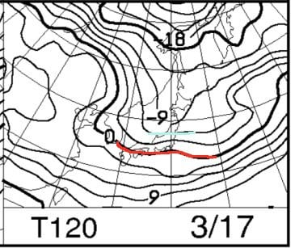

# 3月16，17日の週末の志賀高原の天気は…土曜は終日冷え冷え雪降り．日曜は朝は曇るけど，概ね晴れの冷え冷えデー！

📅 投稿日時: 2019-03-14 00:17:02

🏷️ カテゴリ: [スキー天気予想](c6554f5c3c106093b511a8daae23757e8.md)

えー．

本日は，志賀高原特派員からの

情報が無いのですが．

どうやら，志賀高原は，

本日もいいコンディションだった

ようですね…

そして，13日水曜深夜の現在．

雪が降っているようです…！

（[北信建設事務所HP](http://hokushin-camera.org/)より）

それも，麓の上林チェーンベースまで

雪です！

3号トンネル付近では，-10℃近くと，

真冬並みに冷え込んでいるようです…

とりあえず，14日木曜の朝の

500hpa図を見ると．

うおお！

真冬並みの，-30℃の寒気が

志賀高原にかかってますよ！！

そして，850hpa気温図を見ると．

水色の-6℃線が志賀高原より

南まで下がってくれているので．

…明日木曜は，終日いい感じの

冷え冷えデーになりそうですね…！

地上天気図を見ると，

日本海側に降水域がかかっている

冬型パターンですが．

…西風なので，それほどドサドサ

積もらないかな？

…これだけ完全な西風だと．

普通は志賀高原には雪が降らないん

ですけど．

今回は気合の入った寒気が

入っているので．

根性のある雪雲が，北アルプスを越えて

志賀高原までやってくるパターン．

…おそらく，今晩から明日の朝までは

雪が降り続け．

朝には10cm．

上手くいけばそれ以上積もって．

ブーツパフの冷え冷え新雪が

楽しめるかも！！

昼間は曇り～時折日も射す感じで．

そんなに積もらなさそうですが…

で．15日の金曜日も，-30℃の寒気が

入り続けますが…

でも，残念ながら降水域は志賀高原に

かかってないので．

この日は終日曇り空で．

雪はぱらつく程度あったとしても，

積もらなさそう…

でも，冷え冷えをキープするので．

14日木曜朝に積もった雪が

いい感じに締まって，

この日もいい雪で楽しめるかな！

ってな感じで．

ここからは肝心な週末の予想ですが．

16日土曜日の500hpa図を見ると．

えええ！

-30℃線が，太平洋側まで下がってますよ！！

これは，真冬でもそうそうない

冷え込みなんですが…！！

さらに，850hpa図を見ると．

赤い0℃線はかなり南まで下がり．

水色の-3℃線が志賀にかかってます．

そして．

降水域も日本を広く覆ってるので．

…これって．

3月中旬なのに．

中国から関西方面で雪になりそうな

天気図…

…でも．

志賀高原にはそんなに降らなさ

そうですが（ちょい涙）

で．

17日日曜の850hpa図を見てみると…

この日も志賀高原には，水色の

-6℃線が近づいているので．

…先週末よりもよっぽど

冷え込みそう…！！

そして．

地上天気図は．

高気圧が近づいてきているので．

午前中は雲が多そうだけど…

午後は晴れてくるかな？？

ってな感じで．

まとめると．

15日木曜：午前中まで雪が降り，

　冷え冷え10cmほどの雪が積もるか…

　昼間はほとんど雪は降らない

16日金曜：ほぼ積雪なし．曇り空．

　気温はマイナスをキープして，

　前日に積もった雪が圧雪された

　いい感じのコンディション

16日土曜：朝は-5～6℃とそこそこの冷え．

　昼間もほとんど気温が上がらず，

　最高気温も-5℃を超えるかな？

　という冷え冷えの一日！

　朝イチは柔らかい圧雪の上に

　数cmの冷え冷え新雪が積もった，

　トップシーズンのような柔らか

　ゲレンデ．

　朝は小雪がぱらつく程度だけど，

　昼間は本格的な雪降りになり，

　冷え冷えのいい雪がゲレンデに

　積もっていく．

　雪質自体はいいけど，午後は積もった

　雪が蹴散らされて，荒れていくか…

　北風がちょっと強く入るので，

　奥志賀ゴンドラは止まる可能性あり．

17日日曜：朝は-7℃程度の冷え冷え！

　早朝の間はまだ曇り空だけど，

　前日の雪が圧雪された，やわらか

　冷え冷え圧雪バーン！

　昼間も気温は-3℃程度までしか

　上がらず，雪質はトップシーズン並みを

　キープ！

　そして，昼ごろには雲が減っていき，

　晴れてくるので…

　この日の午後は，冷え冷えで

　トップシーズン並みの雪質なのに，

　いい感じで日が射すという，

　恵まれたコンディションに

　なりそう．

　ただ，雪が柔らかいので．

　午後には斜度のあるバーンは

　荒れてきそう…

おまけ・18日月曜：終日冷え冷えの晴れ！

　まだ予想が変わる可能性もあるけど．

　今の天気図のままなら，この日は

　大当たりかも…

ってな感じで．

すっきり晴れる感じではないものの．

日曜午後は晴れてきそうだし．

なぜか雨でアイスバーンにやられた2月や，

気温が上がった3月上旬より．

この週末の方が，よっぽど冷えて

いい雪になりそうという．

嬉しいボーナスのような冷え込みの

週末になりそうです…

ずっとこの冷え込みが続いて欲しいな～←残念ながら，19日の

火曜からは気温が上がります（涙）

## 💬 コメント一覧

### 💬 コメント by (地元民)
**タイトル**: Unknown
**投稿日**: 2019-03-14 00:34:06

午前0時30分の段階で標高350mの里も数センチの積雪になってます。積もり始めたのは夜9時頃からですが、夕方からずっとかなりの降りだったので、山はうまく行くとけっこうな量になってるかも。

### 💬 コメント by (Skier_S)
**タイトル**: ＞地元民さま
**投稿日**: 2019-03-14 00:47:01

志賀高原は，ライブカメラを見る分では

まだそこまで積もってなさそうですが…

本来西風なので，志賀にはそんなに積もらなさそうな

天気図なんですが．

気合の入った寒気が来ているので．

北アルプスを越えて雪雲が志賀に達してます…！

おそらく明日の朝までにはそこそこ積もりそうな

感じです…！

今週末はいいコンディションで滑れそうですよ～！

### 💬 コメント by (新潟のスキーヤー)
**タイトル**: Unknown
**投稿日**: 2019-03-14 01:52:30

妙高も午後から結構な吹雪でしたよ！

Sさんの情熱的な冷え冷え踊りが効いたみたいです！笑

お陰様で夕方には今季最後かもしれないパウダーを堪能して

きました！

ところで．来期のアトミックは若干構造変更するみたいですね！自分的には来季のS9iが今季のPRO並にしっかりしてくれると結構期待出来そうなんですが…

そろそろSさんの試乗レポートが気になる時期になりました！笑

### 💬 コメント by (地元民)
**タイトル**: Unknown
**投稿日**: 2019-03-14 07:10:44

朝、起きたら里でも10センチくらいの積雪。山は30～40センチの可能性あるのでは？

### 💬 コメント by (さち)
**タイトル**: Unknown
**投稿日**: 2019-03-14 15:25:53

今日はお休みでやけびにおります。

大変申し上げにくいのですが、本日はサイコーです。

### 💬 コメント by (若杉勲71)
**タイトル**: Unknown
**投稿日**: 2019-03-14 16:30:53

志賀高原情報（特派員報告）

仕事してる人には悪いけど、天気は晴れ、雪質最高、オリンピック30積雪。なーんもふまんなし。幸せすぎる１日でした。逆に、こんな幸せ生活をしていていいんだろうか、わたしだけ？って考えましたが。いました。

今日もオリンピックポールポジションをゲットした、さらにはGS下の非圧雪までもポールポジションをゲットした某K藤ご夫妻が。ダブルのPPゲットは20000m以上の価値では？

ちなみに午後はその幸せすぎる某加Tご夫妻とご一緒させていただきました。

今日はGS下の非圧雪は適度に雪で埋まってだれでも滑り易い最高レベル。GSは勿論ベスト。SGはかちかち山のそこ付きがあって上級者向き。白樺は朝圧雪なので朝一番から軽快な斜面。奥志賀は強風のためゴンドラ間引きがひどく、意気地なしの私には行く勇気がわきませんでしたが、加藤ご夫妻は（しまった、実名は伏せたのに）ダウンヒル一本滑って、いまいちだったうえ止まる危機を感じて、逃げ帰ったそうです。

ごごは最近では一ノ瀬方面が雪質がいいようです。ファミリーは最高レベル。パーフェクタも快感。たかまのこぶは三本やったけど、某K藤ご夫妻が速すぎてついていくのがやっと。でも、楽しかった。皆様、志賀高原はベストですよ。

それから今日もこのぶろくのファンのご家族にGS下の非圧雪でお会いしましたよ。S様は疲れて死んだように眠る生活を送っておられるようですが、十分な社会貢献をしておられると思いますよ。

### 💬 コメント by (ヒロ18)
**タイトル**: Unknown
**投稿日**: 2019-03-14 17:37:16

先程、若杉勲71さんにご紹介頂いたご家族の息子です。今日は控えめに言って最高、大袈裟に言って最高のコンディションでした。

脛パフでウハウハでしたー。

嬉しくなって滑ってたらパフパフの中で板外れて無くしてしまいました(><)。若杉勲71さんに助けられて見つかりました。この場をお借りしてお礼申し上げます。本当にありがとうございました。（買って2回目の板だったので無くしたら…と思ったら今でも冷や汗物です）

今週末までいるのでS様にもお会いできることを願ってます。

### 💬 コメント by (ozxys.xya)
**タイトル**: Unknown
**投稿日**: 2019-03-14 23:32:30

ブログを追加してみました。

路肩に停まっている車の感じからすうると、私の方が少し早く登っていたみたいです。

https://

ozxys.xyz/2019/03/14/ski-board-shiga-2019/

### 💬 コメント by (Skier_S)
**タイトル**: 今週末で冷え冷え祭りはいったん終了
**投稿日**: 2019-03-15 02:49:35

＞新潟のスキーヤーさま

新潟でも雪だったんですね…

この週末は，ボーナスみたいな感じの冷え冷え真冬並みの

週末になりそうです！

…で．

S9i，来シーズンモデルはメタルシートが入るみたいですね…

ちょっと強くなるのかな？

＞地元民さま

焼額は30cmの積雪だったようです～！

＞さちさま

…なんという目に毒なレポートでしょう…

明日も最高だと思います．

また土曜お会いしましょう…

＞若杉さま

木曜は良かったんですね…！！

この時期に冷え冷えの新雪が滑れるとは…！

今週末まで，冷え冷えは続きそうです．

週末にお会いしましょう！

＞ヒロ18さま

コメントありがとうございます～！

…最高だったんですね…

うらやましいです…

今週末までいらっしゃるのですか．

私はいつも通り，土日は志賀高原です．

土曜は一日ヤケビにいると思いますが，

日曜はスーパーキッズたちと志賀高原を

さすらっているかも…

志賀高原で見かけたら声をかけてください～！

＞ozxys.xyaさま

Blog見せていただきました～！

私の方が，かなり遅くに通過したようですね…

年1と言わず，何度でも志賀高原にお越しください～！

志賀のシーズンは，まだまだ続きますよ！

