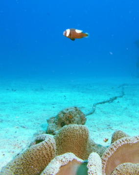
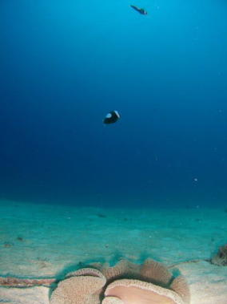
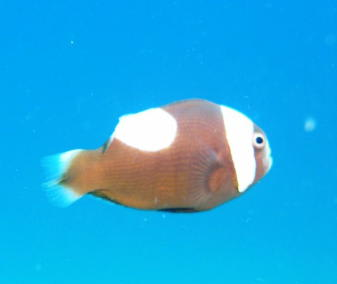
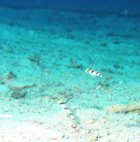
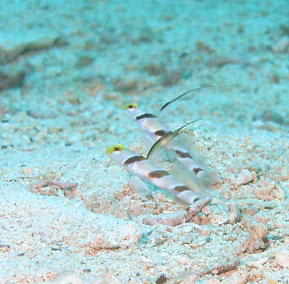
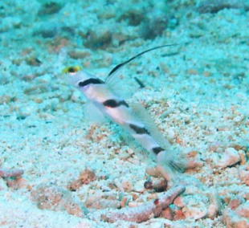
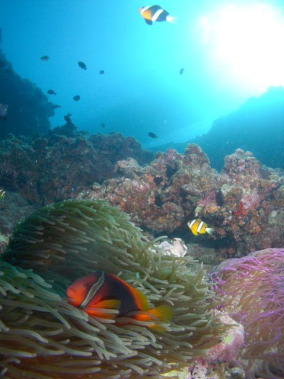

# 初の子連れダイビング旅行記＠2009年　その6　1本目のダイビング

📅 投稿日時: 2012-07-17 00:51:30

さて．

というわけで，恩名の海，いろいろ新鮮な経験をしつつ

1本目のスタートです．

エントリーの岩場から，砂地に進み，ロープに沿って泳いでいくと…

現れました．トウアカクマノミ．

日本のクマノミとしてはもっとも個体数が少ないクマノミ．

わが人生で2度目の遭遇です．

このトウアカ，ダイバー慣れしているのか，イソギンチャクから遠く離れて

中層を漂ってます．

中層を漂われると…うーーーーん．写真に撮りにくい…

クマノミって，イソギンチャクをベッドにしている図，というのが

理想なんだけど，

こいつはダイバーが周りを囲んでも平然と，イソギンチャクの上

1mを漂ってます．

というわけで，中層を漂うトウアカの写真になってしまいました…

でも，よく見ると，トウアカってそんなにかわいくないですよね…

さて．気分を取り直して．

トウアカからわずか5mほど離れたところに，今度はヒレナガネジリンボウです．

それもペアだっ！

わがチームのほかの人は，あまりハゼに興味がないのかちら見で終わり．

え？みんな，そんな一瞬しか見ないの？

ふっふっふ．それだけで満足したのかい？皆さん．

では，私一人，これからじっくりと見させてもらいましょ…

ということで，匍匐全身開始．

じり，じりとにじり寄ります．

後の人たちはもう別なものを見ているので，最悪引っ込めてもOK．

数枚撮影しつつ，どこまで寄れるかチャレンジ．

最終的には1匹引っ込めちゃったけど，結構近づけたし，ひれを広げた全身像も取れたし，

ほかのみんなを待たせても悪いので，3分ほどで切り上げ．

その後は，浅瀬でしばらく遊んで終了．

エグジット後，ガイドが

「奥さんから『旦那はハゼの前では動かなくなりますから』って聞いてましたが…

　ハゼ，好きなんですね…」

えーっと．そうかな？待たせちゃ悪いなぁ，とそうそうに切り上げたんですが…

やはり高級リゾートでは，ハゼの前で粘る人はいないようですな～．
