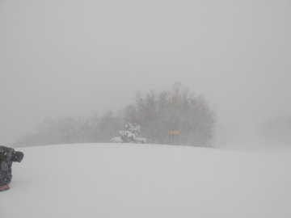
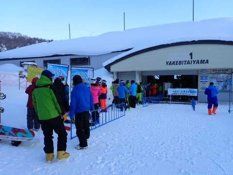

# 1月30日(月)，1月31日(火)の志賀高原特派員からの報告＆2023/1/29(日)の志賀高原焼額山スキー場詳細レポート！

📅 投稿日時: 2023-02-01 03:32:20

昨日はBlog更新する時間がなかった（涙）

ちょっと死んでました…

いや．今も半分死んでますが…（泣）

しかし．

確か2013年以降，このBlogの更新が

2日間続けて止まったのは

確か1回しかないと思っているので…

今日は’意地で更新！！

（でも結構やばい）

で，いつも通り志賀高原特派員の方が

写真を送ってくださっているので．

まずは特派員レポートです！

えー．

昨日…というか，もう一昨日ですね．

30日の月曜は，朝はうっすら積雪があったようで…

午前中はすっきり晴れ！！

気温も朝は-10℃近く，冷え冷えの

最高シマシマバーンで．

午前中は最高のコンディションだった

みたいですが…

昼ごろににわかに搔き曇り，午後1時には

かなりの雪降りに激変！！

午後3時ごろには圧雪コース上に10cmくらい

積もるような激しい雪だったようです…

そして，31日の火曜日は．

朝は30cm以上積もっていたようで…

ゲレンデも圧雪の上に5cmほどの積雪！

気温も，あさイチでは-12℃とそこそこ冷えて．

冷え冷えパフパフデーだったようです…！

コースによっては，膝パフが楽しめたようで…

いいなぁ…

ってことで．

今日はもう夜も遅いし，このあたりで

記事を終えようかと思ったけど…

特派員レポートだけだと寂しいので，

昨日書きそびれた日曜の志賀高原レポートに

載せようと思った写真をいくつか

ピックアップして掲載！

まず．

土曜はナイターまで滑ったというのに…

日曜の朝起きたらすっきり晴天だったので．

我慢できずに7:50からのファーストトラックに

参加しちゃいました～！！

さすが晴天なだけあって，ファーストトラック

参加者，結構いますね…

で．

今シーズン初めてのファーストトラックですが．

ゴンドラの上から見ると…

まだ1本も滑った跡の無い，まっさらの

ピカピカシマシマバーン！

昨晩の10cmほどの積雪がきれいに

圧雪された柔らかトップシーズン雪を，

この晴天で滑れるとは…！！

ってなことで．

いつもより40分早く，シマシマをいただきま～す！！

ぐおおおお！！！

最高！！

これは最高だ！！！

いつものファーストトラックのあとの

通常営業のあさイチと違って，

まだ跡がついてないまっさらのシマシマ…

美味しさが桁違い！！

いい…

これはいい…

雪質最高の晴天の日は．

朝の1本目だけで，ファーストトラックの

1500円分の価値があるよ…！！！

ってなことで．

ファーストトラックのシマシマをいただくと．

通常営業開始を待つ人の列が

並んでますが．

これを横目に，通常営業開始1分前に

4本目のゴンドラに乗車！

そして，今度は通常営業でオープンする

パノラマコースに向かえば…

通常営業の人より早く，まだ跡がついてない

パノラマコースを滑れて．

本日2度目の，ピカピカシマシマを滑れます！！

いや…最高…

今日は最高だよ…

いやー．

今日は天気もいいし．

朝9時でも-13℃と，冷え冷えで．

だもんで，朝は見事にダイヤモンドダストが

出ていて．

ダイヤモンドダストに朝日が当たって，

見事なサンピラーが出てました！！

そして，なぜか今日も人が少なく．

ゴンドラも最大で待ちはこの程度．

ゲート内に収まってるし…

いや，今日は最高だよね！！

昼ごろには，ちょっと曇り始めたけど…

昼を過ぎると，ゲレンデもゴーストタウン化

していくし．

最高気温も-10℃程度で，冷え冷えで

雪質は終日最高のままだし…

さらに昼ごろは曇ったけど，午後になると

また晴れて来て．

ガラガラ晴天最高雪質だったし…

そして，今日もゲレンデはそれほど荒れず．

営業終了時まで最高雪質バーンを大回り

し放題という，恵まれた一日だったのでした…

この週末も，良かったなぁ…

で．

志賀高原は，このあと1日夜から2日にかけて，

10～20cmくらい積もりそうですが…

そのあとは週末までは雪は積もら

なさそうかな．

でも，気温は平年並みで，トップシーズンの

雪質はキープするし．

週末は天気も良さそうだし．

週末はいい感じに締まった圧雪が滑れそう

かな～

しかし．

…私は今週末，すべりにいけない可能性が

高くなってきたんですが…（涙）←だったらこんな時間までBlog書かずに早く寝ようよ

## 💬 コメント一覧

### 💬 コメント by (アリス)
**タイトル**: 最高のコンデイション
**投稿日**: 2023-02-01 13:00:49

S様

週末は最高のコンデイションだったみたいでお祝い申し上げます♬

FT、ピカピカのシマシマ、ダイヤモンドダスト、サンピラーと心躍りながら滑走しているSさんが想像できます♬

記事を読みながら職場でのたうち回っております。

(羨ましい・・・）

特にレインボーさんの情報を拝見して、仕事やってるどころじゃないと,血を吐きながらはやる気持ちが抑えられません・・・

早速、2月早々にヤケビに参戦と思っている次第です♬（平日もズル休みして・・・）

### 💬 コメント by (だい)
**タイトル**: 最高の週末でした
**投稿日**: 2023-02-01 23:41:51

だいです。週末はお世話になりました。

日曜も良かったですが、月曜午前もとても良かったです。多少無理して休みを取った甲斐がありました…！

ハイシーズン晴天冷え冷えの志賀は体験したことが無かったので感動物です。

私の腕でCTはかなりのオーバースペックなのですが、この天気＋ヤケビの圧雪でなら気持ちよく乗れてとてもいい感じでした。

半年とか贅沢な事は言わないので、せめてあと3ヶ月この状態が保存されてほしい…（無茶）

### 💬 コメント by (ダウンヒル)
**タイトル**: Unknown
**投稿日**: 2023-02-02 00:35:35

Sさま、お疲れ様です。

今日は晴天スタート。

シマシマを味わいたくて早々にコースへ...平日にコース整備しない時もあった西館...不安をいだきコースイン...整備されてて、シマシマたらふくいただきました!!!修学旅行生達をやり過ごせば、ガラガラな高天ヶ原と西館。高速ターンし放題でした!!!

午後から一ノ瀬、第２高速、２ゴンと遠征。楽しく過ごしましたよ!!!平日スキー最高!!!これが毎日なら...レインボー上がりでも満足する気持ちが分かります。(けど...私はリフト終了直前まで味わう派ですけどね...なんせ、中毒者ですから。)

### 💬 コメント by (Skier_S)
**タイトル**: 今週末もコンディション良さそうかな
**投稿日**: 2023-02-02 03:47:06

＞アリスさま

この週末は良かったですよ～！

特に日曜は最高でした！

＞だいさま

今週末はお疲れ様でした！

良い天気で雪も良い週末でしたね！

そして月曜もコンディション良かったみたいなので，楽しめたかと…

CT，やっぱりいい板ですよね．

ホントにあと3ヶ月，いや6か月でいいからこのコンデションが続いて欲しい…

＞ダウンヒルさま

今日の朝イチシマシマ，気持ちよさそうでしたねて！！

明日も雪質はいいと思うので楽しんでください！！

