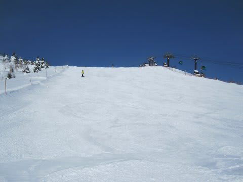

# 1月29.30日　志賀高原

📅 投稿日時: 2011-02-01 00:18:48

というわけで．

この土日も，志賀高原へ行ってきたわけですが．

すでにレポートしたように，日曜は晴天！！

いやーーーー．久しぶりの晴れ．

スキーって，やっぱり，太陽の下でやるべきもの

ですねーーっ！

ハイシーズンで雪もやわらかく，何でもできちゃいますね～

今が一番いい時期ですね．

なのに，ゴンドラもリフトもがらがらなのはどうして？？？？

で，この日は毎週土日に開催している焼額の

「アフタヌーンファースト」へ繰り出してみました．

これは，焼額第1高速リフト沿いのコースを昼に15分ほど

コースクローズして，圧雪を掛けなおしてくれるという

すばらしいイベント．

んで，圧雪終了後は，並んでいた順番に，適当に間隔を

あけてコースに入れてくれるので，圧雪かけたてバーンを

独り占めできるという．

並ぶのが遅いと，前を滑っている遅い人に追いついてしまうので

あんまり貸切感はないですが，なんにしろ昼間にまた

圧雪かけたてバーンを滑れるのはいいですな～．

午後には雲が増え始め，夕方からは雪が降ってきて，

夜は結構降ってきました．

夜はダイヤモンドナイターへ繰り出しましたが…

人が少ないですねーーー．

だれもいないんですけど…

ホントにスキー場の経営大丈夫か？？？

志賀のナイターは，開始前にきれいに圧雪をかけなおしてくれるので

またまたシマシマバーンを独り占め．

うほー！最高っ！

…んで．

あけて日曜．

…

朝からかなりの風＆雪です．

昨晩から30cmほど積もってるでしょうか？

昨日の夜はそれほど降ってるように感じませんでしたが，

夜更けからかなり風雪が強まったようで…

リフト営業開始ごろから風は弱まりましたが，

除雪のため一の瀬ファミリーのリフト営業開始は

30分ほど遅れました．

営業開始後，コースに繰り出すと…

コース全面10cm～20cm程度，ブーツが埋まるくらいの

新雪です．

朝の気温はマイナス19度と寒かったので，雪は軽い，

まさにパウダー．

んで，焼額のオリンピックコースへ．

ここは…ひざパフ．

もう少し深いかと期待したんですが…

でも，ひざパフの新雪を目いっぱいいただきました．

午前10時過ぎには，パウダーもだいぶ食い散らされたので，

一の瀬へ戻り，一の瀬ファミリーの正面バーンへ．

新雪が積もった後なので，結構ぼこぼこになってます．

んで，下地は人工雪のちょっとエッジが引っかかる

ざらざらした硬い斜面の上に，もそもそした雪が溜まって

いるので，多少滑りづらい…

昼近くには，どのコースも積もった雪がところどころ溜まって，

ちょっとでこぼこした感じになっちゃいましたね．

…そこを飛びながら滑ると，背負われた子供は喜ぶんですけどね．

今回は子供づれだったので，昼ごろには切り上げました．

結局，日曜は終日雪．

好天の土曜といいコントラストでした…

しかし，この1月は冷えて恵まれたコンディションが

続きますね～．

リフトも空いてるし．

2月に入ると混むかな～
