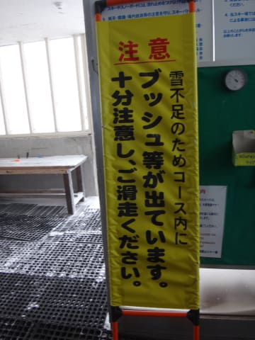

# 12月13日の志賀高原・焼額山は…雪は降れども，微妙なコンディション

📅 投稿日時: 2014-12-13 20:13:18

🏷️ カテゴリ: [2015スキー滑走日記](c09ea645cfc085f86dfcd80f49599dd89.md)

ということで．

本日は，予告どおり志賀高原にやってきてるわけですが．

本日は，信州中野ICまではチェーン規制がなかったけれども．

んでも，志賀高原の上り道，本格雪道で．

…これは，そこそこ積もってるな～．

ゲレンデコンディション，いいに違いないっ！！

と，やってきた，焼額山．

今日は，第2ゴンドラに加え，先週うごいてなかった

第2高速リフトが運転しています！

ふはは．

今週は，楽しめそうだぞ～．

と，喜び勇んでゴンドラに乗って，山頂へ行くと…

うむ．

山頂の気温はマイナス8度と．

トップシーズン並みの冷え込み！

うははは．

やっぱり，今週はよさそうだぞ～

そして，山頂のゲレンデは…

うは！

雪がたっぷり！

うはははは！

楽しみますよ～っ！！

いけ～っ！！！

…と，滑り出したところ．

あれ？

あれれれ？

これは…

ゲレンデ全面，なんだか…

氷のコロコロが覆ってます（涙）

な，何てことだ…

おとといの雨で凍ったやつだ，これ…

おとといの雨で凍ったゲレンデが，昨日からの

雪でも隠れきらずに，ゲレンデ全面にコンニチハしてきてます…

…いや，あなたは出てこなくていいですから…

と，謙虚にお願いしたいところですが．

その上にかぶさった雪は10cmほどしかないため．

すぐに雪が掘り返され，氷のゴロゴロさんは，

私の願いも聞き入れてくれず．

ゲレンデ全面に登場してきました…（涙）

そして．

氷だけではなく．

あり？？

ゴンドラ途中，旧第1高速降り場からの急斜面．

ちょっとブッシュや石さんもコンニチハして来ました…

今週もこの看板が出てましたが．

うーーーーむ．

もう一降り，欲しいかな…（残念）

で．

天気は雪が降ったりやんだり．

降るときは，結構激しく降って…

視界が悪くなり…

足元がよく見えない中，氷のコロコロと

新雪が入り乱れた難しいバーンを

滑るという，結構難しいコンディション（涙）

こ，この，氷が…

おとといの，雨が…

かなり残念．．．

で．

基本的に，お客さんは少なく，コースは

ガラガラで．

ゴンドラ待ちもほとんどなかったんですが．

ただ，指導員研修会が入っていて，

ちょっと人口密度が高いタイミングもあったのも，

ちと残念さを増してしまったところも…

うーーーむ．

一見，ゲレンデ状況は改善しているように見えるんだけど…

なんにしろ，2日前の雨の影響の氷のコロコロが，

昨日からの雪では，まだ隠れきってないというのが．

ちょっと惜しすぎる．．．．

うーーん．

返す返す，おとといの雨が残念すぎる！！

とりあえず．

今も，雪は降り続けているので．

明日の朝までの積雪で．

改善してくれることを，祈るばかりだな～．．．．

## 💬 コメント一覧

### 💬 コメント by (いか)
**タイトル**: Unknown
**投稿日**: 2014-12-13 20:32:06

ふむ～、志賀はあまり降ってないんですね。。。

私のホーム八方は先週でも十分雪がございました！

シーズン一発目からファットで攻めたおかげでやっとこさ筋肉痛が治ってきたところです。。。笑

### 💬 コメント by (Skier_S)
**タイトル**: いかさま
**投稿日**: 2014-12-13 22:24:12

そうなんですよ…

志賀はそんなに降ってないんですよ…

明日に期待！

