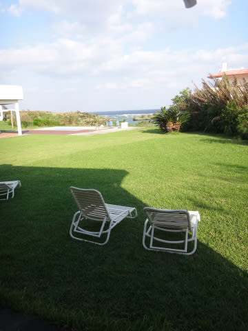
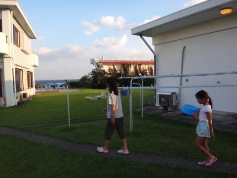
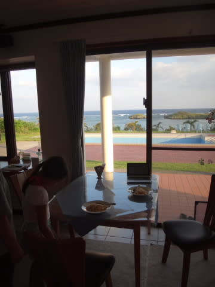
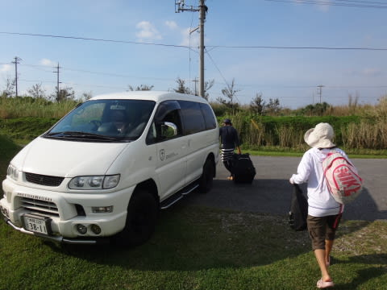
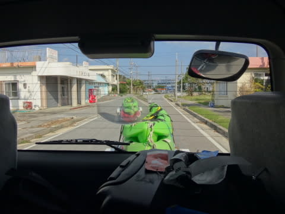
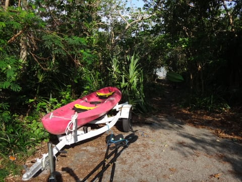
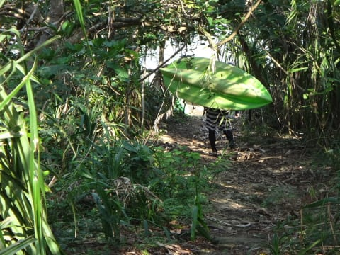
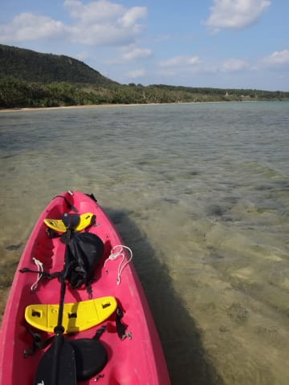
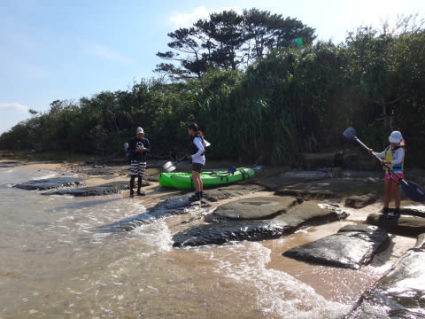

# 2015年10月　子連れで西表へダイビング旅行その18…帰宅の日，午前中はカヤックツアーへ

📅 投稿日時: 2016-09-19 04:26:39

🏷️ カテゴリ: [ダイビング日記](ce3a7a8d424d112fce83ee85c81a0e344.md)

って感じで．

明けて，帰宅の日…

今日もいい天気ですな．

朝ごはんを食べに，食堂へ向かいます…

今日も，朝ごはんとしてはちょっと不思議なメニューの，

ピラフで朝食．

うむ．

今日も，アウトドア日和の天気！

…実は今回．

「3泊4日，実質，中2日の短期滞在で．

　中2日はダイビングだけだよなぁ…

　せっかく西表まで来たのだから．

　せめて最終日に，ダイビング以外のことを

　楽しんでから帰りたいよなぁ…」

と．

帰宅の日も昼過ぎまで西表に滞在できるよう，

帰りの飛行機を最終便としていたのですが．

西表らしいことと言えば，

カヤック＆トレッキングツアー

だよな～

…ということで．

昨日，ダイビングショップのオーナーを通じて，

ツアーガイドに午前中の半日ツアーを申し込んで

おいたのでした．

ってなわけで．

器材を片づけ，荷物をまとめていると．

ツアーガイドが，9時にピックアップに来てくれます．

カヤックを引っ張った車で走ること20分ほど．

カヤックツアーのスタートポイントに着いたようです…

道路わきから，海に下りる道をカヤックを抱えて

下り…

海辺へやってきました．

ここで，娘と一緒に，簡単なパドリングの

レクチャーを受けて…

いざ，カヤックツアーへ出発です！

