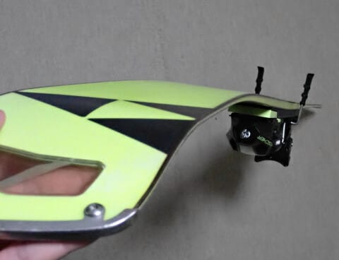

# 実はFISCHERのRC4 SC（石ころふみ用）のスキー板をひん曲げてしまった（涙）

📅 投稿日時: 2024-12-29 00:24:18

ということで．

年末年始休みに突入したけど，

今日はスキーに行かず，家でいろいろ

仕事をしていたSkier_Sです（涙）

でも，明日から志賀高原に出発です~！！

いつも通り，あと3時間後に出発という

睡眠時間の短さ（泣）

ってなことで．

本日も特派員の皆さんから志賀高原の

写真を頂きましたが…

年末休みに入った本日から，焼額山で

動いてなかった最後の1本，第3高速

リフトが動き出し，ついに全リフトが

運転となりました！！

コースの方も，奥志賀連絡コースや

SGSコース，ミドルコースもすべて

オープンし，条件付きコース以外は

全面オープン！

条件付きコースも，本日10時に

ヤケビバレーがオープンしたようで…

12月にヤケビバレーがオープンできるとは，

結構積もってる感じですね…！！

（[焼額山スキー場Facebook](https://www.facebook.com/reel/995345122418666)より）

上のFacebookの投稿には，ヤケビバレー

オープンのアナウンスの他に

・ファーストラックが本日スタート！

・ナイターも今日から始まるよ！！

という案内があって…

完全にトップシーズンに突入しましたね…！

ということで．

トップシーズンに突入した志賀高原ですが．

本日は朝の気温は-11℃！

予想の-10℃程度というのがほぼぴったりの，

冷え冷えの朝で…

これもまた予想通り，朝までの積雪は

10cmほど！！！

さらにここも予想通り，朝の圧雪コースは

圧雪の上に数cmのうっすら積雪！

平日よりは多いものの，年末年始休みと

考えれば，意外と人が少なく，

リフト待ちもそれほどひどくなかった

ようです…！

ただ．

さすが年末年始休み．

コース上の人は意外と多かったみたい

ですが…

リフトはそこまで混まなかったようです．

で．

根性の無いスキーヤーふるい落としデーと

予想されたこの日．

昼間もモサモサと雪が降り続け．

昼前にはバーンは新雪が蹴散らされ

結構ボコボコになっちゃったところも，

予想通りで…

結局，昼間だけで20~30cmくらい積もった

ようで．この積雪量は予想より多かった

ようですが．

それ以外の予想はほぼ完全に正解で，

今日の天気予想も予言レベルの正解だった

との，某特派員からの報告でした…

ただ，夜7時くらいまでは結構降ったよう

ですが，それ以降は止んでしまったので…

明日の朝までの積雪は10cm程度，

昨日の予想通り，朝は西風で晴れ~曇り，

昼頃から北に風が回って雪…

という天気になりそうです．

ってなことで，本題へ．

…実はまだ，今のところ．

そう，現時点ではまだ，物欲選手権に

敗れていない今シーズン．

今シーズンのスキー板のラインナップも

[昨シーズンと変わらず](e65b745c5fdaadf1ffc8d13e27fcb47bb.md)，

1．朝イチ用GS　FISCHER GS Master 198cm 

2．普段履き用大回り　FISCHER RC4 RC 185cm

3．大回りバックアップ　FISCHER RC4 RC 185cm

4．小回り用　FISCHER RC4 SC 165cm

5．セミファット　VOLKL DEACON84 177cm

6．新雪用ファット　LINE SIR Francis Bacon 176cm

7. 石ころふみ用　FISCHER RC4 SC 165cm

という7セット体制なのですが…

この7番目の石ころふみ用FISCHERで，

イエティを滑っていた11月のこと．

リフト乗り場で搬器に座り，

スキー板が地面を離れたその直後．

ちょうど地面を離れたスキーやボード

から落ちた雪が小雪になっているような

ところに板がちょうど刺さった形になり．

スポーンと板が外れてしまいました…

乗っていた自分がリフトから落ちるとか

そういうことはなく．椅子に座ったまま

引っかかった板だけスポーンと外れた

感じだったんだけど，

リフトを止めてしまいました…（泣）

うおぉぉぉ！

今までこんなに長くスキーをやってきて，

おそらくこれまで1万回の単位でリフトに

乗っている自分として，これまで一度も

リフトを止めたことがないのが自慢

だったのに…

ついにリフトを止めてしまったか…っ！！！（がっくし）

リフトが止まったのはまだリフト乗り場で，

足が10cmも地面から離れてない

ところだったので，

搬器から降りて，外れた板を履きなおして

リフトに乗りなおしましたが…

ついに初めてリフトを止めてしまった

ことにショック…（激涙）

ってなことで．

しばらくはショックを引きずりながらも，

しばしイエティの紐コースを滑って

いたわけですが…

しばらく滑って，

「トイレへ行こうかな」と，板を脱いで

手に持った瞬間，強烈な違和感がっ！！！

…これ…

板，曲がってない！？？？

よく見ると…

うげげげげげげげげーーーーっ！！！

曲がってる…

軽く曲がってるなんてもんじゃなく，

強烈に曲がっているよ！！！！

うぎゃーーーーー！！

いくら石ころふみ用の，5シーズン目に

突入した古い板とはいえ．

まだそんなにヘタってもないし，

そもそもこの次の石ころ踏み板に

できる，使い込んだ板がない今…

これは痛い…っ！！

あぁぁぁ…

次から，イエティとか月山とかで

使う石ころふみ，どうしよう…？？

185cmのロングの板でイエティや

月山は辛いので，小回り板がいいんだけど…

最近小回り板を使ってないので，

小回り板はまだ1シーズン，それもおそらく

合計10時間程度しか履いてない，新品の

’23モデルのRC4 SCしかないんだけど？？

さて，どうしようか？？？？

…と，しばらく次期石ころふみを

どうしようか悩んでいたけど…

それ以前にちょっとショックだったのは．

曲がった板を履いていたのに，

滑っている間は全く気付かなかった

という自分の感覚のいい加減さにも，

かなりの衝撃を受けてたのでした…

だって．

曲がった板でも，角付けすればしっかり

グリップしてターンしていくんだもん…

小回り板なので結構深い角付けをしてた

から，曲がった板とあんまり変わらない

くらいトップがたわんでたんだろうな…

ただ．

「板が曲がってる！」

ということを知ってしまうと．

確かに角付けが弱い領域で，

トップの安定性が低いことに

気づくけど…

でも．曲がっていると言われなければ．

角付けの弱い領域でも

「こんな感じの板だったかな」と

スルーしてしまうレベルで，

深回りで角付けを強めにして滑ってると

曲がってない板も同じくらいたわんでいる

からか，あんまり良くわからない…

うーん．

11月のイエティの紐ゲレンデを滑る

ような比較的低速じゃなく，もっと

高速でガンガン滑ると差がわかるのかも

しれないけど…

まぁ，そこまで差がわからず，普通に

滑れちゃうレベルだったので．

この日は結局，曲がった板で普通に

一日滑ったし．

次の週も曲がった板で滑ってました（笑）．

ということで．

今回．板を曲げたことよりも．

「自分は板のトップが曲がってても，

　滑っていてそれに気づくぐらい鋭い

　感覚をもっていない」

ということにショックを受けた，

Skier_Sだったのでした…

…でも，今後の月山とかの石ころふみ用板

どうしよう？

どうせ気づかないくらいだから，このまま

曲がった板を使い続けるのか…？

## 💬 コメント一覧

### 💬 コメント by (Unknown)
**タイトル**: Unknown
**投稿日**: 2024-12-29 01:06:23

色々な意味で「白い粉」が怖い

### 💬 コメント by (カンタロス)
**タイトル**: Unknown
**投稿日**: 2024-12-29 08:15:40

エスさま、こんにちは。

一般スキーヤー（エスさまは違いますが（笑））

はそんなもんですよね。

私もスキー板を買いたい友達（saj2.5級くらい）に付き合って板をみつくろった時、お店の人はプレチューンを激烈に勧めましたが、普通の人はソールかフラットじゃなくても、エッジ角が均一でなくても絶対分からないから、プレチューンなんていらない！

とお店泣かせなアドレスをして、プレチューンを無くしました（笑）

### 💬 コメント by (まーくん)
**タイトル**: Unknown
**投稿日**: 2024-12-29 08:21:35

ということは石ころ踏んでも滑走性の違いに気づかない可能性を信じて新しい板を出動させてみるのは如何でしょう😆

### 💬 コメント by (べー)
**タイトル**: Unknown
**投稿日**: 2024-12-29 10:12:40

物欲選手権を開催して欲しいと思っている読者さんは多いはず…（笑）

### 💬 コメント by (マルハバ)
**タイトル**: 誰しも・・
**投稿日**: 2024-12-29 12:12:38

右ターン左ターンに得手不得手があるので、

片方キャンバーもう片方ロッカーでも良いのではないでしょうか？（笑）

### 💬 コメント by (metabo-joker)
**タイトル**: Unknown
**投稿日**: 2024-12-29 13:42:28

求　物欲選手権

### 💬 コメント by (SKI46)
**タイトル**: Unknown
**投稿日**: 2024-12-29 16:37:19

Sさん、筋力やバランスで、

山回りというか、ターンインの不安定な瞬間をカバーしていたのですね。

ここがうまく決まってくると、気持ちのいいカービングというか、安定したカービングターンになりますね。

シャトレーゼ小海、白樺高原国際に続き、

本日は、妙高杉ノ原

昨年のここ時期は、下部は草と地面の中を通過したので、今年のシーズンインは、恵まれていますね。

重めの新雪でしたが、娘がシャットダウンしてしまい、最後は、20キロを越える娘を背負ってゴンドラコースを下山しました。

いい修行をしてきましたが、

### 💬 コメント by (Skier_S)
**タイトル**: 物欲選手権への期待度が高い…
**投稿日**: 2024-12-29 21:26:34

＞Unknownさま

怖いです…白い粉が．

人間やめるか，白い粉をやめるかのどちらかですから(笑)

＞カンタロスさま

私も特にプレチューンいらない派でした…

変なお店でプレチューンやると，試乗で乗った時と違う仕上げになって，

期待していたのと全然違う板になっちゃったこともあったので（涙）

でも…エキップさんで板を買うようになってから，プレチューン派になりましたが…

＞まーくんさま

いや…

新しいSCを今シーズン使い倒して，そのまま石ころふみにするシナリオが

かなりリアリティを帯びてます…

＞べーさま

求められている…何かが求められている！！

＞マルハバさま

片方キャンバー，片方ロッカーだと，左右差がなくなるどころか

シルエットの左右差が強くなりそうですね(笑)

＞metabo-jokerさま

ここでも何かが求められている…！

みんな，私に何を求めているんだ…？？

＞SKI46さま

私も自分で板が曲がっていることに気づかないことにショックを受けつつも…

紐ゲレンデのイエティじゃなかったら気づいたのかも？？

と思ってますが．

やっぱり滑りがまずいのかも（涙）

20Kg越えの搬送お疲れ様です．私も15Kgくらいまでは背負ってましたが，

それより重いとかなりつらそう…

### 💬 コメント by (アツシ)
**タイトル**: Unknown
**投稿日**: 2024-12-29 21:26:36

新しいパターン開発されましたね。え？物欲選手権の前フリですよね？本編楽しみにしてます😊

外れた板がそのまま跳ね返って後頭部を直撃して、頭が爆発しなくて良かったと思いましょう。そんな看板あったのイエティでしたよね？

### 💬 コメント by (Skier_S)
**タイトル**: ＞アツシさま
**投稿日**: 2024-12-30 21:08:47

いや…物欲選手権に続きませんから！

続かないはずですから…！！

続かないようにしないと…

続かないよな…

あと，そういえば，昔そんな看板ありましたよね…

