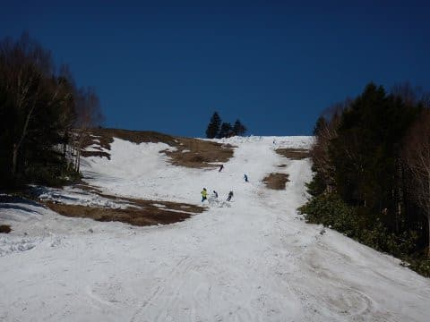

# GW前半は，4/27～4/30までの3泊4日で志賀高原！

📅 投稿日時: 2019-04-26 21:55:43

ってなわけで．

やってきました，GW！

明日からカレンダー通りの10連休です～！

…が．

今日はちょっと残念なお知らせが…

何と．

今日まで滑れたオリンピックコースが．

GW直前にクローズになってしまいました…（涙）

せめてあと2日，いや，1日

もってくれれば…（泣）

（[焼額山FB](https://www.facebook.com/yakebitaiyama/posts/2146004555494879?__xts__[0]=68.ARBd1j3XA1q206acaHl2L_ok-AvJ_7OgpNAGj5ZrvN7zCJgFavJpkgS9c6gW8PNdkRoFblmXhVk8smvjqHJw-mk1dtsTb4C8ShbK0t3VDQZaIxBzfEVhI2tW_U9x9F_ep9-Aj8LYTdx8XHVR0buPNYFj-u5xPdZxnWtIzXL2LMzo9y9c4Q9Qh26Nr3t2AUbKEj9DRgUJ0K1Lywk2Ox_oiGUOz3ECHhuOoIpz0x7pQ69L7WoocFJrUkjpLcCzZ_tohrStbvM53PI5ExrLNlroRzgH408vEqJevxbZf73TyLidwcDKES32qcRJJGfMSpL4P2Ql3wXX26ZcJ2oYAVyfDA&__tn__=-R)より）

…まぁ．

でも．

GWのこの時期まで，良くもったと

いうべきでしょうか．

しかし．

実は，明日からの営業マップをよく見ると．

さらに一か所クローズになったところが…

この地図に矢印で示した部分，

GSコースの一番最後．

ゴンドラをくぐってまっすぐ落ちていく

ショートカットコースが，明日から

クローズになるようです…

（[焼額山HP](http://www2.princehotels.co.jp/ski/shiga/files/pdf/springmap_1_25.pdf)より）

まぁ．

とはいえ．

まだGSコース，パノラマ＆サウスコース，

唐松コース，ビギナーズコースと滑れるし．

奥志賀へも滑って行けるようなので…

GW2日目にして全コースが息絶えた

昨年に比べれば，全然マシですね！！

ちなみに，昨年のGW初日を振り返ると．

焼額はこんな感じだったので…

（GSコース中間）

（GSコース下部）

（パノラマコース）

それに比べれば，まだほとんどのコースが

滑れる今年が，どれだけまともなことか！

…それどころか．

やっぱり明日は朝に積雪がありそうですよ…！

というより，明日は一日，雪が降り続けますよ！

真冬の景色ですよ！

寒いですよ！

志賀草津道は，おそらく明日は通行止めに

なるかと思います…

明日志賀に来る方は，信州中野を回って

くる方が正解でしょう．

そして，ちゃんとスタッドレスを履かないと

ヤバいですよ！！

で．

28日は新雪が降った後の晴天で，最高になりそうで．

29日は曇り空，

30日は雨がぱらつきそうな感じ…

とりあえず．

明日から前半戦，4日間志賀高原を

滑ってますので．

また志賀高原でお会いしましょう～！

## 💬 コメント一覧

### 💬 コメント by (Seeker.NT)
**タイトル**: ギフト
**投稿日**: 2019-04-27 17:33:38

Sさん、GW10日中9日が志賀なんですね。やはり御神体がいないと皆さんの安全を守れないですよね。

　私は金曜から奥志賀入りで、8時にリフトに乗った途端に大粒の雨。14時頃まで50%ザーザー降り・・・まぁ、シーズンに１回位はザーザー降りの中滑らないとね・・・。

　今朝はSさんの予想通り降雪。でも積もった雪は緩かったですね。気温が1〜2℃の違いで雪が溶けたり、その水滴が凍ったりとリフトに乗るたびに変化してました。風も強かったですが、今日の奥志賀は気合いでリフト運行。ジャイアントのリフトより遅く凍えそうでしたが、なんと14時頃にはパウダーの様な雪質となるギフトが！

　明日は今シーズン、そして平成最後のスキーとなる予定です。どんなギフトがあるかなぁ。

### 💬 コメント by (かず)
**タイトル**: Unknown
**投稿日**: 2019-04-27 21:04:39

朝ぷちパウダーでしたね　すぐ板変えました　あれなら早朝行きたかったデス…

### 💬 コメント by (Skier_S)
**タイトル**: 今日は奇跡の一日
**投稿日**: 2019-04-27 21:29:56

＞Seeker.NTさま

今日は奥志賀にいらしたんですね…

昨日は残念な感じだったかと思いますが，

今日は良かったですね～！

明日も最高だと思いますよ！！

…明日でもうシーズン終了というのが，ちょっともったいないですが(笑)．

＞かずさま

今日は朝もプチ新雪でしたが，午後になってだんだん

雪質が良くなっていきましたね…

驚きでした！

明日は最高だと思いますよ！

