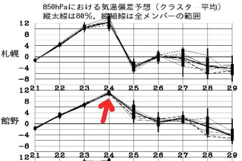

# これから帰国予定…そしてこの土日の志賀高原の天気は？？

📅 投稿日時: 2019-11-23 02:49:50

ということで．

昨晩，某国での仕事が終わり，

やっと一息つきました…

現在，某国空港で帰国のための出発待ち

中です．

あぁ…日本ではもう土曜日というのに．

今日一日の休日が移動でつぶれてしまう，

この悲しさ…（涙）

ということなので．

無事熊の湯が本日からオープンして，

非常に志賀高原に行きたいところですが．

残念ながら私は今週は志賀にはいけません（泣）

天気図を見てみると．

この土日の志賀高原．

土曜は朝には雨雲が去り，

土曜は一日曇りで，雨が降ってもぽつぽつ，

運が良ければ日も差すかも…というくらいの

天気．

気温は「これが11月か？？」というくらいに

上がっちゃうんので，雪はやばくなりそうだけど．

意外と穏やかな天気の中滑れそうです．

そして．

日曜も．

志賀高原より南はやばいけど．

志賀は雨にならずに済みそうな予感…！

天気は土曜とほぼ同じ．

一日曇り，運が悪ければぽつぽつ程度の

雨粒が落ちてくる可能性もあるけど，

時折日も差しそうな天気．

…ただ．

この23，24日の土日．

異常に気温が上がります．

…この24日の，平年比+10度を超えそうっての，

どういうことよ（涙）

23日の高温でゲレンデがやられて，

24日クローズにならないことを祈るばかり…

しかし．

日本は雪不足というのに．

私が滞在している某国某所では，

今朝かなりの雪が積もりました…

この雪を日本に持って帰りたい（涙）

## 💬 コメント一覧

### 💬 コメント by (五輪の書 u Time)
**タイトル**: Unknown
**投稿日**: 2019-11-23 20:27:39

初めてコメントさせて頂きます

お疲れ様です

いつも素晴らしいブログありがとうございます

セルフ突っ込みにはウケまくり

ブロガーじゃないので「いいね」出来ませんでしたが、脳内いいねを累計でかなりしまくりです

今更ながらアメブロ初めました

徒然さまがgooなのでgooブログにしようかとも思いましたが

### 💬 コメント by (Skier_S)
**タイトル**: ＞五輪の書 u Timeさま
**投稿日**: 2019-11-23 23:36:47

コメントありがとうございます～！

＆愛読ありがとうございます～！

ブログ書かれてるのですね．

URLが書かれていないので，ブログを探すことができませんでしたが…

PCからのコメント欄には，URLを貼り付けることも

できるので，次のコメントでURL貼り付けてもらえれば，

私も見に行きますし，他の読者の方も見に行ってくれるかと

思います…

これからもコメントお待ちしています～！

